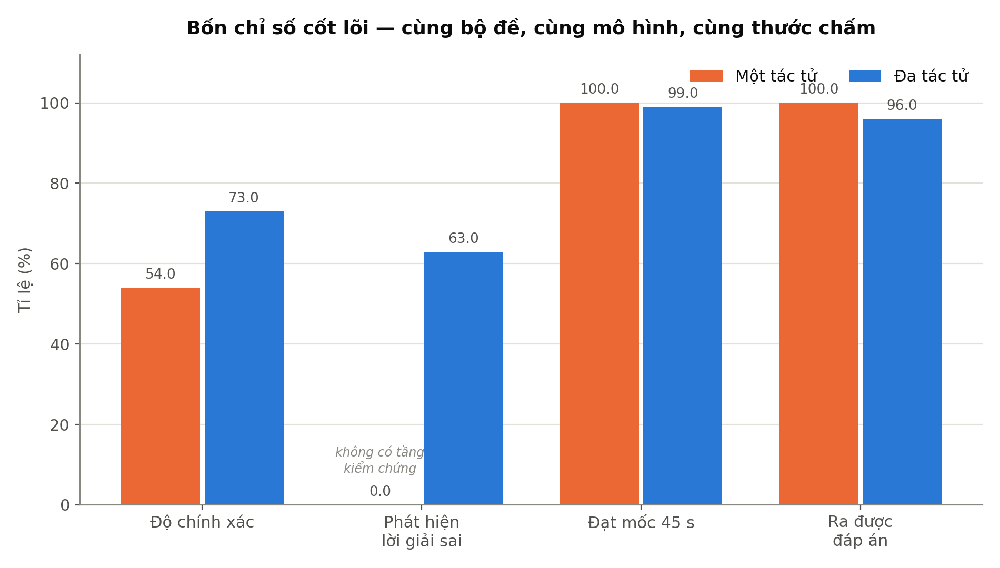
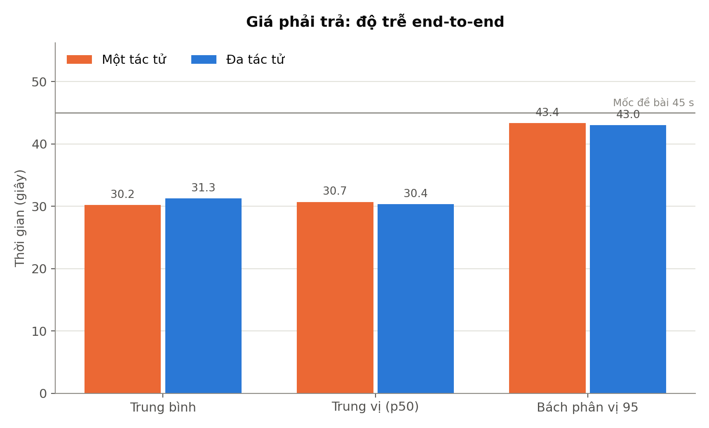
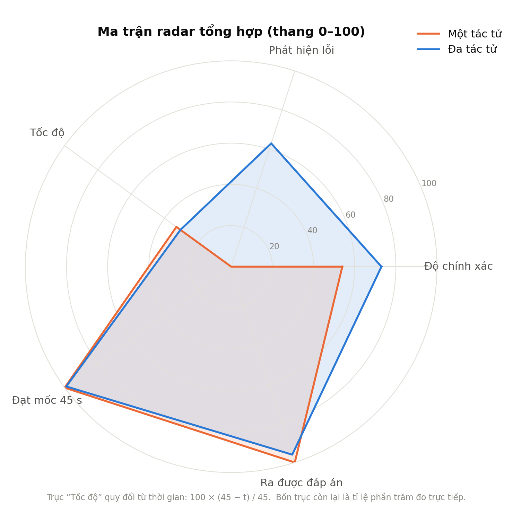
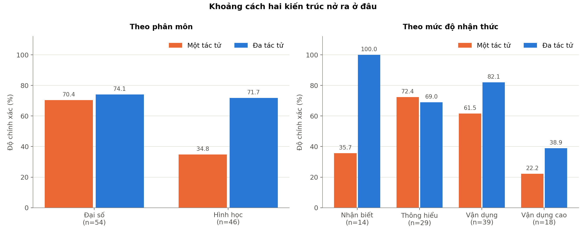
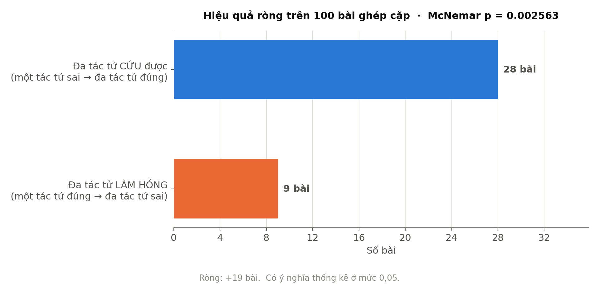

# CHƯƠNG I: GIỚI THIỆU VÀ ĐẶT VẤN ĐỀ

## 1.1. Đặt vấn đề

Giải bài tập là một hoạt động quan trọng trong quá trình tự học của học sinh phổ thông, đặc biệt đối với môn Toán — môn học có tính hệ thống cao, trong đó mỗi bước suy luận đều phụ thuộc vào tính đúng đắn của bước trước đó. Trong thực tế, người học thường gặp khó khăn ở một bước biến đổi hoặc tính toán cụ thể thay vì không hiểu toàn bộ bài toán. Sự phát triển của trí tuệ nhân tạo, đặc biệt là các mô hình ngôn ngữ lớn (Large Language Models – LLM), đã mở ra khả năng xây dựng các hệ thống hỗ trợ học tập có thể đọc hiểu đề bài bằng ngôn ngữ tự nhiên, đưa ra lời giải từng bước và giải thích cho người học.

Tuy nhiên, việc sử dụng một mô hình ngôn ngữ đơn lẻ để giải các bài toán vẫn tồn tại hạn chế đáng kể. Mô hình có thể tạo ra lời giải có lập luận hợp lý và cách trình bày tự nhiên nhưng vẫn mắc sai sót trong quá trình suy luận hoặc tính toán. Đáng chú ý, những sai sót này thường được trình bày một cách tự tin, khiến người học khó nhận biết nếu không có kiến thức đủ tốt để kiểm tra lại. Trong môi trường giáo dục, đây là vấn đề cần được quan tâm vì một lời giải sai nhưng được trình bày thuyết phục có thể dẫn đến việc tiếp thu kiến thức không chính xác.

Bên cạnh đó, các giải pháp AI hiện nay thường phụ thuộc vào dịch vụ trực tuyến, kết nối Internet và chi phí sử dụng. Điều này gây khó khăn khi triển khai trong môi trường học tập có điều kiện phần cứng và mạng hạn chế, đồng thời đặt ra yêu cầu về khả năng xử lý dữ liệu ngay trên thiết bị của người sử dụng. Vì vậy, cần có một giải pháp vừa có khả năng hỗ trợ giải bài tập bằng ngôn ngữ tự nhiên, vừa hạn chế sai sót và có thể hoạt động trong môi trường ngoại tuyến.

Một vấn đề khác cần được cân nhắc là phạm vi chuyên môn của hệ thống. Việc mở rộng đồng thời sang nhiều môn học khác nhau khiến mỗi thành phần chỉ được phát triển ở mức khái quát, trong khi các cơ chế kiểm chứng lại mang tính đặc thù theo từng lĩnh vực và khó dùng chung. Giới hạn phạm vi vào một môn cho phép xây dựng các tác tử chuyên biệt sâu hơn, và quan trọng hơn, cho phép áp dụng công cụ tính toán ký hiệu để kiểm chứng kết quả một cách tất định — điều khó thực hiện đồng đều nếu hệ thống phải phục vụ nhiều lĩnh vực cùng lúc.

Xuất phát từ những vấn đề trên, đề tài “ViMultiAgent – Hệ đa tác tử hỗ trợ giải bài toán Toán trung học phổ thông bằng tiếng Việt, chạy hoàn toàn ngoại tuyến” được thực hiện với mục tiêu xây dựng một hệ thống hỗ trợ giải bài tập Toán bằng tiếng Việt, trong đó các nhiệm vụ được phân chia cho những thành phần chuyên biệt và kết quả được kiểm chứng bằng công cụ tính toán ký hiệu trước khi đưa ra lời giải cuối cùng. Hệ thống hướng tới khả năng hoạt động hoàn toàn cục bộ trên máy tính phổ thông, giảm sự phụ thuộc vào dịch vụ trực tuyến, đồng thời nâng cao độ tin cậy của kết quả giải bài tập.

## 1.2. Mục tiêu nghiên cứu

Mục tiêu của đề tài là xây dựng và đánh giá một hệ thống đa tác tử hỗ trợ giải bài toán Toán bằng tiếng Việt, có khả năng hoạt động hoàn toàn cục bộ trên máy tính phổ thông. Hệ thống hướng tới việc hỗ trợ giải các bài tập Toán ở bậc trung học phổ thông thuộc hai phân môn Đại số – Giải tích và Hình học, đồng thời nâng cao độ chính xác và độ tin cậy của lời giải thông qua sự phối hợp giữa các tác tử chuyên biệt và cơ chế kiểm chứng kết quả.

Để đạt được mục tiêu trên, đề tài tập trung nghiên cứu cơ sở lý thuyết về hệ thống đa tác tử và các phương pháp nâng cao độ tin cậy của trí tuệ nhân tạo trong giải toán; xây dựng hệ thống có khả năng tiếp nhận, phân tích và giải đề bài bằng tiếng Việt trong môi trường ngoại tuyến; ứng dụng mô hình học sâu PhoBERT được tinh chỉnh để nhận dạng dạng bài và định tuyến bài toán tới tác tử phù hợp; phát triển cơ chế kiểm chứng tất định dựa trên tính toán ký hiệu nhằm phát hiện và hạn chế sai sót trong lời giải; đồng thời thực hiện thực nghiệm trên các bộ dữ liệu bài tập độc lập để đánh giá độ chính xác, khả năng phát hiện lời giải sai, thời gian phản hồi và chất lượng lời giải.

Trên cơ sở kết quả thực nghiệm, đề tài phân tích sự cân bằng giữa độ chính xác và thời gian xử lý, thực hiện đối chứng giữa kiến trúc đa tác tử và kiến trúc một tác tử trên cùng một nền tảng kỹ thuật nhằm lượng hoá đóng góp thực sự của việc phân rã vai trò, từ đó đánh giá khả năng triển khai hệ thống trên phần cứng phổ thông.

## 1.3. Đối tượng và phạm vi nghiên cứu

Đối tượng nghiên cứu của đề tài là hệ thống đa tác tử ứng dụng trí tuệ nhân tạo trong hỗ trợ giải bài toán Toán bằng tiếng Việt, tập trung vào cơ chế phối hợp giữa các tác tử chuyên biệt, mô hình ngôn ngữ chạy cục bộ, mô hình học sâu hỗ trợ nhận dạng dạng bài và định tuyến, cùng các cơ chế kiểm chứng và xác thực kết quả bằng công cụ tính toán ký hiệu.

Phạm vi nghiên cứu được giới hạn trong môn Toán bậc trung học phổ thông, chia theo hai phân môn của chương trình phổ thông là Đại số – Giải tích (hàm số, đạo hàm, nguyên hàm – tích phân, giới hạn, tiệm cận, cực trị, phương trình – bất phương trình, mũ – logarit, dãy số, tổ hợp – xác suất, số phức) và Hình học (hình học phẳng, hình học không gian, hình học toạ độ trong mặt phẳng và trong không gian). Bài toán được phân loại chi tiết theo mười lăm dạng bài, phục vụ cả việc định tuyến lẫn việc lựa chọn phương pháp kiểm chứng phù hợp. Phạm vi bao gồm các mức độ nhận thức từ Nhận biết, Thông hiểu, Vận dụng đến Vận dụng cao.

Hệ thống tiếp nhận bài toán dưới dạng văn bản tiếng Việt, tập trung vào các câu hỏi tự luận có đáp số và câu hỏi trắc nghiệm bốn phương án. Đề tài không tập trung xử lý các bài toán yêu cầu nhận dạng hình ảnh, dựng hình hoặc các bài toán có cấu trúc nhiều ý trong cùng một lượt hỏi. Các môn Vật lý và Hóa học không thuộc phạm vi nghiên cứu của đề tài.

Về phạm vi thực nghiệm, hệ thống được đánh giá trên các bộ bài tập độc lập với số lượng và cách phân chia phù hợp nhằm kiểm tra cả khả năng phát triển và khả năng tổng quát hóa, trong đó có một bộ đề được giữ riêng và không sử dụng trong quá trình phát triển. Toàn bộ quá trình thực nghiệm được thực hiện trong điều kiện hệ thống hoạt động hoàn toàn ngoại tuyến, không sử dụng các dịch vụ AI hoặc công cụ tính toán trực tuyến bên ngoài. Thời gian xử lý của mỗi lượt hỏi được giới hạn ở mức 45 giây nhằm đánh giá khả năng đáp ứng của hệ thống trong điều kiện triển khai trên phần cứng phổ thông.

## 1.4. Phương pháp nghiên cứu

Để thực hiện các mục tiêu đề ra, đề tài kết hợp giữa phương pháp nghiên cứu lý thuyết, phương pháp xây dựng hệ thống và phương pháp thực nghiệm. Trước hết, đề tài tiến hành thu thập, tổng hợp và phân tích các tài liệu, công trình liên quan đến trí tuệ nhân tạo, mô hình ngôn ngữ lớn, mô hình ngôn ngữ tiếng Việt và hệ thống đa tác tử, từ đó làm cơ sở cho việc lựa chọn hướng tiếp cận phù hợp.

Trên cơ sở lý thuyết, đề tài tiến hành thiết kế và xây dựng hệ thống đa tác tử hỗ trợ giải bài toán Toán tiếng Việt, trong đó các nhiệm vụ được phân chia theo chức năng và kết quả được kiểm chứng trước khi đưa ra đáp án cuối cùng. Nguyên tắc thiết kế xuyên suốt là mô hình ngôn ngữ quyết định phương pháp giải, còn công cụ tính toán ký hiệu quyết định giá trị kết quả. Hệ thống được triển khai và thử nghiệm trong môi trường hoàn toàn ngoại tuyến nhằm bảo đảm phù hợp với phạm vi nghiên cứu và điều kiện phần cứng đặt ra.

Cuối cùng, đề tài sử dụng phương pháp thực nghiệm và phân tích định lượng để đánh giá hiệu quả của hệ thống. Các chỉ số như độ chính xác, thời gian phản hồi, khả năng phát hiện lời giải sai và chất lượng lời giải được đo lường trên các bộ dữ liệu độc lập. Kết quả được phân tích theo từng phân môn, từng dạng bài và từng mức độ nhận thức.

Đề tài đồng thời thực hiện đối chứng có kiểm soát giữa kiến trúc đa tác tử và kiến trúc một tác tử, trong đó chỉ thay đổi duy nhất biến kiến trúc còn mô hình nền, tham số sinh, bộ đề và hàm chấm đều được giữ nguyên; kết quả được ghép cặp theo từng bài và kiểm định bằng phương pháp McNemar nhằm xác định ý nghĩa thống kê của chênh lệch quan sát được. Cách làm này cho phép kết luận về đóng góp của việc phân rã vai trò dựa trên bằng chứng định lượng thay vì chỉ dựa trên nhận định định tính.

---

# CHƯƠNG II: CƠ SỞ LÝ THUYẾT VÀ KIẾN TRÚC HỆ THỐNG

## 2.1. Cơ sở lý thuyết

### 2.1.1. Hệ đa tác tử dựa trên mô hình ngôn ngữ

Tác tử (Agent) dựa trên mô hình ngôn ngữ lớn (Large Language Model – LLM) là một thành phần phần mềm sử dụng mô hình ngôn ngữ để tiếp nhận thông tin, suy luận và thực hiện một nhiệm vụ được xác định trước. Tùy theo thiết kế, tác tử có thể được cung cấp các chỉ dẫn về vai trò, mục tiêu và các công cụ cần thiết để hoàn thành nhiệm vụ.

Hệ đa tác tử (Multi-Agent System) là mô hình trong đó nhiều tác tử cùng phối hợp để giải quyết một nhiệm vụ phức tạp. Thay vì yêu cầu một tác tử thực hiện toàn bộ quá trình, nhiệm vụ được phân chia thành các công việc nhỏ hơn và giao cho những tác tử có chức năng phù hợp. Kết quả từ các tác tử có thể được trao đổi, tổng hợp hoặc kiểm tra lẫn nhau trước khi tạo ra kết quả cuối cùng.

Một hướng tiếp cận quan trọng trong xây dựng hệ đa tác tử là chuyên biệt hóa vai trò (role specialization). Theo hướng này, mỗi tác tử được giao một nhiệm vụ và phạm vi hoạt động tương đối cụ thể. Việc phân chia vai trò giúp giảm mức độ phức tạp của từng tác vụ, đồng thời tạo điều kiện để các thành phần trong hệ thống phối hợp và kiểm tra kết quả của nhau.

Trong số các hướng tiếp cận tiêu biểu, AutoGen (Wu và cộng sự, 2023) cung cấp một khung phát triển cho phép xây dựng và điều phối các tác tử thông qua cơ chế giao tiếp giữa chúng. Bên cạnh đó, MetaGPT (Hong và cộng sự, 2024) nhấn mạnh việc tổ chức các tác tử theo những vai trò chuyên biệt và quy trình làm việc tương ứng. Trong đề tài này, AutoGen được sử dụng làm nền tảng triển khai hệ thống, trong khi tư tưởng chuyên biệt hóa vai trò được kế thừa để xây dựng các tác tử phục vụ từng nhóm nhiệm vụ khác nhau.

Đối với bài toán Toán trung học phổ thông, việc chuyên biệt hóa vẫn giữ nguyên ý nghĩa dù phạm vi chỉ còn một môn. Nguyên nhân là hai phân môn Đại số – Giải tích và Hình học khác nhau không chỉ ở nội dung kiến thức mà còn ở **kỷ luật trình bày lời giải**: bài đại số đòi hỏi nêu điều kiện xác định trước khi biến đổi và loại nghiệm ngoại lai sau khi giải; bài hình học đòi hỏi mô tả lại hình, xác định rõ đáy và đường cao, đồng thời kiểm tra tính hợp lệ của kết quả vì các đại lượng như độ dài, diện tích, thể tích và khoảng cách không thể mang giá trị âm. Việc gộp cả hai bộ kỷ luật này vào một chỉ dẫn duy nhất khiến mô hình ngôn ngữ có xu hướng bỏ sót phần lớn các ràng buộc. Ngoài ra, việc phân chia theo phân môn còn cho phép áp dụng các phương pháp kiểm chứng khác nhau, phù hợp với đặc thù của từng nhóm bài toán.

### 2.1.2. Mô hình ngôn ngữ mã nguồn mở chạy cục bộ

Mô hình ngôn ngữ lớn (Large Language Model – LLM) là mô hình học sâu được huấn luyện trên lượng lớn dữ liệu nhằm thực hiện các nhiệm vụ xử lý và sinh ngôn ngữ tự nhiên. Trong hệ thống ViMultiAgent, LLM đóng vai trò là thành phần suy luận chính, đảm nhiệm việc phân tích đề bài, xây dựng hướng giải, thực hiện quá trình lập luận và trình bày lời giải bằng tiếng Việt.

Một yêu cầu quan trọng của đề tài là hệ thống phải hoạt động hoàn toàn ngoại tuyến. Do đó, thay vì sử dụng các dịch vụ LLM thông qua API trên Internet, đề tài sử dụng mô hình ngôn ngữ mã nguồn mở được triển khai trực tiếp trên máy tính. Cách tiếp cận này giúp giảm sự phụ thuộc vào kết nối mạng và các dịch vụ bên ngoài, đồng thời cho phép dữ liệu bài toán được xử lý ngay trên thiết bị.

Đề tài lựa chọn Qwen3:4B làm mô hình ngôn ngữ chính và triển khai cục bộ thông qua Ollama. Mô hình được sử dụng ở dạng lượng tử hóa Q4_K_M nhằm giảm yêu cầu về bộ nhớ và phù hợp với giới hạn phần cứng của hệ thống. Ollama đóng vai trò là lớp phục vụ mô hình, cho phép các thành phần của hệ thống gửi yêu cầu suy luận đến mô hình thông qua giao diện cục bộ mà không cần kết nối đến dịch vụ AI bên ngoài.

Việc lựa chọn Qwen3:4B dựa trên sự cân bằng giữa năng lực suy luận và yêu cầu tài nguyên. Hệ thống được triển khai trên phần cứng có GPU 6 GB VRAM; ở cấu hình này, mô hình 4B chiếm khoảng 3,2 GB và nằm trọn trong bộ nhớ đồ họa, trong khi mô hình lớn hơn sẽ vượt quá dung lượng và buộc một phần phải xử lý trên CPU, dẫn đến suy giảm đáng kể tốc độ sinh. Việc lựa chọn mô hình có kích thước phù hợp vì vậy là điều kiện cần để duy trì thời gian phản hồi trong giới hạn 45 giây mà đề tài đặt ra.

Bên cạnh đó, việc sử dụng một mô hình ngôn ngữ chung cho nhiều tác tử giúp giảm yêu cầu tài nguyên so với việc duy trì đồng thời nhiều mô hình khác nhau. Các tác tử có thể đảm nhiệm những vai trò khác nhau thông qua hệ thống chỉ dẫn và cấu hình riêng, trong khi vẫn sử dụng chung mô hình nền. Cách tổ chức này cũng tránh được chi phí hoán đổi mô hình trong bộ nhớ đồ họa, vốn phát sinh mỗi khi hệ thống chuyển giữa các mô hình khác nhau trong cùng một lượt xử lý.

### 2.1.3. Suy luận thần kinh – ký hiệu (Neural-Symbolic Reasoning)

Suy luận thần kinh – ký hiệu (Neural-Symbolic Reasoning) là hướng tiếp cận kết hợp giữa các phương pháp học máy, đặc biệt là mạng nơ-ron và mô hình ngôn ngữ, với các phương pháp suy luận và tính toán dựa trên quy tắc hình thức. Thành phần thần kinh có ưu thế trong việc xử lý ngôn ngữ tự nhiên, nhận dạng mẫu và xây dựng hướng giải, trong khi thành phần ký hiệu có khả năng thực hiện các phép tính xác định, có quy tắc rõ ràng và cho kết quả có thể kiểm tra, tái lập.

Trong phạm vi đề tài, nguyên tắc này được cụ thể hóa theo hướng mô hình ngôn ngữ đảm nhiệm việc xác định *phương pháp* và *quá trình* giải, trong khi các công cụ tính toán hình thức đảm nhiệm việc *thực hiện* và *kiểm chứng* các phép tính. Cách phân chia này nhằm hạn chế một trong những hạn chế phổ biến của LLM khi giải toán: có thể đưa ra lập luận hợp lý nhưng vẫn mắc sai sót trong các phép tính cụ thể.

Các thành phần tính toán ký hiệu được sử dụng trong hệ thống gồm:

| Công cụ | Vai trò trong hệ thống |
|---|---|
| **SymPy** | Thư viện tính toán ký hiệu, thực hiện các phép tính đại số và giải tích như đạo hàm, tích phân, giới hạn, giải phương trình, rút gọn biểu thức và so sánh tương đương giữa hai biểu thức. |
| **Bộ kiểm chứng tất định** (`kiem_symbolic`) | Tự giải lại bài toán từ cấu trúc do mô hình trích xuất, rồi đối chiếu với đáp số của lời giải. Hỗ trợ tám dạng bài có công thức đóng. |
| **Trọng tài số học** (`arbiter`) | Tính lại từng bước trong lời giải và ghi đè giá trị khi phát hiện mô hình nhẩm sai, trước khi lời giải được đưa sang tầng kiểm chứng. |

Cả ba thành phần đều là mã nguồn chạy cục bộ, không phụ thuộc dịch vụ trực tuyến.

Bộ kiểm chứng tất định là thành phần do đề tài tự phát triển. Nguyên tắc thiết kế là **tách đôi trách nhiệm**: mô hình ngôn ngữ chỉ *trích xuất cấu trúc* bài toán — thuộc dạng nào, hàm số nào, biến nào, cận nào, toạ độ nào — còn SymPy *thực hiện phép tính*. Việc trích xuất cấu trúc là nhiệm vụ đơn giản, không đòi hỏi suy luận toán học, nên độ tin cậy cao hơn nhiều so với việc yêu cầu mô hình vừa suy luận vừa tính ra kết quả. Tám dạng bài được hỗ trợ gồm năm dạng thuộc Đại số – Giải tích (đạo hàm, tích phân, giới hạn, phương trình, tiếp tuyến) và ba dạng thuộc Hình học (thể tích khối, khoảng cách giữa hai điểm, khoảng cách từ điểm đến mặt phẳng).

Một nguyên tắc quan trọng được áp dụng xuyên suốt tầng kiểm chứng là: **khi không đủ căn cứ thì im lặng, tuyệt đối không phán đoán**. Nguyên nhân là các phép kiểm tất định có quyền phủ quyết kết luận của mô hình ngôn ngữ; do đó một phép kiểm sai sẽ trực tiếp làm hỏng một lời giải vốn đúng. Hệ thống vì vậy từ chối kiểm chứng trong các trường hợp cấu trúc trích xuất không rõ ràng hoặc có khả năng bị hiểu nhầm, và chấp nhận bỏ sót thay vì báo lỗi sai.

Việc kết hợp giữa mô hình ngôn ngữ và các công cụ tính toán ký hiệu tạo thành một kiến trúc trong đó khả năng hiểu và suy luận ngôn ngữ của LLM được bổ trợ bởi các phép tính có tính xác định. Đây là cơ sở để xây dựng tầng kiểm chứng lời giải của hệ thống ViMultiAgent.

### 2.1.4. Phân loại văn bản tiếng Việt bằng PhoBERT

PhoBERT là mô hình ngôn ngữ dựa trên kiến trúc Transformer encoder, được phát triển và tiền huấn luyện dành riêng cho tiếng Việt. Trong đề tài, PhoBERT được sử dụng để thực hiện bài toán phân loại văn bản nhằm **xác định dạng bài** của câu hỏi, từ đó hỗ trợ quá trình định tuyến câu hỏi đến tác tử phù hợp và lựa chọn phương pháp kiểm chứng tương ứng.

Cụ thể, đề tài sử dụng mô hình `vinai/phobert-base` và thực hiện fine-tune cho bài toán phân loại **mười lăm lớp**, tương ứng với mười lăm dạng bài Toán trung học phổ thông. Mười một dạng thuộc phân môn Đại số – Giải tích và bốn dạng thuộc phân môn Hình học; hai nhãn gộp `khac_dai_so` và `khac_hinh_hoc` được bổ sung để hệ thống không bị ép gán một dạng hẹp cho những câu hỏi không thuộc dạng nào đã liệt kê. Nhãn dạng bài sau đó được quy về phân môn tương ứng thông qua một bảng ánh xạ cố định.

Việc lựa chọn phân loại theo dạng bài thay vì theo môn học có hai lý do. Thứ nhất, hệ thống chỉ còn một môn nên phân loại môn không còn ý nghĩa. Thứ hai, và quan trọng hơn về mặt khoa học, phân loại theo môn là bài toán tương đối dễ mà một bộ luật từ khóa đơn giản đã có thể xử lý phần lớn trường hợp — do đó khó chứng minh sự cần thiết của một mô hình học sâu. Ngược lại, việc phân biệt các dạng bài trong cùng một môn đòi hỏi khả năng hiểu ngữ nghĩa của câu hỏi, vì nhiều dạng chỉ khác nhau ở một vài từ khóa gần nghĩa. Đây là bài toán mà mô hình ngôn ngữ tiếng Việt thể hiện được ưu thế rõ rệt so với phương pháp dựa trên luật.

Một đặc điểm quan trọng của PhoBERT là mô hình được tiền huấn luyện trên văn bản tiếng Việt đã được tách từ. Vì vậy, dữ liệu đầu vào trong quá trình suy luận cũng cần được xử lý theo quy trình tương ứng. Trong đề tài, bước tách từ được thực hiện bằng thư viện `underthesea` trước khi đưa văn bản vào mô hình phân loại. Điều này giúp duy trì sự tương thích giữa dữ liệu đầu vào khi suy luận và cách biểu diễn dữ liệu được sử dụng trong quá trình huấn luyện mô hình.

Hai mô hình học sâu được sử dụng trong hệ thống có vai trò khác nhau và cần được phân biệt rõ ràng:

| Đặc điểm | Qwen3:4B | PhoBERT |
|---|---|---|
| Trạng thái huấn luyện | Mô hình đã được huấn luyện trước, không fine-tune trong đề tài | Được nhóm fine-tune cho nhiệm vụ phân loại |
| Quy mô | Khoảng 4 tỷ tham số | Khoảng 135 triệu tham số |
| Cách triển khai | Phục vụ thông qua Ollama | Tích hợp trực tiếp vào backend |
| Nhiệm vụ | Phân tích, suy luận và sinh lời giải | Phân loại dạng bài và hỗ trợ định tuyến |
| Đầu ra chính | Nội dung lời giải và thông tin phục vụ các tác tử | Nhãn dạng bài |
| Thời gian xử lý | Vài giây cho mỗi lượt gọi | Khoảng vài chục mili-giây |

Trong phạm vi đề tài, Qwen3 không được fine-tune mà được sử dụng trực tiếp với hệ thống chỉ dẫn và kiến trúc đa tác tử. Quyết định này xuất phát từ yêu cầu về tài nguyên phần cứng cũng như mục tiêu của đề tài là xây dựng một hệ thống có khả năng hoạt động cục bộ trên máy tính phổ thông. Thay vì thay đổi trọng số của mô hình ngôn ngữ, hệ thống tập trung cải thiện quá trình giải thông qua việc chuyên biệt hóa vai trò của các tác tử, cơ chế quản lý thông tin, kiểm chứng kết quả và tính toán độc lập.

Sự kết hợp giữa PhoBERT và Qwen3 tạo thành hai tầng xử lý có chức năng khác nhau: PhoBERT đảm nhiệm nhiệm vụ phân loại và định tuyến ban đầu với chi phí tính toán thấp, trong khi Qwen3 đảm nhiệm quá trình suy luận và sinh nội dung lời giải. Cách tổ chức này giúp phân tách nhiệm vụ xử lý ngôn ngữ và suy luận chuyên sâu trong kiến trúc ViMultiAgent, đồng thời mang lại lợi ích trực tiếp về thời gian: bước định tuyến khi được PhoBERT xử lý gần như không tiêu tốn thời gian, trong khi phương án thay thế là hỏi mô hình ngôn ngữ sẽ tiêu tốn vài giây cho mỗi lượt.

## 2.2. Kiến trúc tổng thể

### 2.2.1. Sơ đồ luồng xử lý

Hệ thống ViMultiAgent được tổ chức theo mô hình đa tác tử, trong đó quá trình giải bài được phân chia thành các bước xử lý liên tiếp và một nhánh tính toán độc lập chạy song song. Luồng xử lý tổng quát của hệ thống được mô tả như hình:

```
                        Người dùng
                            |
                            v
    +---------------------------------------------------+
    |  Planner                                          |
    |  Phân tích đề bài, tách dữ kiện và ẩn cần tìm     |
    +---------------------------------------------------+
                            |
                            v
    +---------------------------------------------------+
    |  Router                                           |
    |  PhoBERT nhận dạng bài -> luật từ khoá -> LLM     |
    |  Quy dạng bài về phân môn và định tuyến           |
    +---------------------------------------------------+
                            |
            +---------------+---------------+
            |                               |
            v                               v
    +-------------------+       +---------------------------+
    |  Subject Agent    |       |  Bộ tính lại độc lập      |
    |  Đại số / Hình học|       |  (chạy SONG SONG)         |
    +-------------------+       |  Trích cấu trúc bài toán  |
            |                   |  để SymPy tự giải lại     |
            v                   +---------------------------+
    +-------------------+                   |
    |  Trọng tài SymPy  |                   |
    |  Tính lại từng    |                   |
    |  bước, ghi đè số  |                   |
    |  mô hình nhẩm sai |                   |
    +-------------------+                   |
            |                               |
            +---------------+---------------+
                            |
                            v
    +---------------------------------------------------+
    |  Verify                                           |
    |  Kiểm chứng tất định trước,                       |
    |  hỏi LLM chỉ khi chưa đủ căn cứ                   |
    +---------------------------------------------------+
                            |
                            v
    +---------------------------------------------------+
    |  Chốt đáp án                                      |
    |  Người dùng nhận được đáp số TỪ MỐC NÀY           |
    +---------------------------------------------------+
                            |
                            v
    +---------------------------------------------------+
    |  Explain                                          |
    |  Sinh lời giảng, chảy chữ theo thời gian thực     |
    +---------------------------------------------------+
                            |
                            v
                         Kết thúc
```

Quá trình xử lý bắt đầu khi người dùng gửi một bài toán bằng tiếng Việt. Planner thực hiện phân tích đề bài, xác định các dữ kiện quan trọng và đại lượng cần tìm. Sau đó, Router nhận dạng dạng bài của câu hỏi, quy dạng bài đó về phân môn tương ứng và chuyển yêu cầu đến tác tử chuyên môn phù hợp.

Router được thiết kế theo ba tầng, xếp theo thứ tự chi phí tăng dần. Tầng thứ nhất là mô hình PhoBERT đã được tinh chỉnh, cho kết quả gần như tức thời. Tầng thứ hai là bộ luật từ khóa, không tiêu tốn tài nguyên tính toán, được dùng khi mô hình phân loại chưa đủ tin cậy. Tầng thứ ba là hỏi trực tiếp mô hình ngôn ngữ, chỉ được kích hoạt khi hai tầng trước không thống nhất hoặc không đủ căn cứ. Cách tổ chức này bảo đảm phần lớn lượt định tuyến được xử lý ở tầng rẻ nhất, đồng thời vẫn giữ được độ chính xác ở những câu hỏi khó phân loại.

Tại bước giải, tác tử chuyên môn tương ứng thực hiện quá trình suy luận và xây dựng lời giải. Đồng thời, một bộ tính lại độc lập thực hiện việc phân tích và tính toán theo một đường xử lý riêng. Hai nhánh được thực hiện song song nhằm tạo ra hai kết quả độc lập để phục vụ quá trình đối chiếu. Điểm khác biệt cốt lõi giữa hai nhánh là ở chỗ bộ tính lại không yêu cầu mô hình ngôn ngữ tự tính ra đáp số, mà chỉ yêu cầu mô hình trích xuất cấu trúc bài toán, còn phần tính toán do công cụ ký hiệu đảm nhiệm.

Kết quả từ tác tử chuyên môn tiếp tục được đưa qua trọng tài SymPy để kiểm tra và xử lý các giá trị có thể biểu diễn dưới dạng phép tính xác định. Sau đó, kết quả của hai nhánh được đưa vào Verify, nơi hệ thống thực hiện các phép kiểm chứng và đánh giá tính nhất quán của lời giải. Verify ưu tiên các phép kiểm tất định; chỉ khi những phép kiểm này chưa đủ căn cứ kết luận thì hệ thống mới hỏi thêm mô hình ngôn ngữ.

Sau khi quá trình kiểm chứng hoàn tất, hệ thống thực hiện chốt đáp án và gửi kết quả đến giao diện. Bước Explain sau đó chịu trách nhiệm trình bày và giải thích lời giải theo cách dễ hiểu đối với người học. Việc tách thời điểm chốt đáp án khỏi quá trình sinh lời giảng cho phép hệ thống hiển thị kết quả sớm hơn thay vì phải chờ toàn bộ phần giải thích hoàn thành.

Ngoài luồng xử lý chính, hệ thống còn cung cấp chức năng sinh bài tập tương tự theo yêu cầu của người dùng. Chức năng này được xử lý độc lập với quy trình giải bài và không nằm trong thời gian phản hồi chính được sử dụng để đánh giá hệ thống. Đáp án của bài tập sinh ra được tính bằng chương trình từ chính các tham số đã đưa vào đề, không do mô hình ngôn ngữ sinh, nên tính đúng đắn được bảo đảm về mặt kiến tạo.

Kiến trúc trên có bốn đặc điểm đáng chú ý. Thứ nhất, nhánh giải kép chạy song song tạo ra hai kết quả độc lập, là cơ sở cho cơ chế tự kiểm chứng của hệ thống. Thứ hai, trọng tài tính toán được đặt trước tầng kiểm chứng nhằm xử lý các giá trị số có thể xác định bằng phép tính hình thức, qua đó giảm khả năng sai sót số học từ mô hình ngôn ngữ. Thứ ba, tầng kiểm chứng ưu tiên phương pháp tất định và chỉ dùng mô hình ngôn ngữ như phương án bổ sung, giúp giảm cả thời gian xử lý lẫn khả năng kết luận sai. Thứ tư, đáp án được chốt trước khi hoàn thành phần giải thích, cho phép hệ thống cung cấp kết quả cho người dùng sớm hơn trong khi vẫn tiếp tục hoàn thiện phần diễn giải.

### 2.2.2. Manager – Bộ điều phối

Manager là thành phần trung tâm chịu trách nhiệm điều phối toàn bộ quá trình xử lý của hệ thống. Manager không trực tiếp giải bài toán mà quản lý thứ tự thực hiện các tác vụ, truyền dữ liệu giữa các thành phần và phát kết quả đến giao diện.

Một đặc điểm quan trọng của Manager là khả năng xử lý bất đồng bộ và phát sự kiện theo tiến trình. Thay vì chờ tất cả các tác tử hoàn thành rồi mới trả về kết quả, Manager phát các sự kiện ngay khi từng bước xử lý hoàn tất. Nhờ đó, giao diện có thể cập nhật trạng thái của hệ thống theo thời gian thực, giúp người dùng theo dõi được quá trình giải bài. Các sự kiện được phát bao gồm trạng thái của từng tác tử, thông tin về tầng định tuyến đã được sử dụng và dạng bài mà mô hình phân loại nhận ra, những lần trọng tài can thiệp vào giá trị số, đáp án đã chốt, và cuối cùng là nội dung lời giảng được truyền theo từng đoạn.

Manager đồng thời thực hiện việc quản lý ngân sách thời gian của mỗi lượt xử lý. Trước các bước có chi phí tính toán lớn, hệ thống kiểm tra thời gian còn lại và có thể bỏ qua những bước tinh chỉnh không bắt buộc khi ngân sách thời gian gần hết. Đối với quá trình sinh lời giảng, thời gian thực hiện được giới hạn riêng nhằm bảo đảm một lượt xử lý không vượt quá ngưỡng thời gian quy định.

Bên cạnh quản lý thời gian, Manager còn chịu trách nhiệm điều phối cơ chế sửa sai. Khi tầng Verify xác định lời giải chưa đạt yêu cầu, Manager có thể yêu cầu tác tử chuyên môn thực hiện lại quá trình giải với thông tin phản hồi từ bước kiểm chứng. Quá trình này được giới hạn bởi số lần thử lại được cấu hình trước nhằm tránh việc lặp vô hạn và kiểm soát thời gian xử lý.

Ngoài ra, Manager còn đảm nhiệm cơ chế thay thế đáp án trong trường hợp đặc biệt: khi tác tử chuyên môn không đưa ra được đáp số, hoặc khi đáp số đưa ra không vượt qua được kiểm chứng trong khi bộ tính lại độc lập cho một giá trị xác định, hệ thống sẽ sử dụng giá trị từ công cụ tính toán kèm theo cảnh báo rõ ràng cho người dùng. Nguyên tắc áp dụng ở đây thống nhất với toàn hệ thống: mô hình ngôn ngữ quyết định phương pháp giải, còn công cụ tính toán quyết định giá trị kết quả. Lời giải đã vượt qua kiểm chứng thì tuyệt đối không bị can thiệp.

Như vậy, Manager đóng vai trò như bộ điều phối trung tâm, bảo đảm các tác tử thực hiện đúng trình tự, các nhánh xử lý song song được kết hợp phù hợp, đồng thời duy trì các ràng buộc về thời gian và số lần sửa sai của toàn hệ thống.

### 2.2.3. Ngăn xếp công nghệ

Hệ thống ViMultiAgent được xây dựng trên một ngăn xếp công nghệ gồm các thành phần phục vụ cho quá trình điều phối tác tử, suy luận ngôn ngữ, tính toán, phân loại, xử lý phía máy chủ và hiển thị giao diện. Các công nghệ chính được sử dụng được trình bày trong bảng sau:

| Thành phần | Công nghệ |
|---|---|
| Khung đa tác tử | AutoGen (`autogen-agentchat`, `autogen-ext[ollama]`) |
| Mô hình ngôn ngữ | Qwen3:4B thông qua Ollama, triển khai cục bộ |
| Phân loại dạng bài | PhoBERT (`vinai/phobert-base`) được fine-tune |
| Tách từ tiếng Việt | `underthesea` |
| Tính toán tất định | SymPy, cùng bộ kiểm chứng và trọng tài số học tự phát triển |
| Backend | FastAPI + Server-Sent Events (SSE) |
| Frontend | React + TypeScript + Vite + KaTeX |
| Lưu trữ dữ liệu | SQLite |

AutoGen đóng vai trò là lớp điều phối các tác tử; Qwen3:4B đảm nhiệm các nhiệm vụ suy luận và sinh nội dung; PhoBERT thực hiện phân loại dạng bài và hỗ trợ định tuyến. SymPy cùng hai thành phần tự phát triển là bộ kiểm chứng tất định và trọng tài số học cung cấp khả năng tính toán và xác thực kết quả có tính xác định.

Ở phía máy chủ, hệ thống sử dụng FastAPI để cung cấp các API và quản lý quá trình xử lý. Kết quả của từng bước được truyền đến giao diện thông qua Server-Sent Events (SSE) thay vì chờ toàn bộ quá trình hoàn thành mới trả về một phản hồi duy nhất. Cơ chế này phù hợp với kiến trúc đa tác tử, trong đó một lượt giải có thể bao gồm nhiều bước xử lý liên tiếp.

Phía giao diện sử dụng React, TypeScript và Vite, kết hợp KaTeX để hiển thị các biểu thức toán học và công thức trong lời giải. Bản dựng của giao diện được máy chủ FastAPI phục vụ trực tiếp, nhờ đó toàn bộ hệ thống hoạt động như một tiến trình duy nhất trên một cổng, phù hợp với yêu cầu triển khai đơn giản trên máy tính phổ thông. SQLite được sử dụng làm cơ sở dữ liệu nhẹ phục vụ lưu trữ lịch sử các lượt giải.

Toàn bộ các thành phần trên đều hoạt động cục bộ. Hệ thống không sử dụng bất kỳ dịch vụ trí tuệ nhân tạo hoặc công cụ tính toán trực tuyến nào, phù hợp với yêu cầu hoạt động ngoại tuyến đã đặt ra trong phạm vi nghiên cứu.

## 2.3. Các thành phần và cơ chế hoạt động của hệ thống

Trên cơ sở kiến trúc tổng thể được trình bày ở Mục 2.2, ViMultiAgent được tổ chức thành các thành phần có chức năng chuyên biệt và phối hợp với nhau theo một quy trình thống nhất. Mỗi thành phần đảm nhiệm một nhiệm vụ cụ thể, từ phân tích đề bài, định tuyến, giải bài, tính lại độc lập đến kiểm chứng và trình bày kết quả.

Planner là thành phần thực hiện bước phân tích ban đầu. Từ đề bài bằng tiếng Việt, Planner xác định các dữ kiện, đại lượng cần tìm và những thông tin quan trọng phục vụ quá trình giải. Kết quả được chuyển thành cấu trúc thống nhất để các thành phần phía sau có thể tiếp tục xử lý. Planner cũng thực hiện chuẩn hóa lại phát biểu của đề bài, kèm theo cơ chế đối chiếu nhằm bảo đảm bản chuẩn hóa không làm sai lệch các số liệu gốc; khi phát hiện sai lệch, hệ thống giữ nguyên đề bài ban đầu thay vì dùng bản đã chuẩn hóa.

Sau Planner, Router xác định dạng bài của câu hỏi, quy dạng bài đó về phân môn tương ứng và lựa chọn tác tử chuyên môn phù hợp. Cơ chế định tuyến được tổ chức theo ba tầng, trong đó mô hình PhoBERT được sử dụng ở tầng đầu tiên, tiếp theo là bộ luật từ khóa, và cuối cùng là mô hình ngôn ngữ trong những trường hợp hai tầng trước không thống nhất hoặc không đủ căn cứ. Cách tổ chức này giúp hạn chế việc sử dụng LLM cho những nhiệm vụ phân loại đơn giản, đồng thời vẫn duy trì khả năng xử lý các trường hợp khó.

Sau khi được định tuyến, bài toán được chuyển đến một trong hai Subject Agent tương ứng với hai phân môn Đại số – Giải tích và Hình học. Hai tác tử này sử dụng chung mô hình ngôn ngữ nền nhưng được chuyên biệt hóa bằng chỉ dẫn và phạm vi nhiệm vụ riêng, phản ánh sự khác biệt về kỷ luật trình bày giữa hai phân môn. Subject Agent chịu trách nhiệm xây dựng lời giải, thực hiện các bước suy luận và đưa ra đáp án ban đầu.

Song song với quá trình trên, Recompute Agent thực hiện tính lại bài toán theo một đường xử lý độc lập. Điểm khác biệt về nguyên tắc của thành phần này là mô hình ngôn ngữ không được yêu cầu tự tính ra đáp số, mà chỉ trích xuất cấu trúc bài toán dưới dạng máy đọc được — thuộc dạng nào, hàm số nào, biến nào, cận nào, toạ độ nào — sau đó công cụ tính toán ký hiệu tự thực hiện phép tính. Mục đích của thành phần này là tạo ra một kết quả đối chứng với lời giải của Subject Agent. Việc thực hiện hai nhánh song song giúp hệ thống có thêm một nguồn kết quả độc lập mà không phải chờ hoàn thành tuần tự toàn bộ các bước.

Kết quả từ các nhánh xử lý được chuyển đến Verify, nơi hệ thống tổng hợp và đánh giá tính nhất quán của lời giải. Verify không chỉ dựa trên nội dung do LLM sinh ra mà còn sử dụng các phép kiểm chứng tất định được trình bày ở Mục 2.4. Khi phát hiện sai lệch, kết quả kiểm chứng có thể được sử dụng làm phản hồi để yêu cầu Subject Agent thực hiện lại quá trình giải trong phạm vi số lần cho phép.

Sau khi đáp án được xác nhận, Explain Agent đảm nhiệm việc trình bày lời giải cho người học. Explain tập trung vào việc diễn giải các bước giải, công thức và kết quả đã được xác nhận thay vì tự quyết định lại đáp án. Việc tách quá trình xác định kết quả khỏi quá trình trình bày giúp hạn chế khả năng phần giải thích làm thay đổi đáp án đã được kiểm chứng.

Bên cạnh các tác tử trong luồng xử lý chính, hệ thống sử dụng Memory Pool để lưu trữ và cung cấp lại các thông tin có giá trị cho quá trình giải. Memory Pool gồm hai phần: kho định lý chứa các công thức chuẩn của chương trình phổ thông được tổ chức theo phân môn và dạng bài, và kho lời giải lưu lại những lời giải đã vượt qua kiểm chứng để dùng làm ví dụ tham khảo. Cơ chế này hỗ trợ các tác tử trong quá trình suy luận và góp phần duy trì tính nhất quán giữa các bước xử lý. Nguyên tắc bắt buộc khi vận hành kho lời giải là chỉ lưu những lời giải đã được xác nhận, vì việc lưu một lời giải sai sẽ khiến sai sót đó được nhân bản ở các lượt sau.

Toàn bộ các thành phần được điều phối bởi Manager. Manager chịu trách nhiệm kiểm soát thứ tự thực hiện, truyền dữ liệu giữa các tác tử, quản lý các nhánh chạy song song và giới hạn thời gian của một lượt xử lý. Khi tầng kiểm chứng phát hiện lỗi, Manager cũng là thành phần quyết định việc thực hiện lại quá trình giải hoặc chuyển sang bước trình bày kết quả.

Như vậy, luồng hoạt động của hệ thống có thể khái quát theo chuỗi:

> Phân tích → Định tuyến → Giải chuyên môn + Tính lại độc lập → Kiểm chứng → Chốt đáp án → Giải thích.

Cách tổ chức này bảo đảm mỗi thành phần tập trung vào một nhiệm vụ cụ thể, đồng thời tạo ra sự phân tách giữa quá trình suy luận, tính toán, kiểm chứng và trình bày.

## 2.4. Tầng kiểm chứng và cơ chế đảm bảo độ tin cậy

Một hạn chế quan trọng của việc sử dụng LLM để giải bài tập là mô hình có thể tạo ra lập luận hợp lý về mặt ngôn ngữ nhưng vẫn mắc sai sót trong tính toán. Vì vậy, ViMultiAgent không xem kết quả do LLM sinh ra là đáp án cuối cùng mà bổ sung một tầng kiểm chứng sử dụng các công cụ tính toán có tính xác định.

Nguyên tắc cốt lõi của tầng này là:

> LLM quyết định làm gì, công cụ quyết định kết quả là bao nhiêu.

Theo nguyên tắc trên, LLM đảm nhiệm các nhiệm vụ liên quan đến hiểu đề, lựa chọn phương pháp và xây dựng lời giải; trong khi những phép tính có thể biểu diễn bằng quy tắc hình thức được chuyển cho các công cụ chuyên biệt.

Tầng kiểm chứng của hệ thống gồm ba thành phần, hoạt động ở ba thời điểm khác nhau trong luồng xử lý.

**Thứ nhất là trọng tài số học**, hoạt động ngay sau khi Subject Agent hoàn thành lời giải và trước khi lời giải được đưa sang bước kiểm chứng. Thành phần này tính lại từng bước trong lời giải bằng SymPy, thay giá trị của các ký hiệu đã xác định ở những bước trước, rồi đối chiếu với con số mà mô hình ghi. Khi phát hiện chênh lệch vượt ngưỡng làm tròn cho phép, giá trị từ công cụ được ghi đè lên giá trị của mô hình. Cơ chế này nhằm hạn chế các lỗi số học đơn giản nhưng có thể làm sai toàn bộ đáp án.

**Thứ hai là bộ kiểm chứng tất định**, thực hiện việc tự giải lại bài toán từ cấu trúc do Recompute Agent trích xuất, sau đó đối chiếu kết quả với đáp số của lời giải. Bộ kiểm chứng hỗ trợ tám dạng bài có công thức đóng, gồm năm dạng thuộc phân môn Đại số – Giải tích là đạo hàm, tích phân, giới hạn, phương trình và tiếp tuyến; cùng ba dạng thuộc phân môn Hình học là thể tích khối, khoảng cách giữa hai điểm và khoảng cách từ điểm đến mặt phẳng. Đối với dạng phương trình, việc kiểm chứng được thực hiện bằng cách thế ngược nghiệm vào phương trình gốc thay vì so sánh trực tiếp, do một phương trình có thể có nhiều cách biểu diễn nghiệm khác nhau.

**Thứ ba là các phép kiểm tính hợp lệ**, dựa trên những ràng buộc mà kết quả bắt buộc phải thỏa mãn. Đối với phân môn Hình học, hệ thống kiểm tra dấu của đáp số: các đại lượng như độ dài, diện tích, thể tích và khoảng cách không thể mang giá trị âm. Đây là phép kiểm không tốn tài nguyên tính toán nhưng phát hiện được một lỗi thường gặp, đó là việc bỏ sót giá trị tuyệt đối khi áp dụng công thức khoảng cách.

Kết quả của các phép kiểm được tổng hợp tại Verify. Mỗi phép kiểm có thể đưa ra ba trạng thái: đúng, sai hoặc chưa đủ thông tin để kết luận. Trong đó, nếu một phép kiểm chứng tất định xác định được lỗi thì lời giải được đánh giá là không hợp lệ, bất kể mô hình ngôn ngữ đưa ra lập luận thuyết phục đến đâu. Ngược lại, việc một phép kiểm không thể thực hiện không được xem đồng nghĩa với việc lời giải sai.

Từ quyền phủ quyết nói trên phát sinh một yêu cầu thiết kế bắt buộc: **phép kiểm tất định phải chắc chắn, và khi không đủ căn cứ thì phải im lặng**. Nếu một phép kiểm kết luận sai, hậu quả không phải là bỏ sót một lỗi mà là phủ nhận một lời giải vốn đúng. Vì vậy hệ thống chủ động từ chối kiểm chứng trong những trường hợp cấu trúc trích xuất không rõ ràng hoặc có khả năng bị hiểu nhầm, chấp nhận bỏ sót thay vì đưa ra kết luận sai.

Trong trường hợp các phép kiểm tất định đã cho kết luận rõ ràng và kết quả được nguồn tính lại độc lập xác nhận, hệ thống bỏ qua bước hỏi mô hình ngôn ngữ. Cách tổ chức này vừa rút ngắn thời gian xử lý, vừa giảm khả năng kết luận sai, do mô hình ngôn ngữ khi được yêu cầu đánh giá một lời giải có xu hướng bị cuốn theo cách trình bày trôi chảy thay vì tính đúng đắn thực sự.

Ngoài ra, hệ thống còn có cơ chế thay thế đáp án nhằm xử lý hai tình huống: khi Subject Agent không đưa ra được đáp số, và khi đáp số đưa ra không vượt qua kiểm chứng trong lúc nguồn tính lại độc lập cho một giá trị xác định. Trong cả hai trường hợp, giá trị từ công cụ tính toán được sử dụng kèm cảnh báo rõ ràng để người học biết đáp án đến từ đâu. Lời giải đã vượt qua kiểm chứng thì tuyệt đối không bị can thiệp.

Tầng kiểm chứng vì vậy tạo thành một lớp độc lập giữa kết quả suy luận của LLM và đáp án cuối cùng. Cùng với nhánh Recompute Agent chạy song song, kiến trúc này hình thành cơ chế kiểm chứng hai đường: một đường dựa trên suy luận của tác tử chuyên môn và một đường dựa trên tính lại độc lập, sau đó được đối chiếu bằng các phép kiểm chứng tất định.

Cách tổ chức trên giúp hệ thống không chỉ đưa ra lời giải mà còn có khả năng phát hiện, đối chiếu và xử lý sai lệch trước khi kết quả được trình bày cho người học. Đây là cơ sở kiến trúc quan trọng để ViMultiAgent hướng tới việc nâng cao độ tin cậy khi sử dụng LLM trong giải bài toán Toán trung học phổ thông.

---

# CHƯƠNG III: THIẾT KẾ THỰC NGHIỆM VÀ BỘ DỮ LIỆU ĐỐI CHỨNG

## 3.1. Nguyên tắc thiết kế thực nghiệm

Để đánh giá khách quan hệ thống ViMultiAgent, đề tài phân tách dữ liệu thành ba nhóm có mục đích và vai trò khác nhau: dữ liệu huấn luyện bộ phân loại, bộ dữ liệu đánh giá hệ thống và Memory Pool phục vụ vận hành. Việc phân tách này nhằm tránh hiện tượng sử dụng cùng một dữ liệu cho cả quá trình phát triển và đánh giá, từ đó bảo đảm tính độc lập của các phép đo.

| Loại dữ liệu | Vị trí | Vai trò | Dùng để huấn luyện |
|---|---|---|---|
| Dữ liệu huấn luyện bộ phân loại | `backend/ml/data/` | Fine-tune PhoBERT | Có |
| Ba bộ đề đánh giá | `backend/eval/data/` | Đánh giá hiệu năng hệ thống | Không |
| Memory Pool | `vimultiagent.db` (SQLite) | Cung cấp thông tin hỗ trợ trong quá trình suy luận | Không |

Thiết kế thực nghiệm được xây dựng dựa trên ba nguyên tắc chính.

Thứ nhất, dữ liệu sử dụng trong quá trình phát triển không được sử dụng để báo cáo kết quả cuối cùng. Các bộ dữ liệu đánh giá được tách biệt với dữ liệu dùng để điều chỉnh hệ thống, trong đó có một bộ giữ riêng nhằm đánh giá khả năng tổng quát hóa của hệ thống trên dữ liệu chưa được sử dụng trong quá trình phát triển.

Thứ hai, đáp án chuẩn phải được xác định một cách độc lập và có thể kiểm chứng. Các bài toán được xây dựng từ các mẫu tham số hóa; đáp án được tính toán từ chính các tham số đầu vào bằng chương trình, sau đó được kiểm tra lại bằng các công cụ tính toán phù hợp. Cách xây dựng này hạn chế ảnh hưởng của sai sót trong quá trình soạn đáp án thủ công.

Thứ ba, điều kiện đo phải được giữ ổn định trong suốt quá trình đánh giá. Các cơ chế có khả năng làm thay đổi trạng thái của hệ thống trong quá trình chạy, chẳng hạn việc tự động ghi thêm lời giải vào Memory Pool, được vô hiệu hóa khi thực hiện benchmark. Điều này bảo đảm các bài toán trong cùng một bộ đánh giá được xử lý trong điều kiện tương đương.

Ba nguyên tắc trên tạo thành cơ sở để các kết quả thực nghiệm ở Chương 4 có thể được đối chiếu và tái lập.

## 3.2. Bộ dữ liệu huấn luyện bộ phân loại dạng bài

### 3.2.1. Quy mô và cấu trúc dữ liệu

Bộ dữ liệu phục vụ huấn luyện mô hình phân loại dạng bài gồm **1041 câu** tiếng Việt do nhóm tự xây dựng, được chia thành ba tập theo phương pháp phân tầng, gồm 873 câu huấn luyện, 113 câu xác thực và 55 câu kiểm tra.

Mỗi câu được gắn thêm trường `source` nhằm phân biệt nguồn và phương thức xây dựng dữ liệu. Cấu trúc này cho phép đánh giá riêng khả năng phân loại trên các loại dữ liệu có mức độ tương đồng khác nhau.

| Nguồn | Số câu trong tập test | Phương thức xây dựng | Vai trò |
|---|---:|---|---|
| `seed` | 40 | Soạn thủ công dựa trên chương trình Toán THPT và các dạng bài phổ biến | Đại diện cho dữ liệu gốc |
| `template` | 0 | Sinh từ các khuôn mẫu với sự thay đổi về số liệu và cách diễn đạt | Bổ sung và mở rộng dữ liệu huấn luyện |
| `hard` | 15 | Soạn thủ công, hạn chế từ khóa đặc trưng của dạng bài | Đánh giá khả năng phân loại trong trường hợp khó |

Toàn bộ nhóm `hard` được dồn vào tập kiểm tra thay vì phân chia đều, do nhóm này đóng vai trò thước đo chứ không phải dữ liệu luyện. Nhóm `template` không xuất hiện trong tập kiểm tra vì kết quả phân loại trên dữ liệu sinh từ khuôn mẫu gần như luôn cao và không phản ánh khả năng khái quát hóa thực sự của mô hình.

Dữ liệu được lưu dưới dạng CSV với ba trường chính: `question`, `label`, `source`. Trong đó `question` là nội dung câu hỏi, `label` là nhãn dạng bài và `source` xác định nguồn tạo dữ liệu.

Bộ nhãn gồm mười lăm dạng bài, trong đó mười một dạng thuộc phân môn Đại số – Giải tích và bốn dạng thuộc phân môn Hình học. Hai nhãn gộp được bổ sung cho mỗi phân môn nhằm tiếp nhận những câu hỏi không thuộc dạng hẹp nào đã liệt kê, tránh việc mô hình bị ép gán nhãn sai.

### 3.2.2. Kiểm soát rò rỉ dữ liệu

Đề tài áp dụng hai biện pháp chính nhằm hạn chế rò rỉ dữ liệu giữa các tập.

Thứ nhất, dữ liệu được chia theo phương pháp phân tầng (stratified split), bảo đảm sự phân bố của các dạng bài tương đối đồng đều giữa các tập. Số lượng câu của mỗi dạng bài cũng được cân bằng ngay từ khâu sinh dữ liệu, do mô hình có xu hướng học theo tỉ lệ xuất hiện của nhãn: khi một nhãn có số mẫu vượt trội, mô hình sẽ ưu tiên gán nhãn đó cho những câu hỏi ở vùng ranh giới, ngay cả khi đặc trưng ngữ nghĩa không ủng hộ.

Thứ hai, các câu hỏi được sinh từ cùng một khuôn mẫu được giữ trong cùng một tập dữ liệu. Quy tắc này nhằm tránh trường hợp một khuôn câu hỏi xuất hiện đồng thời trong tập huấn luyện và tập kiểm tra. Nếu các mẫu có cấu trúc gần như giống nhau xuất hiện ở cả hai tập, kết quả đánh giá có thể phản ánh khả năng ghi nhớ khuôn mẫu thay vì khả năng khái quát hóa của mô hình.

### 3.2.3. Thiết kế đối chứng cho bộ phân loại

Để đánh giá liệu việc sử dụng mô hình Transformer có thực sự mang lại lợi ích trong bài toán định tuyến hay không, đề tài xây dựng phép đối chứng giữa ba phương pháp trên cùng một tập kiểm tra:

- **Phương pháp luật từ khóa**: sử dụng tập luật hiện được triển khai trong Router. Phương pháp này không yêu cầu huấn luyện và không sử dụng token của LLM.
- **TF-IDF kết hợp Logistic Regression**: sử dụng phương pháp học máy truyền thống làm đường cơ sở (baseline). Đây là đối chứng quan trọng để xác định liệu mô hình học sâu có thực sự cải thiện khả năng phân loại so với một phương pháp đơn giản hơn hay không.
- **PhoBERT fine-tuned**: mô hình PhoBERT được fine-tune trên bộ dữ liệu do nhóm xây dựng và sử dụng để phân loại mười lăm dạng bài.

Chỉ số chính được sử dụng để đánh giá là Macro-F1, được tính bằng trung bình F1-score của các lớp. Việc sử dụng Macro-F1 cho phép đánh giá đồng đều khả năng phân loại của từng dạng bài thay vì để các lớp có số lượng mẫu lớn chi phối kết quả.

Ngoài chỉ số tổng hợp, kết quả được phân tích riêng theo trường `source`, đặc biệt là nhóm `hard`. Nhóm này được thiết kế để hạn chế sự phụ thuộc vào các từ khóa đặc trưng, qua đó cung cấp một phép kiểm tra khắt khe hơn đối với khả năng phân loại thực sự của các phương pháp. Đây cũng là nhóm cho phép trả lời trực tiếp câu hỏi về sự cần thiết của mô hình học sâu: nếu luật từ khóa đạt kết quả tương đương trên nhóm `hard`, thì việc sử dụng Transformer là không cần thiết.

Việc chuyển bài toán phân loại từ ba lớp môn học sang mười lăm lớp dạng bài làm tăng đáng kể độ khó của nhiệm vụ. Nhiều dạng bài chỉ khác nhau ở một vài từ khóa gần nghĩa, chẳng hạn giá trị lớn nhất và giá trị nhỏ nhất, hoặc tiệm cận ngang và tiệm cận đứng. Đây là những trường hợp mà phương pháp dựa trên luật gặp khó khăn, đồng thời cũng làm cho phân bố xác suất đầu ra của mô hình trải rộng hơn so với bài toán ba lớp — một đặc điểm cần được tính đến khi thiết lập ngưỡng tin cậy cho tầng định tuyến.

## 3.3. Ba bộ đề đánh giá hệ thống

### 3.3.1. Cấu trúc và vai trò của các bộ đề

Để đánh giá hệ thống một cách độc lập và hạn chế hiện tượng tối ưu hóa quá mức trên một tập dữ liệu duy nhất, đề tài xây dựng ba bộ đề đánh giá với vai trò khác nhau: bộ phát triển, bộ giữ riêng và bộ khó.

| Tệp | Số bài | Phân môn | Vai trò |
|---|---:|---|---|
| `eval/data/de_chuan.csv` | 50 | 46 Đại số · 4 Hình học | Bộ phát triển, sử dụng trong quá trình điều chỉnh hệ thống |
| `eval/data/de_giu_rieng.csv` | 50 | 46 Đại số · 4 Hình học | Bộ giữ riêng, không được sử dụng để điều chỉnh hệ thống |
| `eval/data/de_kho.csv` | 100 | 54 Đại số · 46 Hình học | Khảo sát giới hạn năng lực của hệ thống |

Bộ phát triển được sử dụng trong quá trình xây dựng và điều chỉnh các thành phần của hệ thống. Bộ giữ riêng được xây dựng độc lập và không được sử dụng để thay đổi cấu hình hay cơ chế hoạt động của hệ thống. Bộ khó có số lượng bài lớn hơn và được thiết kế với tỷ lệ câu hỏi ở mức độ vận dụng cao hơn, nhằm khảo sát khả năng hoạt động của hệ thống trong những trường hợp có độ khó lớn.

Cần lưu ý về sự chênh lệch trong phân bố phân môn giữa các bộ đề. Bộ phát triển và bộ giữ riêng có tỉ lệ bài Hình học thấp, trong khi bộ khó có tỉ lệ cân bằng hơn giữa hai phân môn. Do đó, các kết luận liên quan đến năng lực của hệ thống trên phân môn Hình học chủ yếu dựa trên kết quả đo ở bộ khó.

Mỗi bài toán được lưu trữ với 14 trường thông tin: `id`, `subject`, `topic`, `level`, `question_type`, `question`, `choices`, `answer_value`, `answer_unit`, `answer_expr`, `answer_choice`, `bieu_thuc_kiem`, `nguon`, `ghi_chu`.

Trong đó, ngoài nội dung câu hỏi và đáp án, dữ liệu còn lưu thông tin về phân môn, dạng bài, mức độ nhận thức, loại câu hỏi và nguồn xây dựng. Đặc biệt, trường `bieu_thuc_kiem` chứa biểu thức dùng để kiểm tra độc lập đáp án chuẩn bằng công cụ tính toán.

Ví dụ một dòng dữ liệu:

```
math_nb_001, dai_so, dao_ham, NB, numeric,
"Tính đạo hàm của hàm số y = 4x^3 + 11x - 1 tại điểm x = 3.",
, 119, , , , "3*4*3**2 + 11", tu_soan, "y' = 3ax^2 + b, thay x0"
```

Việc lưu đồng thời đáp án và biểu thức kiểm tra giúp tách biệt đáp án được dùng để chấm với cơ chế độc lập dùng để xác nhận đáp án, qua đó tăng độ tin cậy của bộ dữ liệu đánh giá.

### 3.3.2. Quy trình bảo đảm tính đúng đắn của đáp án

Đáp án chuẩn của các bộ đề được xây dựng theo quy trình nhiều tầng nhằm hạn chế sai sót trong quá trình biên soạn.

Thứ nhất, phần lớn bài toán được tạo từ các mẫu tham số hóa. Các tham số được sinh trước và đáp án được chương trình tính toán trực tiếp từ chính các tham số này. Cách xây dựng này giúp giảm sai sót do tính toán thủ công. Về mặt kiến tạo, sai sót số học không thể xảy ra vì đáp án và đề bài cùng được sinh ra từ một bộ tham số duy nhất.

Thứ hai, trường `bieu_thuc_kiem` được sử dụng để tạo một phép kiểm độc lập bằng SymPy thông qua script `eval/kiem_de_chuan.py`. Công cụ này tính lại đáp án từ biểu thức kiểm tra và đối chiếu với đáp án được lưu trong dữ liệu. Cả ba bộ đề đều phải vượt qua bước kiểm tra này trước khi được sử dụng trong thực nghiệm.

Thứ ba, tầng bảo đảm mà chương trình không thay thế được là tính đúng đắn của bản thân công thức. Việc lựa chọn công thức phù hợp với hình vẽ hoặc điều kiện của đề bài chỉ có thể được thẩm định bởi người đọc. Vì lý do này, mỗi mẫu đề đều ghi rõ công thức đã sử dụng trong trường `ghi_chu` để phục vụ rà soát.

Các bộ đề được tạo với seed cố định, do đó quá trình sinh dữ liệu có thể được tái lập. Khi sử dụng cùng các tham số và mã nguồn tương ứng, bộ dữ liệu được tạo ra phải giữ nguyên nội dung, tạo điều kiện cho việc kiểm tra và tái lập thực nghiệm.

### 3.3.3. Bộ giữ riêng và kiểm soát rò rỉ dữ liệu

Bộ giữ riêng đóng vai trò quan trọng trong việc đánh giá khả năng tổng quát hóa của hệ thống. Trong quá trình phát triển, các điều chỉnh về bộ đọc số, quy tắc kiểm chứng, kiến trúc tính lại và cơ chế xử lý sai lệch đều được thực hiện dựa trên quan sát từ bộ phát triển. Vì vậy, kết quả đo trên bộ phát triển có thể bị ảnh hưởng bởi quá trình tối ưu hóa lặp lại và không còn phản ánh hoàn toàn khả năng hoạt động trên dữ liệu chưa từng được sử dụng.

Để hạn chế vấn đề này, bộ giữ riêng được tạo với cơ chế loại trừ tường minh các câu đã xuất hiện trong bộ phát triển. Việc chỉ thay đổi seed khi sinh dữ liệu là chưa đủ, bởi trong trường hợp không gian tham số giới hạn, hai bộ dữ liệu vẫn có thể chứa các câu hỏi trùng hoặc rất gần nhau. Do đó, quá trình xây dựng bộ giữ riêng sử dụng tham số `--tranh` để loại bỏ các trường hợp đã xuất hiện trong bộ phát triển.

Bộ giữ riêng không được sử dụng để điều chỉnh kiến trúc, tham số hoặc các quy tắc của hệ thống trước khi thực hiện đánh giá chính thức. Vì vậy, đây là bộ dữ liệu được sử dụng làm đối chứng độc lập cho các kết quả chính được trình bày trong Chương 4.

### 3.3.4. Bộ đề khó và đánh giá giới hạn năng lực

Bên cạnh bộ phát triển và bộ giữ riêng, đề tài xây dựng một bộ đề khó gồm 100 bài nhằm khảo sát giới hạn năng lực của hệ thống. Bộ này không được sử dụng làm căn cứ chính để xác định các ngưỡng nghiệm thu mà được thiết kế với mức độ khó cao hơn nhằm tạo điều kiện quan sát những trường hợp hệ thống bắt đầu suy giảm hiệu năng.

Trong bộ đề khó, 18% số bài thuộc mức Vận dụng cao và 57% số bài thuộc hai mức Vận dụng và Vận dụng cao, cao hơn tỷ lệ tương ứng trong bộ phát triển. Các bài được thiết kế nhằm tăng mức độ thử thách về suy luận, tính toán hoặc khả năng lựa chọn phương pháp giải.

Bộ đề khó đồng thời là bộ duy nhất có phân bố cân bằng giữa hai phân môn, với 46% số bài thuộc Hình học. Vì vậy, đây cũng là bộ dữ liệu chính được sử dụng cho phép đối chứng giữa kiến trúc đa tác tử và kiến trúc một tác tử, do phép đối chứng này cần đánh giá được cả hai phân môn.

Do mục tiêu của bộ đề này là khảo sát giới hạn năng lực thay vì tối ưu hóa hệ thống, kết quả trên bộ khó được báo cáo riêng và được phân tích cùng các nguyên nhân gây sai lệch trong Chương 4. Điều này giúp phân biệt giữa khả năng đạt ngưỡng trên bộ đánh giá chính và khả năng duy trì hiệu năng khi độ khó của bài toán tăng lên.

## 3.4. Memory Pool và kiểm soát điều kiện thực nghiệm

Memory Pool là thành phần dữ liệu phục vụ quá trình vận hành của hệ thống, không phải dữ liệu dùng để huấn luyện mô hình. Tuy nhiên, do nội dung trong Memory Pool được đưa vào prompt của các tác tử, sự thay đổi của kho dữ liệu có thể ảnh hưởng trực tiếp đến kết quả suy luận. Vì vậy, Memory Pool được xem là một biến cần được kiểm soát trong quá trình thực nghiệm.

Hệ thống sử dụng hai kho chính:

| Kho | Nội dung | Cách hình thành |
|---|---|---|
| Kho định lý | Công thức và kiến thức chuẩn của chương trình Toán THPT, tổ chức theo phân môn và dạng bài | Soạn sẵn và cố định |
| Kho lời giải | Các lời giải mẫu đã được kiểm chứng | Tích lũy từ các lượt xử lý đạt trạng thái PASS |

Trong quá trình vận hành thông thường, kho lời giải có thể tiếp tục được bổ sung sau mỗi lượt xử lý thành công. Nếu cơ chế này được duy trì trong quá trình benchmark, các bài toán được chạy ở những thời điểm khác nhau sẽ không còn được xử lý trong cùng một điều kiện.

Do đó, khi thực hiện phép đo chính thức, cơ chế lưu lời giải mẫu được tắt thông qua biến môi trường `VMA_LUU_LOI_GIAI_MAU=0`. Kho dữ liệu được giữ cố định trong toàn bộ quá trình đánh giá, bảo đảm kết quả của các bài toán có thể được so sánh trong cùng một điều kiện thực nghiệm.

Một nguyên tắc bắt buộc khác trong vận hành kho lời giải là chỉ lưu những lời giải đã vượt qua kiểm chứng và không kèm cảnh báo. Việc lưu một lời giải sai sẽ khiến sai sót đó được lấy ra làm ví dụ tham khảo ở các lượt sau, tức là sai sót được nhân bản thay vì được sửa.

Ảnh hưởng của Memory Pool vẫn được xem xét như một biến độc lập trong các phép thử đối chứng A/B. Kết quả của phép đối chứng này được trình bày cùng các phân tích ablation ở Chương 4.

## 3.5. Giao thức đo và tiêu chí đánh giá

### 3.5.1. Môi trường thực nghiệm

Các phép đo được thực hiện trên một máy tính trang bị GPU NVIDIA RTX 3060 Laptop 6 GB VRAM. Mô hình ngôn ngữ sử dụng trong hệ thống là Qwen3:4b, lượng tử hóa Q4_K_M và được phục vụ cục bộ thông qua Ollama.

Tổng cộng **200 bài toán** thuộc ba bộ đề được sử dụng trong quá trình đánh giá, gồm 50 bài thuộc bộ phát triển, 50 bài thuộc bộ giữ riêng và 100 bài thuộc bộ khó.

Trong quá trình benchmark, giao diện web không được sử dụng đồng thời nhằm tránh các yêu cầu phát sinh cạnh tranh tài nguyên GPU và ảnh hưởng đến phép đo thời gian. Toàn bộ hệ thống được chạy trong điều kiện ngoại tuyến theo phạm vi nghiên cứu đã xác định ở Chương 1.

Độ chính xác của hệ thống được đánh giá độc lập với tốc độ xử lý của phần cứng. Tuy nhiên, các chỉ số liên quan đến thời gian phản hồi được xem là phụ thuộc vào cấu hình phần cứng và môi trường thực thi; do đó, cấu hình máy được cố định và ghi rõ khi báo cáo kết quả.

### 3.5.2. Bộ chấm tự động

Để đánh giá 200 bài toán, đề tài xây dựng bộ chấm tự động `scripts/bench.py`. Bộ chấm không thực hiện so sánh chuỗi đơn thuần mà lựa chọn phương pháp đánh giá phù hợp với từng loại câu hỏi.

| Loại câu hỏi | Phương pháp chấm |
|---|---|
| Numeric | Tính lại biểu thức bằng SymPy, cho phép sai số 2% và quy đổi đơn vị |
| Trắc nghiệm | Đối chiếu phương án được lựa chọn |
| Biểu thức | Rút gọn và so sánh biểu thức bằng phương pháp ký hiệu |

Cách chấm này cho phép hệ thống nhận diện các cách biểu diễn tương đương về mặt toán học. Chẳng hạn, `1/2`, `0,5` và `50%` được xem là cùng một giá trị; tương tự, `36π` và `113,097` được quy về cùng một giá trị trước khi so sánh, và các đơn vị đo độ dài, diện tích, thể tích được quy đổi về cùng đơn vị.

Bộ chấm được kiểm tra và hoàn thiện thông qua nhiều vòng rà soát. Các vấn đề được xem xét bao gồm khả năng đọc biểu thức phân số, căn thức, số mũ, hằng số `e`, ký tự `π` và quy đổi đơn vị. Sau mỗi thay đổi, toàn bộ kết quả đã có có thể được chấm lại bằng `scripts/cham_lai.py` mà không cần thực hiện lại quá trình suy luận của mô hình.

Việc tách riêng bộ chấm khỏi quá trình suy luận là cần thiết vì lỗi của bộ chấm có thể tạo ra kết quả sai trong bảng đánh giá và dễ bị nhầm với lỗi của hệ thống. Cần đặc biệt lưu ý rằng một lỗi của bộ chấm có thể tác động **không đồng đều** giữa các cấu hình được so sánh: nếu một kiến trúc có xu hướng trả đáp số dưới dạng số thập phân trong khi kiến trúc còn lại hay giữ dạng ký hiệu, một thiếu sót trong bộ đọc số sẽ phạt oan riêng một phía và làm sai lệch toàn bộ kết luận đối chứng.

### 3.5.3. Các thời điểm đánh giá

Đề tài phân biệt rõ hai thời điểm trong quá trình xử lý để tránh nhầm lẫn giữa khả năng phát hiện lỗi và khả năng sửa lỗi.

Đối với chỉ số độ chính xác, kết quả được đánh giá trên đáp án cuối cùng sau khi toàn bộ cơ chế kiểm chứng và xử lý sai lệch đã hoàn thành.

Đối với chỉ số tỉ lệ phát hiện lời giải sai, kết quả được đánh giá trên đáp án ban đầu của Subject Agent, trước khi cơ chế cứu đáp án được thực hiện. Cách tách này cho phép xác định riêng khả năng của Verify trong việc phát hiện lỗi, thay vì đánh giá kết quả cuối cùng sau khi hệ thống đã sửa lỗi. Nếu trộn hai thời điểm, một bài mà Subject Agent giải sai, Verify phát hiện đúng và Manager cứu thành công sẽ bị tính thành trường hợp Verify báo oan, tức hệ thống bị phạt cho chính hành vi đúng của nó.

### 3.5.4. Các chỉ số đánh giá

Các chỉ số chính được sử dụng trong thực nghiệm gồm:

| Chỉ số | Định nghĩa |
|---|---|
| Accuracy | Tỷ lệ bài có đáp án cuối cùng khớp với đáp án chuẩn |
| Khoảng tin cậy 95% | Khoảng ước lượng cho tỷ lệ chính xác trên từng bộ dữ liệu |
| Tỉ lệ đạt 45 giây | Tỷ lệ lượt xử lý có thời gian end-to-end không vượt quá 45 giây |
| Thời gian tới đáp án | Thời gian tính đến lúc đáp số được chốt, chưa tính phần sinh lời giảng |
| Tỉ lệ phát hiện sai | Trong các bài Subject Agent giải sai, tỷ lệ Verify xác định được lỗi |
| Tỉ lệ báo oan | Trong các bài Subject Agent giải đúng, tỷ lệ Verify kết luận FAIL |

Đối với tỉ lệ phát hiện sai, đề tài có thể báo cáo riêng trường hợp Verify kết luận FAIL và trường hợp Verify chỉ đưa ra cảnh báo nhưng chưa đủ căn cứ để kết luận FAIL.

Chỉ số thời gian tới đáp án được bổ sung bên cạnh tổng thời gian, do hệ thống chốt đáp số trước khi sinh lời giảng. Người dùng nhận được kết quả từ mốc này, còn phần lời giảng tiếp tục chảy chữ sau đó. Hai con số được báo cáo cùng nhau và không thay thế cho nhau: tổng thời gian vẫn là con số phải đối chiếu với ngưỡng 45 giây của đề bài.

### 3.5.5. Các công cụ hỗ trợ đo

Quy trình thực nghiệm sử dụng một số script hỗ trợ:

| Công cụ | Chức năng |
|---|---|
| `eval/kiem_de_chuan.py` | Kiểm tra tính đúng đắn của đáp án chuẩn bằng SymPy |
| `scripts/bench.py` | Chạy benchmark và ghi nhận kết quả |
| `scripts/bench_don_le.py` | Chạy mốc nền một tác tử, ghép cặp và kiểm định McNemar |
| `scripts/ve_so_sanh.py` | Dựng biểu đồ đối chứng giữa hai kiến trúc |
| `scripts/tien_do.py` | Theo dõi tiến độ quá trình benchmark |
| `scripts/cuu_log.py` | Khôi phục kết quả khi benchmark bị gián đoạn |
| `scripts/cham_lai.py` | Chấm lại kết quả đã có mà không chạy lại mô hình |
| `scripts/soi_verify.py` | Kiểm tra chi tiết các phép kiểm của Verify |

Việc có thể chấm lại kết quả mà không cần chạy lại mô hình giúp quá trình kiểm tra và hoàn thiện bộ chấm không làm phát sinh thêm chi phí suy luận. Đây là điểm quan trọng về mặt thực hành, bởi một chiến dịch đo đầy đủ tiêu tốn nhiều giờ máy, trong khi lỗi của bộ chấm thường chỉ lộ ra sau khi đã có kết quả để rà soát.

## 3.6. Thiết kế đối chứng và kiểm thử hệ thống

Để xác định đóng góp của từng cơ chế cải tiến, các thành phần quan trọng của hệ thống được thiết kế dưới dạng các tùy chọn có thể bật hoặc tắt. Điều này cho phép thực hiện các phép đối chứng A/B trên cùng bộ dữ liệu và trong cùng điều kiện thực nghiệm.

Một số cấu hình được kiểm soát gồm:

| Cấu hình | Chức năng |
|---|---|
| `VMA_LOC_TINH_LAI_DO_DANG` | Kiểm soát kết quả tính lại còn ở dạng ký hiệu |
| `VMA_BO_QUA_LLM_REVIEW` | Bỏ bước LLM review khi các phép kiểm tất định đã đủ căn cứ |
| `VMA_DUNG_KHO_DINH_LY` | Bổ sung kho định lý vào prompt |
| `VMA_DUNG_KHO_LOI_GIAI` | Bổ sung kho lời giải mẫu vào prompt |
| `VMA_LUU_LOI_GIAI_MAU` | Kiểm soát việc lưu lời giải mẫu |
| `VMA_MAX_RETRY_ROUNDS` | Xác định số vòng yêu cầu giải lại |
| `VMA_AGENTS_SUY_NGHI` | Xác định các tác tử được bật chế độ suy nghĩ của Qwen3 |
| `VMA_MODEL_HEAVY` / `VMA_MODEL_LIGHT` | Chọn mô hình cho từng nhóm tác tử |

Ba cấu hình chính được sử dụng để so sánh gồm:

| Cấu hình | Đặc điểm |
|---|---|
| A | Cấu hình nền, sử dụng kiến trúc tính lại ban đầu |
| C | Bật chế độ suy nghĩ cho bộ tính lại, ưu tiên chất lượng suy luận |
| D | Cấu hình hiện tại, sử dụng kiến trúc tính lại mới và các cơ chế tối ưu thời gian |

Kết quả so sánh giữa các cấu hình được trình bày và phân tích ở Chương 4, qua đó xác định đóng góp của từng thay đổi đối với độ chính xác và thời gian xử lý.

Bên cạnh benchmark, hệ thống còn có bộ **236 kiểm thử tự động** tập trung vào các thành phần tất định như SymPy, bộ kiểm chứng ký hiệu, trọng tài số học, bộ tính lại, Memory Pool và bộ chấm. Các kiểm thử này được thiết kế để phát hiện lỗi hồi quy khi thay đổi mã nguồn mà không cần khởi động mô hình ngôn ngữ.

Tuy nhiên, bộ kiểm thử tự động chủ yếu tập trung vào các thành phần xác định và không thể bao phủ hoàn toàn các thay đổi phát sinh từ prompt hoặc hành vi của LLM. Ngoài ra, kiểm thử ở mức đơn vị cho từng công cụ không thay thế được kiểm thử ở chỗ nối giữa các thành phần: một tính năng có thể vượt qua toàn bộ kiểm thử của tầng dưới nhưng vẫn không hoạt động trên thực tế do dữ liệu không được truyền đúng qua chỗ nối. Vì vậy, benchmark trên các bộ đề đánh giá vẫn là lớp kiểm tra cần thiết đối với toàn bộ hệ thống.

## 3.7. Kiểm soát các mối đe dọa tới tính hợp lệ

Trong quá trình thiết kế thực nghiệm, đề tài xác định một số yếu tố có thể làm sai lệch kết quả và đưa ra biện pháp kiểm soát tương ứng.

| Mối đe dọa | Biện pháp kiểm soát |
|---|---|
| Rò rỉ dữ liệu giữa bộ phát triển và bộ đánh giá | Sử dụng bộ giữ riêng và cơ chế loại trừ câu trùng |
| Rò rỉ khuôn mẫu trong dữ liệu PhoBERT | Giữ các câu cùng khuôn mẫu trong cùng một tập |
| Mất cân bằng số lượng mẫu giữa các nhãn | Cân bằng số câu theo lớp ngay từ khâu sinh dữ liệu |
| Memory Pool thay đổi trong quá trình đo | Tắt cơ chế lưu lời giải mẫu khi benchmark |
| Lỗi bộ chấm bị nhầm với lỗi hệ thống | Kiểm tra, chấm lại và xác nhận bộ chấm trước khi đánh giá |
| Bộ chấm phạt oan không đồng đều giữa hai kiến trúc | Dùng chung một hàm chấm, rà soát riêng các dạng biểu diễn đáp số |
| Trộn thời điểm đo giữa phát hiện lỗi và sửa lỗi | Định nghĩa riêng kết quả trước và sau cơ chế cứu đáp án |
| Nhiễu do giao diện sử dụng GPU đồng thời | Không sử dụng giao diện trong quá trình benchmark |
| Nhiễu do hai nhánh đối chứng tranh tài nguyên | Chạy tuần tự, không chạy song song hai kiến trúc |
| Biến thiên tự nhiên giữa các lượt đo | Ghi rõ tham số sinh và số lượt đo khi báo cáo |
| Dữ liệu tự xây dựng khác với dữ liệu thực tế | Ghi nhận rõ nguồn dữ liệu và phân tích hạn chế trong Chương 4 |

Một số hạn chế không thể loại bỏ hoàn toàn, đặc biệt là sự khác biệt giữa các bài toán tự xây dựng và đề thi thực tế, cũng như khả năng xuất hiện lỗi ở tầng prompt mà bộ kiểm thử tất định không phát hiện được. Các hạn chế này được giữ lại trong phân tích kết quả thay vì loại bỏ khỏi báo cáo.

Một hạn chế cần nêu rõ là mô hình ngôn ngữ được cấu hình ở `temperature` 0,2 chứ không phải 0, do đó kết quả giữa các lượt đo không hoàn toàn trùng khớp. Với cỡ mẫu ở mức vài chục đến một trăm bài, chênh lệch nhỏ giữa hai lần đo có thể nằm trong khoảng biến thiên tự nhiên và không đủ căn cứ để kết luận về hiệu quả của một thay đổi. Vì vậy, những kết luận dựa trên chênh lệch nhỏ được trình bày kèm mức độ tin cậy tương ứng thay vì được khẳng định dứt khoát.

Về phân bố dữ liệu giữa các bộ đề, cần lưu ý bộ phát triển và bộ giữ riêng có tỉ lệ bài Hình học thấp. Do đó các kết luận về năng lực của hệ thống trên phân môn này chủ yếu dựa vào bộ khó, nơi hai phân môn có tỉ lệ cân bằng hơn.

Đối với đánh giá chất lượng lời giảng, đề tài ban đầu xây dựng một quy trình chấm mù bằng giáo viên, sử dụng mẫu neo và trộn cả lời giải đúng và sai. Tuy nhiên, chỉ số này đã được loại khỏi bộ tiêu chí nghiệm thu chính. Do đó, nội dung này chỉ được xem là phần hạ tầng đánh giá bổ trợ và không sử dụng làm căn cứ cho các kết luận định lượng chính của đề tài.

---

# CHƯƠNG IV: CÁC ÁP DỤNG THỰC TẾ, QUÁ TRÌNH CÀI ĐẶT VÀ KẾT QUẢ THỰC NGHIỆM

## 4.1. Các áp dụng thực tế của hệ thống

Hệ thống ViMultiAgent được xây dựng nhằm hỗ trợ học sinh phổ thông giải và học tập các bài toán Toán bằng tiếng Việt. Khác với một công cụ chỉ trả về đáp án cuối cùng, hệ thống được thiết kế theo hướng vừa giải bài, vừa kiểm tra kết quả và trình bày lại lời giải để người học có thể theo dõi quá trình suy luận.

Trong quá trình sử dụng, người học nhập đề bài dưới dạng văn bản tiếng Việt. Hệ thống tiếp nhận, phân tích và xác định dạng bài cùng phân môn phù hợp trước khi chuyển bài toán đến tác tử chuyên môn. Kết quả giải được kiểm tra thông qua các cơ chế kiểm chứng trước khi đáp án cuối cùng được chốt và hiển thị.

Một số chức năng chính của hệ thống gồm:

- **Giải bài toán Toán THPT**: tiếp nhận câu hỏi tiếng Việt thuộc hai phân môn Đại số – Giải tích và Hình học, đưa ra đáp án kèm lời giải từng bước.
- **Kiểm chứng lời giải**: tính lại các phép tính và biểu thức bằng công cụ ký hiệu, kiểm tra tính hợp lệ của kết quả theo đặc thù từng phân môn.
- **Giải thích lời giải**: trình bày lại quá trình giải theo dạng từng bước, hỗ trợ người học hiểu phương pháp thay vì chỉ nhận đáp số.
- **Hiển thị tiến trình xử lý**: giao diện cập nhật trạng thái của các tác tử trong quá trình giải, đồng thời hiển thị dạng bài mà mô hình phân loại nhận ra và tầng định tuyến đã được sử dụng.
- **Cảnh báo khi kết quả chưa được xác nhận**: khi lời giải không vượt qua kiểm chứng, hệ thống hiển thị cảnh báo rõ ràng thay vì trình bày kết quả như một đáp án chắc chắn.
- **Sinh bài tương tự**: từ một bài toán đã có, hệ thống tạo ra các bài luyện tập cùng dạng nhằm hỗ trợ tự học. Đáp án của bài sinh ra được tính bằng chương trình từ chính các tham số đã đưa vào đề, không do mô hình ngôn ngữ sinh.

Các chức năng trên cho phép hệ thống được sử dụng trong một số tình huống như hỗ trợ tự học tại nhà, luyện tập bài tập theo chủ đề và kiểm tra lại lời giải. Do hệ thống được thiết kế để chạy cục bộ, mô hình có thể hoạt động trong môi trường không có kết nối Internet và không phụ thuộc vào dịch vụ LLM bên ngoài.

Đặc điểm cảnh báo khi kết quả chưa được xác nhận có ý nghĩa riêng trong môi trường giáo dục. Một hệ thống trả lời sai nhưng có thông báo mức độ tin cậy vẫn an toàn hơn một hệ thống trả lời sai với giọng điệu chắc chắn, bởi người học phổ thông thường không đủ kiến thức để tự phát hiện lỗi trong một lời giải được trình bày mạch lạc.

## 4.2. Quá trình cài đặt và triển khai

Hệ thống được triển khai theo mô hình gồm backend, frontend và mô hình ngôn ngữ chạy cục bộ. Backend đảm nhiệm điều phối các tác tử, thực hiện các phép kiểm chứng và cung cấp giao tiếp cho giao diện người dùng. Frontend chịu trách nhiệm tiếp nhận câu hỏi, hiển thị tiến trình xử lý và trình bày kết quả.

Mô hình Qwen3:4b được phục vụ thông qua Ollama thay vì được nạp trực tiếp vào mã nguồn backend. Cách triển khai này tách biệt phần mô hình và phần ứng dụng, đồng thời cho phép thay đổi mô hình mà không phải thay đổi kiến trúc xử lý chính.

Quá trình cài đặt hệ thống gồm các bước chính:

1. Cài đặt môi trường Python và các thư viện cần thiết cho backend.
2. Cài đặt Ollama và tải mô hình Qwen3:4b lượng tử hóa.
3. Cài đặt các thư viện phục vụ hệ đa tác tử và tầng tính toán tất định.
4. Cài đặt các thư viện học sâu và huấn luyện mô hình PhoBERT từ bộ dữ liệu đi kèm.
5. Cài đặt môi trường Node.js và các thư viện cho frontend, sau đó tạo bản dựng của giao diện.
6. Khởi tạo cơ sở dữ liệu SQLite.
7. Khởi động backend; máy chủ tự phục vụ bản dựng giao diện trên cùng một cổng.
8. Kiểm tra các thành phần bằng bộ kiểm thử tự động trước khi thực hiện benchmark.

Bước huấn luyện PhoBERT được đưa vào quy trình cài đặt thay vì phân phối kèm mô hình đã huấn luyện, do tệp trọng số có kích thước vượt quá giới hạn của hệ thống quản lý mã nguồn. Bộ dữ liệu huấn luyện được phân phối cùng mã nguồn, nên mô hình có thể được tái tạo trên máy đích. Trong trường hợp bỏ qua bước này, hệ thống vẫn hoạt động nhưng tầng định tuyến sẽ lùi về phương pháp luật từ khóa; vì vậy, chương trình phát ra cảnh báo rõ ràng khi khởi động mà không tìm thấy mô hình, tránh trường hợp tầng học sâu bị vô hiệu hóa mà người sử dụng không nhận biết.

Từ bước 5 đến bước 7, bản dựng của giao diện được máy chủ FastAPI phục vụ trực tiếp. Nhờ đó, toàn bộ hệ thống hoạt động như một tiến trình duy nhất trên một cổng, người sử dụng chỉ cần mở trình duyệt tại địa chỉ cục bộ mà không phải khởi động thêm máy chủ phát triển cho giao diện. Cách triển khai này phù hợp với bối cảnh sử dụng trên máy tính phổ thông, nơi việc phải vận hành đồng thời nhiều tiến trình là một rào cản thực tế.

Kiến trúc triển khai cho phép các thành phần được kiểm tra tương đối độc lập. Các công cụ tính toán tất định không phụ thuộc vào việc mô hình ngôn ngữ có sinh kết quả chính xác hay không, trong khi các tác tử LLM chịu trách nhiệm chính về hiểu đề, lựa chọn phương pháp và trình bày lời giải. Sự tách biệt này cũng thể hiện trong quy trình kiểm thử: phần tất định được kiểm tra bằng bộ kiểm thử tự động không cần khởi động mô hình ngôn ngữ, còn phần phụ thuộc mô hình được đánh giá thông qua benchmark trên các bộ đề.

## 4.3. Giao diện hệ thống

### Hình 4.1: Giao diện khởi tạo chương trình

Giao diện khởi tạo được thiết kế theo nguyên tắc hiển thị tối giản khi chưa có dữ liệu: toàn bộ khu vực kết quả để trống, chỉ còn lại đúng một điểm tương tác duy nhất là ô nhập câu hỏi. Người dùng lần đầu mở chương trình không phải phân vân nên bắt đầu từ đâu.

Ngay dưới tiêu đề là hàng nhãn công nghệ gồm `qwen3:4b`, `PhoBERT`, `SymPy` và `Verification Engine`. Bốn nhãn này phản ánh bốn thành phần đang hoạt động thực tế; nhãn nào tương ứng với thành phần không sẵn sàng sẽ được làm mờ, nhờ đó người sử dụng nhận biết được ngay khi một tầng của hệ thống chưa hoạt động.

Góc phải trên là chỉ báo trạng thái "Hệ thống sẵn sàng" với chấm xanh, cùng nút chuyển giao diện sáng/tối. Chỉ báo này phản ánh kết nối thực tới backend và Ollama; khi một trong hai chưa chạy, nhãn sẽ đổi trạng thái thay vì để người dùng gõ xong câu hỏi rồi mới gặp lỗi.

Khối trung tâm là ô nhập liệu nhiều dòng với văn bản gợi ý "Nhập câu hỏi Toán THPT — Đại số, Giải tích hoặc Hình học…". Bên dưới là ba nút **Đại số · Giải tích · Hình học** dùng để điền nhanh đề bài mẫu của từng nhóm nội dung — chức năng phục vụ demo và kiểm thử, giúp người xem thử ngay hệ thống mà không cần tự soạn đề. Nút "✦ Giải bài" bị vô hiệu hoá khi ô nhập còn trống, và phím tắt Ctrl + Enter được ghi rõ ngay cạnh nút cho người dùng quen thao tác bàn phím.

Điểm cần lưu ý về mặt kiến trúc: không có thành phần nào của luồng xử lý được vẽ sẵn ở trạng thái này. Dải tiến trình năm tác tử, thẻ kết quả, bảng hiệu suất và thẻ bài tập tương tự đều chỉ xuất hiện khi sự kiện tương ứng được máy chủ đẩy về qua SSE. Giao diện do đó luôn phản ánh đúng trạng thái thật của hệ thống, không hiển thị khung rỗng hay thanh tiến trình giả trong lúc chờ.

### Hình 4.2: Giao diện sau khi xử lý câu hỏi

Sau khi người dùng nhập bài toán và bấm Giải bài, giao diện chuyển sang bố cục ba cột, mỗi cột đảm nhiệm một vai trò tách bạch: cột trái theo dõi quá trình xử lý, cột giữa trình bày kết quả và lời giải, cột phải cung cấp phần luyện tập mở rộng.

Bài toán minh hoạ trong hình là *"Cho cấp số nhân có u₁ = 2 và q = 3. Tính u₅."*

**Cột trái — quá trình xử lý.** Ô nhập giữ nguyên đề bài để người dùng đối chiếu. Bên dưới là thẻ Quy trình đa tác tử, liệt kê năm tác tử đã tham gia kèm trạng thái và thời gian thực thi của từng vai:

| Tác tử | Thời gian | Tỉ lệ |
|---|---:|---:|
| Planner Agent | 5,36 s | 17% |
| Router Agent | **0,00 s** | — |
| Đại số Agent | 9,97 s | 31% |
| Verification Agent | 3,97 s | 12% |
| Explanation Agent | 12,61 s | 40% |

Mỗi dòng có chấm trạng thái riêng và bấm vào để mở chi tiết công việc tác tử đó đã làm. Dòng Router hiển thị thêm hai thông tin: tầng định tuyến đã quyết định và tên tác tử được chọn — trong lượt này là nhãn "Luật từ khoá" và `dai_so_agent`. Việc hiển thị tầng định tuyến cho phép người xem phân biệt được lượt nào do bộ phân loại học sâu quyết định, lượt nào do luật từ khoá, và lượt nào phải hỏi tới mô hình ngôn ngữ.

Đáng chú ý là Router Agent hoàn tất trong **0,00 giây**. Đây là bằng chứng trực quan cho thấy bước định tuyến được xử lý ở tầng rẻ, không cần gọi tới mô hình ngôn ngữ — phương án thay thế là hỏi LLM sẽ tiêu tốn vài giây cho mỗi lượt.

Thẻ Hiệu suất xử lý phía dưới quy đổi các con số này thành thanh xếp chồng theo tỉ lệ phần trăm, cho thấy ngay vai nào chiếm nhiều ngân sách thời gian nhất. Trong lượt đo này, Explanation Agent chiếm 40% tổng thời gian, là vai tốn kém nhất. Cuối cột là dải xác nhận tổng thời gian **32,37 giây**, đối chiếu trực tiếp với ngưỡng 45 giây của đề tài.

**Cột giữa — kết quả và lời giải.** Thẻ Kết quả cuối cùng hiển thị đáp số **162** ở cỡ chữ lớn nhất trang, kèm mô tả đại lượng "số hạng thứ 5 của cấp số nhân". Khi lời giải vượt qua toàn bộ các phép kiểm, hệ thống hiển thị nhãn xác nhận; nhãn này không phải trang trí mà chỉ xuất hiện khi các phép kiểm tất định đều đạt và nguồn tính lại độc lập đã xác nhận đáp số. Khi lời giải không qua được kiểm chứng, nhãn đổi trạng thái và một cảnh báo riêng được hiển thị — hệ thống không trình bày đáp án chưa xác minh giống hệt đáp án đã xác minh.

Thẻ Lời giải chi tiết trình bày từng bước có đánh số, mỗi bước gồm mục tiêu, lý do thực hiện, biểu thức toán học dựng bằng KaTeX và kết quả trung gian. Trong ví dụ này, lời giải gồm bốn bước: xác định công thức tổng quát của cấp số nhân, thay các giá trị đã cho vào công thức, tính giá trị luỹ thừa 3⁴, và cuối cùng nhân với số hạng đầu để ra 162. Nút "fx Hiển thị dạng LaTeX" cho phép chuyển qua lại giữa công thức đã dựng hình và mã LaTeX gốc, phục vụ người dùng cần sao chép công thức.

**Cột phải — luyện tập mở rộng.** Thẻ Bài tập tương tự cho phép sinh một bài cùng dạng với bài vừa giải; đáp án của bài sinh ra được tính bằng công thức từ chính tham số của đề nên luôn đúng, và được giấu sau một nút bấm để học sinh tự làm trước. Thẻ Lưu ý thường gặp tổng hợp các lỗi hay mắc ở dạng bài này, được bóc tự động từ phần cuối lời giảng — trong ví dụ này gồm ba lưu ý về việc nhầm lẫn số mũ khi tính luỹ thừa và về công thức số hạng tổng quát.

**Về trình tự hiển thị.** Toàn bộ các thành phần trên không xuất hiện cùng lúc mà hiện dần theo sự kiện máy chủ đẩy về qua SSE: từng tác tử sáng lên khi hoàn tất, và đáng chú ý nhất là đáp số được chốt và hiển thị **trước khi** lời giảng chảy xong. Với lượt đo trong hình, Explanation Agent chiếm 12,61 giây trong tổng số 32,37 giây; nghĩa là người dùng đọc được kết quả ở khoảng giây thứ 20 thay vì phải chờ tới giây thứ 32. Độ trễ cảm nhận vì vậy thấp hơn đáng kể so với tổng thời gian xử lý, và đây là lý do đề tài báo cáo đồng thời hai chỉ số thời gian như đã trình bày ở Mục 3.5.4.

## 4.4. Kết quả thực nghiệm

### 4.4.1. Phạm vi phép đo đã thực hiện

Ba bộ đề với tổng cộng 200 bài toán đã được xây dựng như trình bày ở Chương 3. Tại thời điểm báo cáo, phép đo đầy đủ đã được thực hiện trên **bộ đề khó gồm 100 bài**, là bộ có phân bố cân bằng nhất giữa hai phân môn và có tỉ lệ câu hỏi ở mức Vận dụng và Vận dụng cao cao nhất. Các số liệu trong mục này được lấy từ phép đo đó.

Việc lựa chọn bộ khó làm căn cứ báo cáo chính có hai lý do. Thứ nhất, đây là bộ duy nhất có 46% số bài thuộc phân môn Hình học, nên là bộ duy nhất cho phép đánh giá năng lực của hệ thống trên cả hai phân môn. Thứ hai, đây cũng là bộ được dùng cho phép đối chứng hai kiến trúc ở Mục 4.5, nên việc báo cáo trên cùng một bộ dữ liệu giúp các kết luận nhất quán với nhau.

### 4.4.2. Kết quả tổng hợp

| Chỉ số | Kết quả | Ngưỡng đề bài |
|---|---:|---|
| Độ chính xác | **73,0%** ± 8,7 điểm % | ≥ 75% |
| Tỉ lệ phát hiện lời giải sai (chặt) | 63,0% | ≥ 85% |
| Tỉ lệ phát hiện lời giải sai (nới) | 77,8% | — |
| Tỉ lệ báo oan lời giải đúng | 16,4% | — |
| Tỉ lệ xử lý trong 45 giây | **99,0%** | — |
| Thời gian xử lý trung bình | 31,3 giây | ≤ 45 giây |
| Thời gian tới đáp án trung bình | 20,2 giây | — |

Khoảng tin cậy 95% được tính trên cỡ mẫu n = 100.

Về thời gian, hệ thống đạt yêu cầu với biên độ rộng: trung bình 31,3 giây so với ngưỡng 45 giây, trung vị 30,4 giây và phân vị 95 ở mức 43,0 giây. Có một bài duy nhất vượt ngưỡng, đạt 66,5 giây, khiến tỉ lệ tuân thủ là 99/100 thay vì tuyệt đối.

Về độ chính xác, kết quả 73,0% chưa đạt ngưỡng 75% mà đề bài đặt ra. Tuy nhiên cần lưu ý rằng con số này được đo trên **bộ đề khó**, vốn được thiết kế để khảo sát giới hạn năng lực chứ không phải để đối chiếu ngưỡng nghiệm thu. Với khoảng tin cậy ± 8,7 điểm phần trăm, ngưỡng 75% nằm trong khoảng ước lượng, nên chưa thể kết luận dứt khoát hệ thống đạt hay không đạt trên cỡ mẫu này.

Về khả năng phát hiện lời giải sai, tỉ lệ 63,0% chưa đạt ngưỡng 85%. Đây là hạn chế được ghi nhận và phân tích ở Mục 4.6.

### 4.4.3. Phân rã theo phân môn

| Phân môn | Số bài | Đúng | Tỉ lệ |
|---|---:|---:|---:|
| Đại số – Giải tích | 54 | 40 | 74,1% |
| Hình học | 46 | 33 | 71,7% |

Hai phân môn chênh nhau 2,4 điểm phần trăm — mức chênh lệch nằm trong khoảng nhiễu với cỡ mẫu này. Kết quả cho thấy phân môn Hình học, vốn được tách ra sau khi thu hẹp phạm vi đề tài, không phải là mắt xích yếu của hệ thống. Điều này ủng hộ quyết định chia hai tác tử chuyên biệt thay vì sử dụng một tác tử chung cho cả môn Toán.

### 4.4.4. Phân rã theo mức độ nhận thức

| Mức độ | Số bài | Đúng | Tỉ lệ |
|---|---:|---:|---:|
| Nhận biết | 14 | 14 | **100,0%** |
| Thông hiểu | 29 | 20 | 69,0% |
| Vận dụng | 39 | 32 | 82,1% |
| Vận dụng cao | 18 | 7 | **38,9%** |

Kết quả cho thấy điểm gãy rõ rệt ở mức Vận dụng cao, nơi tỉ lệ chính xác chỉ đạt 38,9%. Đây là nhóm bài đòi hỏi nhiều bước suy luận liên tiếp hoặc phải lựa chọn phương pháp giải trong nhiều phương án khả dĩ — hai việc mà mô hình ngôn ngữ quy mô 4 tỷ tham số gặp khó khăn.

Một điểm bất thường đáng lưu ý là mức Thông hiểu (69,0%) lại thấp hơn mức Vận dụng (82,1%). Trật tự này ngược với kỳ vọng thông thường. Nguyên nhân có thể đến từ phân bố dạng bài không đồng đều giữa hai nhóm trong bộ đề khó, chứ không phản ánh việc hệ thống giải bài dễ kém hơn bài khó. Vấn đề này cần được kiểm tra thêm bằng cách phân rã đồng thời theo cả mức độ và dạng bài trên cỡ mẫu lớn hơn.

### 4.4.5. Ma trận kiểm chứng

Khả năng phát hiện lời giải sai được chấm trên lời giải của Subject Agent, trước khi cơ chế cứu đáp án được thực hiện, theo đúng nguyên tắc tách thời điểm đánh giá đã trình bày ở Mục 3.5.3.

| | PASS | FAIL | UNCERTAIN |
|---|---:|---:|---:|
| **Lời giải ĐÚNG** (73 bài) | 54 | 12 | 7 |
| **Lời giải SAI** (27 bài) | 6 | 17 | 4 |

Từ ma trận trên rút ra ba chỉ số:

- **Phát hiện sai theo nghĩa chặt** (chỉ tính kết luận FAIL): 17/27 = **63,0%**
- **Phát hiện sai theo nghĩa nới** (tính cả UNCERTAIN): 21/27 = **77,8%**
- **Báo oan lời giải đúng**: 12/73 = **16,4%**

Hai chỉ số đầu và chỉ số cuối phải được đọc cùng nhau. Một bộ kiểm chứng luôn trả về FAIL sẽ đạt 100% ở dòng phát hiện sai nhưng hoàn toàn vô dụng; tỉ lệ báo oan chính là đại lượng chặn cách lách đó. Với 16,4% báo oan, hệ thống đang đánh đổi: cứ khoảng sáu lời giải đúng thì có một lời giải bị kết luận sai.

Con số 6 ở ô "Lời giải SAI – PASS" là nhóm đáng lo nhất: đây là những bài mà hệ thống vừa giải sai vừa xác nhận là đúng, tức người học nhận được một đáp án sai kèm dấu xác nhận. Tỉ lệ này là 6/100 trên toàn bộ đề khó.

### 4.4.6. Các phép đo còn lại

Hai phép đo sau chưa được thực hiện đầy đủ tại thời điểm báo cáo và cần được bổ sung:

- **Đo trên bộ phát triển và bộ giữ riêng.** Hai bộ này dễ hơn bộ khó nên độ chính xác dự kiến cao hơn; đặc biệt, con số đo trên bộ giữ riêng mới là căn cứ phù hợp để đối chiếu với ngưỡng nghiệm thu 75%, do bộ khó vốn không được thiết kế cho mục đích đó.
- **Đối chứng ba cấu hình A, C và D.** Các cấu hình này được thiết kế để tách riêng đóng góp của từng cơ chế như bộ tính lại độc lập, kiểm chứng tất định và chế độ suy nghĩ của mô hình. Kết quả đối chứng sẽ được bổ sung khi hoàn tất.

## 4.5. Đánh giá đối chứng kiến trúc Single-Agent và Multi-Agent

Phần này trình bày kết quả đo đối chứng giữa hai kiến trúc trên cùng một nền tảng kỹ thuật, nhằm lượng hoá đóng góp thực sự của việc phân rã vai và tầng kiểm chứng tất định. Toàn bộ phép đo thực hiện trên bộ đề khó `de_kho.csv` gồm **100 bài Toán trung học phổ thông**, phân bố 54 bài Đại số – Giải tích và 46 bài Hình học, trong đó 57 bài (chiếm 57%) thuộc hai mức nhận thức Vận dụng và Vận dụng cao.

Nguyên tắc thiết kế thực nghiệm là chỉ thay đổi một biến duy nhất là kiến trúc. Hai nhánh dùng chung mô hình `qwen3:4b` lượng tử hoá Q4_K_M chạy cục bộ qua Ollama, chung tham số sinh (`temperature` 0,2 và `num_ctx` 4096), chung trạng thái tắt chế độ suy nghĩ của Qwen3, chung bộ đề và chung hàm chấm. Riêng hàm chấm được dùng lại trực tiếp từ `bench.py` cho cả hai nhánh thay vì viết bản riêng, bởi hai thước đo lệch nhau dù chỉ một chi tiết nhỏ cũng đủ làm toàn bộ phép so sánh mất giá trị.

Mốc nền một tác tử được cấp trần 2750 token cho một lượt gọi, đúng bằng tổng ngân sách token mà hệ đa tác tử tiêu cho một bài (Planner 400, Subject Agent 1100, Verify 350 và Explain 900). Việc cấp trọn thay vì cấp một phần là có chủ đích: mốc nền phải hoàn tất cả việc đọc đề, giải và trình bày trong một lượt duy nhất, nên cắt bớt ngân sách của nó sẽ tạo ra lợi thế giả cho phía đa tác tử và làm suy yếu mọi kết luận rút ra sau đó.

Quy ước màu giữ nguyên qua cả năm biểu đồ: màu cam biểu thị kiến trúc một tác tử, màu xanh biểu thị kiến trúc đa tác tử. Màu bám theo thực thể chứ không theo thứ hạng, bảo đảm người đọc chuyển từ hình này sang hình khác không phải học lại quy ước.

### BENCHMARK 1: BỐN CHỈ SỐ CỐT LÕI

Phép đo so sánh trực tiếp bốn chỉ số nghiệm thu của đề tài trên cùng một thang tỉ lệ phần trăm, gồm độ chính xác, khả năng phát hiện lời giải sai, mức độ tuân thủ ngân sách 45 giây và tỉ lệ trả về được đáp án.



*Hình 4.3. So sánh bốn chỉ số cốt lõi giữa hai kiến trúc trên 100 bài của bộ đề khó*

| Chỉ số | Một tác tử | Đa tác tử | Chênh |
|---|---:|---:|---:|
| Độ chính xác (%) | 54,0 | **73,0** | **+19,0** |
| Phát hiện lời giải sai (%) | 0,0 | **63,0** | **+63,0** |
| Đạt mốc 45 giây (%) | 100,0 | 99,0 | −1,0 |
| Ra được đáp án (%) | 100,0 | 96,0 | −4,0 |

**Nhận xét (Benchmark 1):**

Thứ nhất, hai kiến trúc chênh lệch rõ rệt về độ chính xác. Hệ đa tác tử đạt 73,0% trong khi mốc nền một tác tử đạt 54,0%, chênh 19 điểm phần trăm nghiêng về phía đa tác tử. Kết quả này ủng hộ kỳ vọng rằng phân rã vai sẽ nâng chất lượng lời giải, song vẫn phải được đọc cùng với kiểm định thống kê ở Benchmark 5 trước khi rút ra kết luận cuối cùng.

Thứ hai, khoảng cách tuyệt đối và mang tính quyết định nằm ở chỉ số khả năng phát hiện lời giải sai, nơi hệ đa tác tử đạt 63,0% còn mốc nền đạt đúng 0%. Cần nhấn mạnh rằng con số 0% này không phải kết quả của một phép đo kém mà là hệ quả tất yếu của kiến trúc: một lời gọi mô hình ngôn ngữ đơn lẻ không sở hữu bất kỳ đường tính toán độc lập nào để đối chiếu chéo, nên về mặt nguyên tắc nó không thể phát hiện sai lầm của chính mình. Lời giải đúng và lời giải sai đều được trả về với cùng một mức độ tự tin trong diễn đạt. Đây là khác biệt về bản chất chứ không phải về mức độ, và vì vậy không cần đến kiểm định thống kê để khẳng định.

Thứ ba, hai chỉ số còn lại nghiêng nhẹ về phía mốc nền. Tỉ lệ tuân thủ mốc 45 giây đạt 100% so với 99,0%, và tỉ lệ trả về được đáp án đạt 100% so với 96,0%. Chênh lệch nhỏ này đến từ việc hệ đa tác tử có nhiều bước xử lý hơn nên có nhiều điểm có thể phát sinh sự cố hơn. Đổi lại, chính các bước đó là nguồn gốc của 19 điểm phần trăm độ chính xác và 63 điểm phần trăm khả năng phát hiện lỗi ở trên.

### BENCHMARK 2: ĐỘ TRỄ END-TO-END

Phép đo khảo sát phân bố thời gian phản hồi của hai kiến trúc qua ba thống kê là trung bình, trung vị và bách phân vị 95, đối chiếu với mốc 45 giây đã đăng ký trong tiêu chí nghiệm thu.



*Hình 4.4. Phân bố độ trễ end-to-end của hai kiến trúc*

| Thống kê thời gian | Một tác tử | Đa tác tử |
|---|---:|---:|
| Trung bình (giây) | 30,2 | 31,3 |
| Trung vị p50 (giây) | 30,7 | 30,4 |
| Bách phân vị 95 (giây) | 43,4 | 43,0 |
| Số lượt gọi LLM mỗi bài | 1 | 4–6 |

**Nhận xét (Benchmark 2):**

Thứ nhất, chênh lệch thời gian giữa hai kiến trúc là **1,1 giây**, tương đương 1,04 lần. Đây là con số nhỏ hơn nhiều so với dự đoán lý thuyết, bởi hệ đa tác tử thực hiện bốn đến sáu lượt gọi mô hình thay vì một lượt duy nhất. Nguyên nhân nằm ở hai cơ chế: bộ tính lại độc lập chạy song song với Subject Agent nên không cộng thêm vào đường găng, và bước định tuyến được xử lý bằng bộ phân loại học sâu thay vì gọi mô hình ngôn ngữ.

Thứ hai, ở trung vị và bách phân vị 95, hệ đa tác tử thậm chí **nhanh hơn** mốc nền: 30,4 giây so với 30,7 giây ở trung vị, và 43,0 giây so với 43,4 giây ở bách phân vị 95. Nguyên nhân là mốc nền phải sinh trọn 2750 token trong một lượt gọi duy nhất; với những bài dài, toàn bộ ngân sách token này được sử dụng hết. Trong khi đó hệ đa tác tử chia ngân sách cho từng vai và mỗi vai dừng khi hoàn thành nhiệm vụ của mình.

Thứ ba, cần ghi nhận rằng 32 trong số 100 lời giải của mốc nền **bị cắt vì chạm trần token**, tập trung ở nhóm bài dài. Đây là hạn chế mang tính kiến tạo của kiến trúc một lượt gọi: mọi việc đọc đề, giải và trình bày phải nằm gọn trong một ngân sách cố định, và khi bài toán vượt quá ngân sách đó thì lời giải bị cắt giữa chừng.

Cuối cùng, xét trên chỉ số độ trễ cảm nhận được, hệ đa tác tử có lợi thế mà bảng trên không thể hiện: đáp số được chốt và phát về giao diện trước khi lời giảng chảy xong, ở mốc trung bình 20,2 giây. Người dùng vì vậy đọc được kết quả sớm hơn khoảng 11 giây so với thời điểm toàn bộ lượt xử lý hoàn tất. Mốc nền không có cơ chế tương ứng do nó chỉ trả về kết quả một lần duy nhất khi sinh xong toàn bộ văn bản.

### BENCHMARK 3: MA TRẬN RADAR TỔNG HỢP

Phép đo tổng hợp năm chiều năng lực về cùng một thang chuẩn hoá từ 0 đến 100 nhằm quan sát hình thái mạnh yếu tổng thể của mỗi kiến trúc thay vì so từng chỉ số rời rạc.



*Hình 4.5. Ma trận radar năm trục của hai kiến trúc trên thang chuẩn hoá 0–100*

**Nhận xét (Benchmark 3):**

Thứ nhất, đa giác của hệ đa tác tử bao trùm đa giác của mốc nền ở ba trục quan trọng nhất là Độ chính xác, Phát hiện lỗi và Ra được đáp án, chỉ nhường lại một khoảng nhỏ ở trục Tốc độ và Đạt mốc 45 giây. Hình thái này khác hẳn kết quả đo trên bản ba môn trước đây, nơi hai đa giác gần như trùng khít và chỉ khác nhau ở trục Phát hiện lỗi.

Thứ hai, khác biệt lớn nhất vẫn nhận ra được bằng mắt thường ở trục Phát hiện lỗi, nơi đường xanh vươn tới 63 còn đường cam sập hẳn về tâm. Đây là trục duy nhất mà khoảng cách không đến từ mức độ mà đến từ sự tồn tại hay không tồn tại của một cơ chế.

Cuối cùng, về mặt phương pháp cần lưu ý hai điểm khi diễn giải biểu đồ radar. Trục Tốc độ là trục duy nhất phải quy đổi, theo công thức `100 × (45 − t) / 45`, chặn trong đoạn [0, 100], trong đó mốc 45 giây lấy theo ngân sách đã đăng ký của đề tài chứ không phải một hằng số tuỳ ý; bốn trục còn lại đều là tỉ lệ phần trăm đo trực tiếp. Bên cạnh đó, diện tích của đa giác radar không mang ý nghĩa toán học và hình dạng của nó thay đổi hẳn khi hoán vị thứ tự sắp trục, do đó biểu đồ này chỉ nên dùng để nhận diện nhanh hình thái tổng thể, còn mọi so sánh định lượng phải quay về các biểu đồ cột.

### BENCHMARK 4: PHÂN RÃ THEO PHÂN MÔN VÀ MỨC ĐỘ NHẬN THỨC

Phép đo phân rã độ chính xác theo hai chiều là phân môn và mức độ nhận thức, nhằm xác định khoảng cách giữa hai kiến trúc nở rộng hay thu hẹp ở những nhóm bài toán nào.



*Hình 4.6. Độ chính xác phân rã theo phân môn và bốn mức độ nhận thức*

| Phân môn | Một tác tử | Đa tác tử | Chênh | Số bài |
|---|---:|---:|---:|---:|
| Đại số – Giải tích | 70,4% | 74,1% | +3,7 | 54 |
| **Hình học** | **34,8%** | **71,7%** | **+37,0** | 46 |

| Mức độ | Một tác tử | Đa tác tử | Chênh | Số bài |
|---|---:|---:|---:|---:|
| Nhận biết | 35,7% | 100,0% | +64,3 | 14 |
| Thông hiểu | 72,4% | 69,0% | −3,4 | 29 |
| Vận dụng | 61,5% | 82,1% | +20,6 | 39 |
| Vận dụng cao | 22,2% | 38,9% | +16,7 | 18 |

**Nhận xét (Benchmark 4):**

Thứ nhất, phân rã theo phân môn cho thấy **gần như toàn bộ khoảng cách nằm ở Hình học**. Ở phân môn Đại số – Giải tích, hai kiến trúc bám sát nhau với chênh lệch 3,7 điểm phần trăm, nằm trong khoảng nhiễu. Ở phân môn Hình học, mốc nền sụp xuống 34,8% trong khi hệ đa tác tử giữ được 71,7%, chênh 37 điểm.

Giải thích hợp lý nhất cho hiện tượng này gắn với phát hiện ở Benchmark 2: bài hình học đòi hỏi nhiều bước trung gian như mô tả hình, xác định đường cao, lập toạ độ, nên dễ vượt quá ngân sách token của một lượt gọi duy nhất. Nhóm 32 bài bị cắt của mốc nền tập trung chính ở đây.

Thứ hai, phân rã theo mức độ nhận thức cho thấy hệ đa tác tử dẫn ở ba trên bốn mức. Riêng mức Thông hiểu mốc nền nhỉnh hơn 3,4 điểm, nhưng với cỡ mẫu 29 bài thì chênh lệch này nằm trong nhiễu.

Thứ ba, con số 35,7% của mốc nền ở mức Nhận biết là **bất thường** và cần được ghi nhận trung thực. Mức Nhận biết gồm những bài dễ nhất, lẽ ra phải cho tỉ lệ cao nhất, nhưng lại thấp hơn cả mức Thông hiểu và Vận dụng. Nguyên nhân đã được truy ra: bộ chấm không quy đổi được ký tự Unicode `π`, trong khi mốc nền viết văn xuôi nên thường để nguyên đáp số dạng `36π` thay vì `113,097`. Đây là thiên vị hệ thống chứ không phải nhiễu ngẫu nhiên, bởi hệ đa tác tử đi qua SymPy nên gần như luôn trả số thập phân và không dính lỗi này.

Hệ quả trực tiếp: **con số 54,0% của mốc nền là chặn dưới**, và khoảng cách 19 điểm ở Benchmark 1 sẽ hẹp lại khi chấm lại bằng bộ chấm đã vá. Kết luận này được nêu công khai thay vì bỏ qua, bởi một phép đối chứng phạt oan một phía thì mất giá trị bất kể kết quả nghiêng về đâu.

### BENCHMARK 5: HIỆU QUẢ RÒNG VÀ KIỂM ĐỊNH THỐNG KÊ

Phép đo đối chứng ghép cặp trên từng bài, nhằm xác định chênh lệch độ chính xác quan sát được ở Benchmark 1 là hiệu ứng thật hay chỉ là dao động ngẫu nhiên.



*Hình 4.7. Số bài kiến trúc đa tác tử cứu được so với số bài nó làm hỏng, trên 100 bài ghép cặp*

| | Đa tác tử ĐÚNG | Đa tác tử SAI |
|---|---:|---:|
| **Một tác tử ĐÚNG** | 45 | **9** |
| **Một tác tử SAI** | **28** | 18 |

**Nhận xét (Benchmark 5):**

Thứ nhất, đối chứng trên từng bài cho thấy hệ đa tác tử **cứu được 28 bài** mà mốc nền giải sai, đồng thời **làm hỏng 9 bài** mà mốc nền giải đúng, dẫn tới hiệu quả ròng **+19 bài**. Kiểm định McNemar dạng chính xác hai phía cho giá trị **p = 0,002563**, tức chênh lệch quan sát được **đạt ý nghĩa thống kê** ở mức 0,05. Kết luận đúng đắn về mặt thống kê là kiến trúc đa tác tử cho độ chính xác cao hơn trên phạm vi bài toán và cỡ mẫu này.

Thứ hai, số cặp lệch đạt 37, vượt ngưỡng tối thiểu 25 mà xấp xỉ khi-bình-phương đòi hỏi. Do đó kết quả này không rơi vào tình trạng thiếu mẫu, và kết luận có căn cứ chứ không phải hệ quả của cỡ mẫu nhỏ. Việc lựa chọn bản kiểm định chính xác dạng nhị thức thay vì bản xấp xỉ là để giữ nhất quán với các phép đo cỡ nhỏ hơn đã thực hiện trước đó.

Thứ ba, kết luận này **đảo chiều so với kết quả đo trên bản ba môn** trước đây. Bốn phép đo trên 450 bài thuộc hai bộ đề rời nhau khi đó lần lượt cho hiệu quả ròng −5, +5, −10 và −3 bài, không phép đo nào đạt ý nghĩa thống kê, và dấu của hiệu quả ròng đảo chiều giữa các lần đo — chữ ký của nhiễu chứ không phải của một hiệu ứng thật.

Nguyên nhân của sự đảo chiều đã được xác định. Trong bản ba môn, hệ đa tác tử chỉ thắng ở môn Toán (+9 điểm trên bộ khó) còn thua ở Vật lý (−9) và Hoá học (−10). Toàn bộ phần thua nằm ở hai môn nay đã bị loại khỏi phạm vi đề tài. Việc thu hẹp phạm vi về một môn Toán vì vậy không chỉ đáp ứng yêu cầu về mức độ tập trung của đề tài, mà còn loại đúng phần dữ liệu đang che lấp hiệu quả thật của kiến trúc.

Cần nói rõ để tránh hiểu nhầm: đây **không phải việc chọn lọc số liệu có lợi**. Phạm vi đề tài được thu hẹp trước, vì lý do sư phạm và theo yêu cầu chỉnh sửa; phép đo lại là hệ quả bắt buộc của việc đổi phạm vi chứ không phải nguyên nhân.

Cuối cùng, về mặt trình bày, biểu đồ cố ý chỉ vẽ hai ô lệch nhau mà không vẽ đủ bốn ô của bảng chéo (45 bài cả hai cùng đúng và 18 bài cả hai cùng sai). Lý do là chỉ hai ô lệch mới mang thông tin về việc kiến trúc nào ưu việt hơn; bài mà cả hai cùng đúng hoặc cùng sai không nói lên điều gì, và bản thân kiểm định McNemar cũng loại chúng ra khỏi phép tính.

### NHẬN XÉT TỔNG HỢP NĂM BIỂU ĐỒ

Năm biểu đồ trên không phải năm cách minh hoạ khác nhau cho cùng một tập dữ liệu, mà là một mạch lập luận có thứ tự: Benchmark 1 dựng bối cảnh về việc hai kiến trúc hơn kém nhau ở đâu, Benchmark 2 lượng hoá cái giá phải trả, Benchmark 3 tổng hợp hình thái mạnh yếu, Benchmark 4 truy tìm nguồn gốc của khoảng cách, và Benchmark 5 phán quyết xem khoảng cách ấy có thật hay không. Đọc riêng lẻ bất kỳ hình nào cũng dẫn tới kết luận sai lệch.

Kết luận thứ nhất, và cũng là kết luận buộc phải phát biểu trước tiên: trên phạm vi Toán trung học phổ thông, **kiến trúc đa tác tử cho độ chính xác cao hơn một lời gọi mô hình đơn lẻ, và chênh lệch này đạt ý nghĩa thống kê**. Hiệu quả ròng +19 bài trên 100 bài ghép cặp với p = 0,002563 là bằng chứng định lượng cho luận điểm mà đề tài đặt ra ban đầu.

Kết luận thứ hai xác định giá trị cốt lõi của kiến trúc: ưu thế của hệ đa tác tử không chỉ nằm ở độ chính xác mà còn nằm ở **năng lực mà kiến trúc đơn lẻ không có được về mặt kiến tạo**. Khả năng phát hiện lời giải sai đạt 63% đối lập với 0% của mốc nền. Bất kể chênh lệch độ chính xác có thay đổi thế nào sau khi chấm lại, con số 0% này vẫn giữ nguyên, bởi nó là hệ quả của việc không có đường đối chiếu độc lập chứ không phải của một phép đo cụ thể.

Kết luận thứ ba là một hạn chế phải được ghi nhận trung thực. Khả năng phát hiện lời giải sai đạt 63,0% vẫn còn cách xa ngưỡng 85% đã đăng ký trong tiêu chí nghiệm thu của đề tài, và tỉ lệ báo oan 16,4% là cái giá đi kèm. Điều này không phủ nhận giá trị của kiến trúc — khác biệt giữa "phát hiện được gần hai phần ba số lỗi" và "hoàn toàn không phát hiện được lỗi nào" là khác biệt về bản chất — nhưng nó xác định rõ rằng tầng kiểm chứng là chỗ duy nhất còn đáng đầu tư công sức cải tiến.

Kết luận thứ tư liên quan tới tính hợp lệ của chính phép đo. Bộ chấm được phát hiện có thiên vị đối với cách biểu diễn đáp số dạng ký hiệu, và thiên vị này phạt riêng phía mốc nền. Vì vậy con số 54,0% là chặn dưới, và khoảng cách 19 điểm là chặn trên. Việc chấm lại bằng bộ chấm đã vá là công việc cần hoàn tất trước khi con số này được sử dụng làm kết luận cuối cùng của đề tài.

Từ bốn kết luận trên, phát biểu tổng kết được đề xuất như sau: trên 100 bài của bộ đề khó thuộc phạm vi Toán trung học phổ thông, kiến trúc đa tác tử cho độ chính xác cao hơn một lời gọi mô hình đơn lẻ 19 điểm phần trăm với ý nghĩa thống kê ở mức 0,05, đồng thời cung cấp năng lực phát hiện lời giải sai ở mức 63% so với 0% — với cái giá là 1,1 giây độ trễ mỗi lượt xử lý. Trong bối cảnh ứng dụng giáo dục, đây là mức đánh đổi có lợi, bởi một đáp số sai được trình bày với giọng điệu tự tin gây tổn hại nhiều hơn một đáp số chậm.

## 4.6. Đánh giá và hạn chế

Kết quả thực nghiệm cho phép đánh giá khả năng của ViMultiAgent trong việc kết hợp mô hình ngôn ngữ với các cơ chế kiểm chứng để giải bài toán Toán trung học phổ thông bằng tiếng Việt trên phần cứng phổ thông. Việc sử dụng nhiều tác tử chuyên biệt và các phép kiểm định giúp hệ thống giảm sự phụ thuộc vào một lần sinh lời giải duy nhất của mô hình ngôn ngữ.

Tuy nhiên, hệ thống vẫn còn một số hạn chế.

**Về phạm vi.** Hệ thống hiện chỉ tập trung vào môn Toán ở bậc trung học phổ thông, thuộc hai phân môn Đại số – Giải tích và Hình học. Đầu vào chủ yếu là văn bản và chưa xử lý được các bài toán yêu cầu nhận dạng hình ảnh hoặc dựng hình.

**Về năng lực suy luận.** Việc sử dụng mô hình ngôn ngữ quy mô nhỏ để đáp ứng yêu cầu chạy cục bộ tạo ra giới hạn nhất định về khả năng xử lý các bài toán có mức độ suy luận cao. Điều này thể hiện rõ ở mức Vận dụng cao, nơi độ chính xác chỉ đạt 38,9% so với 100% ở mức Nhận biết.

**Về tầng kiểm chứng.** Khả năng phát hiện lời giải sai đạt 63,0%, còn cách ngưỡng 85% đã đăng ký trong tiêu chí nghiệm thu. Đi kèm với đó là tỉ lệ báo oan 16,4%, tức cứ khoảng sáu lời giải đúng thì có một lời giải bị kết luận sai. Đáng chú ý hơn cả là 6 trong 100 bài mà hệ thống vừa giải sai vừa xác nhận là đúng — nhóm trường hợp nguy hiểm nhất đối với người học, bởi họ nhận được một đáp án sai kèm dấu xác nhận.

**Về phạm vi kiểm chứng tất định.** Bộ kiểm chứng hiện hỗ trợ tám dạng bài có công thức đóng. Các dạng bài nằm ngoài danh sách này không có đường đối chiếu độc lập, nên phải dựa vào phán đoán của mô hình ngôn ngữ — vốn là nguồn báo oan chính còn lại của hệ thống.

**Về tính hợp lệ của phép đo.** Bộ chấm tự động được phát hiện có thiên vị đối với cách biểu diễn đáp số dạng ký hiệu, ảnh hưởng không đồng đều giữa hai kiến trúc trong phép đối chứng. Hạn chế này đã được ghi nhận công khai ở Mục 4.5 và cần được xử lý trước khi các con số được sử dụng làm kết luận cuối cùng.

**Về quy mô thực nghiệm.** Phép đo đầy đủ mới được thực hiện trên bộ đề khó gồm 100 bài, đo một lượt. Với mô hình chạy ở `temperature` 0,2, chênh lệch nhỏ giữa các lần đo có thể nằm trong khoảng biến thiên tự nhiên. Phép đo trên bộ phát triển và bộ giữ riêng, cũng như việc lặp phép đo nhiều lượt, chưa được hoàn tất.

Những hạn chế này là cơ sở để tiếp tục mở rộng dữ liệu, mở rộng phạm vi kiểm chứng tất định, cải thiện khả năng xử lý đầu vào và nghiên cứu các mô hình có năng lực suy luận tốt hơn trong các phiên bản tiếp theo.

---

# CHƯƠNG V: KẾT LUẬN VÀ HƯỚNG PHÁT TRIỂN

## 5.1. Mở rộng cho cấp đại học

Bên cạnh việc giải quyết các bài toán Toán ở cấp trung học phổ thông, định hướng tiếp theo của hệ thống **ViMultiAgent** là mở rộng phạm vi tri thức và khả năng suy luận lên cấp Đại học. Ở cấp độ này, các bài toán không chỉ dừng lại ở tính toán công thức cơ bản mà đòi hỏi tư duy logic phức tạp, tích phân nhiều biến, giải phương trình vi phân, đại số tuyến tính hay tối ưu hoá hệ thống.

Để thực hiện điều này, kiến trúc đa tác tử sẽ được nâng cấp bằng cách bổ sung thêm các Agent chuyên sâu — chẳng hạn *Calculus Agent* cho giải tích nâng cao, *Linear Algebra Agent* cho đại số tuyến tính và *Optimization Agent* cho các bài toán tối ưu — tích hợp cùng cơ sở dữ liệu định lý (Theorem Database) chuyên ngành cao cấp hơn.

Đồng thời, hệ thống sẽ mở rộng kết nối API với các thư viện tính toán biểu thức đại số chuyên dụng như SageMath, MATLAB Engine bên cạnh SymPy và WolframAlpha. Điều này giúp ViMultiAgent hỗ trợ sinh viên đại học tiếp cận lời giải mang tính học thuật cao, kèm giải thích tư duy sư phạm chuẩn mực.

Cần lưu ý rằng việc mở rộng theo hướng này phải giữ nguyên tắc thiết kế cốt lõi của hệ thống hiện tại: mỗi dạng bài mới được bổ sung đều cần có phương pháp kiểm chứng tất định tương ứng. Kinh nghiệm từ giai đoạn hiện tại cho thấy những dạng bài không có đường đối chiếu độc lập chính là nơi tầng kiểm chứng suy giảm và tỉ lệ báo oan tăng lên.

## 5.2. Tích hợp Multimodal (đọc hình vẽ, đồ thị hình học)

Một hạn chế lớn của các hệ thống giải toán hiện tại là chỉ tiếp nhận dữ liệu đầu vào dưới dạng văn bản (text-only). Trong thực tế, các đề thi Toán chứa tỷ lệ lớn các biểu đồ, đồ thị hàm số, hình vẽ hình học phẳng và hình học không gian.

Hướng phát triển trọng tâm tiếp theo là nâng cấp ViMultiAgent thành một hệ thống Đa mô thức (Multimodal System). Bằng cách tích hợp các mô hình Thị giác – Ngôn ngữ mã nguồn mở (Vision-Language Models như LLaVA, MiniGPT-4 hoặc Qwen-VL) vào Tác tử Phân tích đề, hệ thống sẽ có khả năng đọc, hiểu và trích xuất dữ liệu trực tiếp từ hình ảnh đề bài.

Tác tử thị giác sẽ chịu trách nhiệm chuyển đổi cấu trúc đồ thị, toạ độ đỉnh, góc hay hình biểu diễn khối đa diện thành dạng biểu diễn trung gian (JSON hoặc SymPy form) trước khi chuyển qua cho Tác tử Giải xử lý. Cách phân chia này giữ đúng nguyên tắc đã áp dụng cho bộ tính lại độc lập của hệ thống hiện tại: mô hình chỉ trích xuất cấu trúc, còn công cụ tính toán đảm nhiệm phần tính.

Việc bổ sung năng lực đa mô thức đặc biệt có ý nghĩa với phân môn Hình học, nơi phần lớn đề bài đi kèm hình vẽ và việc mô tả hình bằng lời là rào cản đầu tiên đối với người sử dụng. Đây cũng là hướng giúp ViMultiAgent hoàn thiện trải nghiệm người dùng, tiến gần hơn tới mô hình trợ lý học tập toàn diện như Khan Academy.

---

# TÀI LIỆU THAM KHẢO

## A. Hệ đa tác tử và mô hình ngôn ngữ lớn

[1] Wu, Q., Bansal, G., Zhang, J., Wu, Y., Li, B., Zhu, E., Jiang, L., Zhang, X., Zhang, S., Liu, J., Awadallah, A. H., White, R. W., Burger, D., & Wang, C. (2023). *AutoGen: Enabling Next-Gen LLM Applications via Multi-Agent Conversation Framework*. arXiv preprint arXiv:2308.08155.

[2] Hong, S., Zhuge, M., Chen, J., Zheng, X., Cheng, Y., Zhang, C., Wang, J., Wang, Z., Yau, S. K. S., Lin, Z., Zhou, L., Ran, C., Xiao, L., Wu, C., & Schmidhuber, J. (2024). *MetaGPT: Meta Programming for A Multi-Agent Collaborative Framework*. International Conference on Learning Representations (ICLR 2024).

[3] Qwen Team, Alibaba Group (2025). *Qwen3 Technical Report*. arXiv preprint arXiv:2505.09388.

[4] Vaswani, A., Shazeer, N., Parmar, N., Uszkoreit, J., Jones, L., Gomez, A. N., Kaiser, Ł., & Polosukhin, I. (2017). *Attention Is All You Need*. Advances in Neural Information Processing Systems (NeurIPS 2017), 5998–6008.

## B. Mô hình ngôn ngữ tiếng Việt và xử lý văn bản

[5] Nguyen, D. Q., & Nguyen, A. T. (2020). *PhoBERT: Pre-trained language models for Vietnamese*. Findings of the Association for Computational Linguistics: EMNLP 2020, 1037–1042.

[6] Devlin, J., Chang, M.-W., Lee, K., & Toutanova, K. (2019). *BERT: Pre-training of Deep Bidirectional Transformers for Language Understanding*. Proceedings of NAACL-HLT 2019, 4171–4186.

[7] Liu, Y., Ott, M., Goyal, N., Du, J., Joshi, M., Chen, D., Levy, O., Lewis, M., Zettlemoyer, L., & Stoyanov, V. (2019). *RoBERTa: A Robustly Optimized BERT Pretraining Approach*. arXiv preprint arXiv:1907.11692.

[8] Vu, A., & cộng sự. *Underthesea: Vietnamese NLP Toolkit*. https://github.com/undertheseanlp/underthesea

## C. Suy luận thần kinh – ký hiệu và sử dụng công cụ

[9] Garcez, A. d'Avila, & Lamb, L. C. (2023). *Neurosymbolic AI: The 3rd Wave*. Artificial Intelligence Review, 56, 12387–12406.

[10] Gao, L., Madaan, A., Zhou, S., Alon, U., Liu, P., Yang, Y., Callan, J., & Neubig, G. (2023). *PAL: Program-aided Language Models*. International Conference on Machine Learning (ICML 2023), 10764–10799.

[11] Schick, T., Dwivedi-Yu, J., Dessì, R., Raileanu, R., Lomeli, M., Zettlemoyer, L., Cancedda, N., & Scialom, T. (2023). *Toolformer: Language Models Can Teach Themselves to Use Tools*. Advances in Neural Information Processing Systems (NeurIPS 2023).

[12] Wei, J., Wang, X., Schuurmans, D., Bosma, M., Ichter, B., Xia, F., Chi, E., Le, Q., & Zhou, D. (2022). *Chain-of-Thought Prompting Elicits Reasoning in Large Language Models*. Advances in Neural Information Processing Systems (NeurIPS 2022), 24824–24837.

[13] Wang, X., Wei, J., Schuurmans, D., Le, Q., Chi, E., Narang, S., Chowdhery, A., & Zhou, D. (2023). *Self-Consistency Improves Chain of Thought Reasoning in Language Models*. International Conference on Learning Representations (ICLR 2023).

[14] Meurer, A., Smith, C. P., Paprocki, M., Čertík, O., Kirpichev, S. B., Rocklin, M., Kumar, A., Ivanov, S., Moore, J. K., Singh, S., Rathnayake, T., Vig, S., Granger, B. E., Muller, R. P., Bonazzi, F., Gupta, H., Vats, S., Johansson, F., Pedregosa, F., Curry, M. J., Terrel, A. R., Roučka, Š., Saboo, A., Fernando, I., Kulal, S., Cimrman, R., & Scopatz, A. (2017). *SymPy: symbolic computing in Python*. PeerJ Computer Science, 3, e103.

## D. Phương pháp thống kê và đánh giá

[15] McNemar, Q. (1947). *Note on the sampling error of the difference between correlated proportions or percentages*. Psychometrika, 12(2), 153–157.

[16] Pedregosa, F., Varoquaux, G., Gramfort, A., Michel, V., Thirion, B., Grisel, O., Blondel, M., Prettenhofer, P., Weiss, R., Dubourg, V., Vanderplas, J., Passos, A., Cournapeau, D., Brucher, M., Perrot, M., & Duchesnay, É. (2011). *Scikit-learn: Machine Learning in Python*. Journal of Machine Learning Research, 12, 2825–2830.

## E. Tài liệu chuyên môn tiếng Việt

[17] Bộ Giáo dục và Đào tạo (2018). *Chương trình giáo dục phổ thông môn Toán*. Ban hành kèm theo Thông tư số 32/2018/TT-BGDĐT ngày 26 tháng 12 năm 2018.

[18] Bộ Giáo dục và Đào tạo. *Sách giáo khoa Toán lớp 10, 11, 12*. Nhà xuất bản Giáo dục Việt Nam.

## F. Công cụ và thư viện phần mềm

[19] Ollama. *Get up and running with large language models locally*. https://ollama.com

[20] Ramírez, S. *FastAPI — Modern, fast web framework for building APIs with Python*. https://fastapi.tiangolo.com

[21] Meta Open Source. *React — The library for web and native user interfaces*. https://react.dev

[22] Eater, E., & Zhang, S. *KaTeX — The fastest math typesetting library for the web*. https://katex.org

[23] Vite. *Next Generation Frontend Tooling*. https://vitejs.dev

[24] Hugging Face. *Transformers — State-of-the-art Machine Learning for PyTorch, TensorFlow, and JAX*. https://huggingface.co/docs/transformers

> **Ghi chú về trích dẫn.** Các tài liệu ở mục A đến D là cơ sở lý thuyết được tham chiếu trực tiếp trong Chương II và Chương III. Mục E là căn cứ xác định phạm vi nội dung và mức độ nhận thức của bộ đề đánh giá. Mục F liệt kê các công cụ và thư viện được sử dụng trong quá trình xây dựng hệ thống; các mục này được truy cập trong giai đoạn thực hiện đề tài, từ tháng 8 năm 2026.
