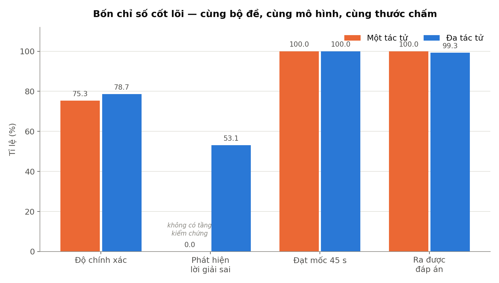
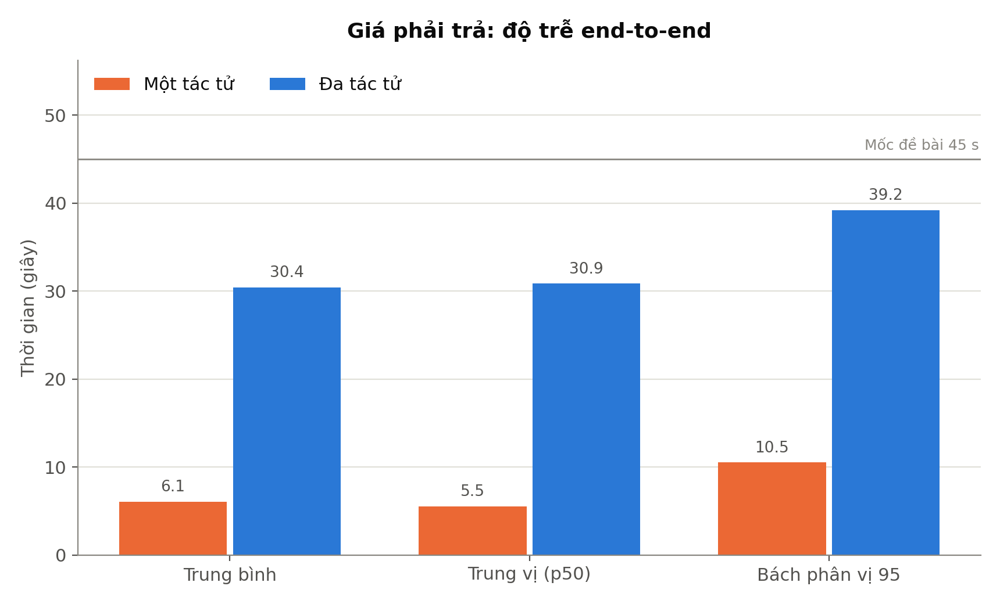
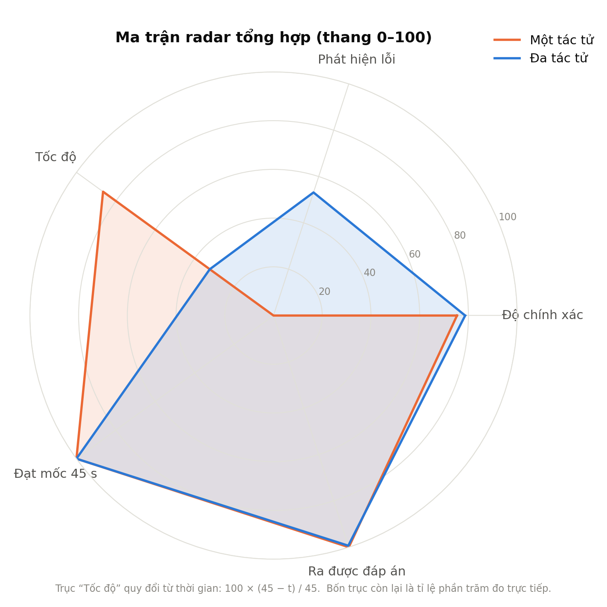
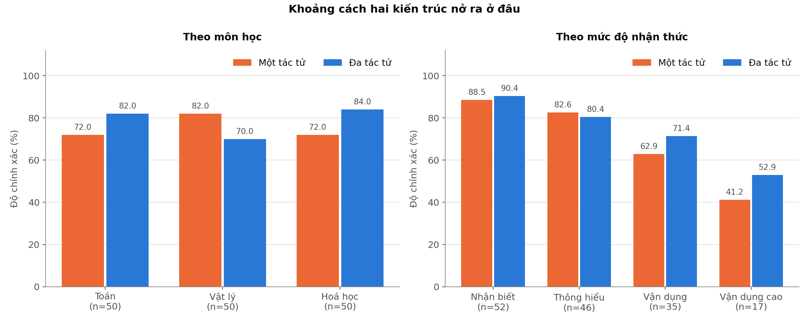
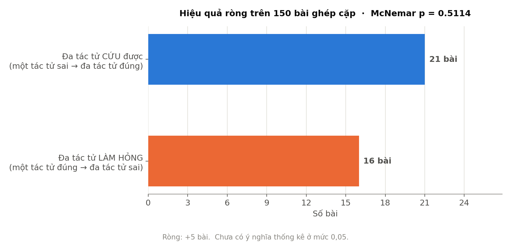

# Đối chứng kiến trúc: MỘT TÁC TỬ vs ĐA TÁC TỬ

*Dựng lúc 12/08/2026 21:16 · 150 bài ghép cặp*

## Nguồn dữ liệu

| Nhánh | Tệp CSV |
|---|---|
| Một tác tử | `moc_nen_json_20260812_210740.csv` |
| Đa tác tử | `ket_qua_sla45_20260809_205118.csv` |

Chỉ đổi **một biến duy nhất là kiến trúc**: cùng mô hình `qwen3:4b`, cùng `temperature`, cùng `num_ctx`, cùng tắt chế độ suy nghĩ, cùng bộ đề, và cùng hàm chấm — `cham()` của `bench.py` được dùng lại trực tiếp cho cả hai nhánh thay vì viết hai bản.

## Bốn chỉ số cốt lõi



| Chỉ số                       Một tác tử | Đa tác tử | Chênh |
|---                         |---:        |---:       ---:    |
| Độ chính xác (%)           | 75.3       | 78.7      | +3.3  |
| Phát hiện lời giải sai (%) | 0.0        | 53.1      | +53.1 |
| Đạt mốc 45 s (%)           | 100.0      | 100.0     | +0.0  |
| Ra được đáp án (%)         | 100.0      | 99.3      | -0.7  |

Dòng *phát hiện lời giải sai* bằng **0 theo kiến tạo** ở mốc nền, không phải do đo kém: một lời gọi LLM đơn lẻ không có đường tính toán độc lập nào để đối chiếu, nên đúng và sai được trả về với cùng một giọng tự tin. Đây là khác biệt về **bản chất**, không phải về mức độ — và là lập luận mạnh nhất của kiến trúc đa tác tử, mạnh hơn vài điểm phần trăm độ chính xác.

## Giá phải trả: độ trễ



| Thống kê thời gian | Một tác tử | Đa tác tử |
|---|---:|---:|
| Trung bình (s) | 6.1 | 30.4 |
| Trung vị p50 (s) | 5.5 | 30.9 |
| Bách phân vị 95 (s) | 10.5 | 39.2 |
| Số lượt gọi LLM mỗi bài | 1 | 4–6 |

Đa tác tử chậm hơn **24.4 giây** mỗi lượt, tức **5.0 lần**. Đây là cái giá của việc chạy thêm Planner, Router, bộ tính lại, Verify và Explain.

## Ma trận radar tổng hợp



Bốn trục là tỉ lệ phần trăm đo trực tiếp. Trục **Tốc độ** quy đổi từ thời gian theo công thức `100 × (45 − t) / 45`, chặn trong [0, 100]; mốc 45 giây là ngân sách đã đăng ký của đề tài chứ không phải hằng số tự đặt.

> Lưu ý khi đọc: diện tích hình radar **không** có ý nghĩa toán học, và đổi thứ tự trục là đổi hẳn hình dạng. Dùng nó để nhìn nhanh hình thái mạnh–yếu, đừng dùng để so hơn kém — việc đó thuộc về các hình cột.

## Khoảng cách nở ra ở đâu



| Môn | Một tác tử | Đa tác tử | Chênh | Số bài |
|---|---:|---:|---:|---:|
| Toán | 72.0% | 82.0% | +10.0 | 50 |
| Vật lý | 82.0% | 70.0% | -12.0 | 50 |
| Hoá học | 72.0% | 84.0% | +12.0 | 50 |

| Mức độ | Một tác tử | Đa tác tử | Chênh | Số bài |
|---|---:|---:|---:|---:|
| Nhận biết | 88.5% | 90.4% | +1.9 | 52 |
| Thông hiểu | 82.6% | 80.4% | -2.2 | 46 |
| Vận dụng | 62.9% | 71.4% | +8.6 | 35 |
| Vận dụng cao | 41.2% | 52.9% | +11.8 | 17 |

## Hiệu quả ròng và kiểm định thống kê



| | Đa tác tử ĐÚNG | Đa tác tử SAI |
|---|---:|---:|
| **Một tác tử ĐÚNG** | 97 | 16 |
| **Một tác tử SAI** | 21 | 16 |

- Đa tác tử **cứu được 21 bài** mà một tác tử làm sai.
- Đa tác tử **làm hỏng 16 bài** mà một tác tử làm đúng.
- Ròng: **+5 bài**.
- **McNemar** (dạng chính xác, hai phía): **p = 0.5114** — **chưa** có ý nghĩa thống kê ở mức 0,05.

Dùng kiểm định ghép cặp chứ không so hai tỉ lệ rời nhau: cùng một bộ đề chạy hai kiến trúc là thiết kế **đo lặp trên cùng đối tượng**. Chỉ hai ô lệch nhau mang thông tin — bài cả hai cùng đúng hay cùng sai không nói gì về việc kiến trúc nào hơn. Dùng bản chính xác thay vì xấp xỉ khi-bình-phương vì số bài lệch chỉ có 37, dưới ngưỡng ≥ 25 mà xấp xỉ đòi hỏi.

> **Đọc trung thực:** chênh lệch quan sát được chưa loại trừ được ngẫu nhiên ở cỡ mẫu này. Cần thêm bài hoặc thêm lượt lặp mới kết luận chắc về độ chính xác. Lưu ý kết luận này **chỉ áp cho độ chính xác** — khác biệt về năng lực tự kiểm chứng không cần kiểm định vì nó đúng theo kiến tạo.

## Cách dựng lại

```bash
cd ViMultiAgent/backend
set VMA_LUU_LOI_GIAI_MAU=0
python scripts/bench_don_le.py --de eval/data/de_giu_rieng.csv \
    --che-do <tho|json> --so-sanh eval/reports/ket_qua_sla45_20260809_205118.csv
python scripts/ve_so_sanh.py --don eval/reports/moc_nen_json_20260812_210740.csv \
    --da eval/reports/ket_qua_sla45_20260809_205118.csv
```