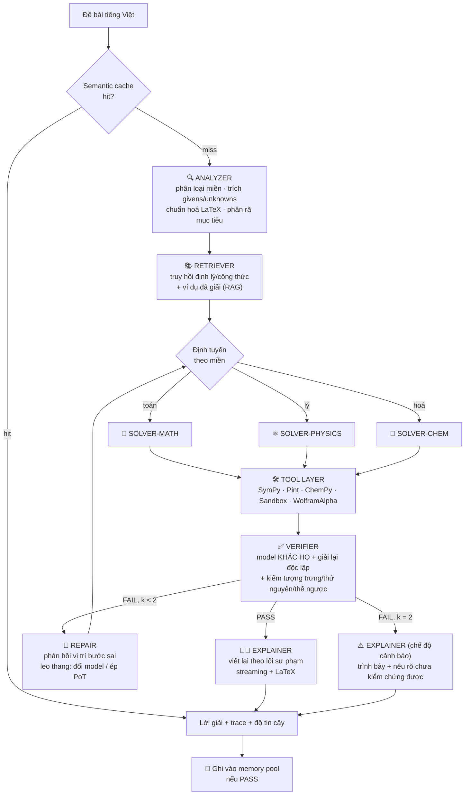

# ViMultiAgent — Bài toán & Kiến trúc triển khai

> Đề tài 19 — Hệ thống Đa Tác tử Giải quyết Bài toán Học thuật STEM Tiếng Việt
> Môn: Học sâu Nâng cao và Ứng dụng — CLO4 — Chuẩn OBE 2024–2025
> Tài liệu này: **phát biểu bài toán, kiến trúc, lựa chọn công nghệ, kế hoạch đánh giá**.

---

## 1. Bài toán

### 1.1 Phát biểu

Xây dựng một hệ thống đa tác tử (multi-agent system) nhận **đề bài STEM tiếng Việt cấp THPT**
(Toán, Vật lý, Hóa học) và trả về **lời giải từng bước có tính sư phạm**, kèm **tín hiệu tự kiểm chứng
độc lập** — tương tự trải nghiệm Khan Academy, nhưng vận hành trên LLM open-source.

Điểm khác biệt so với "hỏi ChatGPT một câu": hệ thống **không tin lời giải của chính nó**. Một tác tử
Kiểm tra độc lập (khác model, khác prompt, có công cụ tính toán tượng trưng) phải xác nhận lời giải
trước khi nó được diễn giải cho học sinh. Nếu không xác nhận được, hệ thống **nói rõ điều đó** thay vì
trình bày một lời giải sai một cách tự tin.

### 1.2 Định nghĩa hình thức

Cho đề bài `q` ở dạng văn bản tiếng Việt (tùy chọn: kèm ảnh hình vẽ — ngoài phạm vi v1).
Hệ thống là một ánh xạ:

```
F(q) -> (a, E, v, c, τ)
```

| Ký hiệu | Ý nghĩa |
|---|---|
| `a` | Đáp án cuối (số + đơn vị, biểu thức ký hiệu, hoặc nhãn A/B/C/D) |
| `E` | Lời giải sư phạm: chuỗi bước `e_1..e_n`, mỗi bước gồm *mục tiêu → kiến thức áp dụng → biến đổi (LaTeX) → tại sao* |
| `v` | Kết luận kiểm chứng ∈ {PASS, FAIL, UNCERTAIN} + vị trí bước sai đầu tiên |
| `c` | Độ tin cậy hiệu chỉnh (calibrated confidence) ∈ [0,1] |
| `τ` | Vết thực thi (agent trace): agent nào chạy, gọi tool gì, tốn bao nhiêu token/giây |

`τ` không phải phụ phẩm — nó là **dữ liệu đo cho toàn bộ phần thực nghiệm của báo cáo**, nên được
thiết kế như một đầu ra hạng nhất ngay từ đầu.

### 1.3 Phạm vi

**Trong phạm vi (v1)**
- Toán THPT: hàm số & khảo sát, mũ–logarit, tích phân, số phức, tổ hợp–xác suất, hình học không gian & tọa độ (Oxyz)
- Vật lý THPT: dao động cơ, sóng cơ, điện xoay chiều, sóng ánh sáng, lượng tử, hạt nhân
- Hóa học THPT: cân bằng phương trình, tính toán mol/stoichiometry, dung dịch–pH, điện phân, hữu cơ (đại cương, este–lipit, amin–amino axit, polime)
- Đề trắc nghiệm 4 lựa chọn **và** đề tự luận yêu cầu đáp số
- Đầu ra tiếng Việt, công thức LaTeX, streaming theo token

**Ngoài phạm vi (v1 — nêu rõ trong báo cáo)**
- Đề có hình vẽ/đồ thị bắt buộc phải nhìn (cần VLM) → v2
- Chứng minh hình học thuần túy dạng suy luận dài (khó chấm tự động)
- Đề đại học/olympiad
- Sinh học, Tin học

### 1.4 Vì sao phải là đa tác tử? (luận điểm cần bảo vệ trong báo cáo)

Đây là câu hỏi hội đồng sẽ hỏi. Ba lý do có thể kiểm chứng bằng thực nghiệm:

1. **Tách sinh khỏi kiểm (generation vs. verification).** Một LLM tự kiểm lời giải của chính nó bị
   thiên lệch xác nhận nghiêm trọng — nó đã "cam kết" với chuỗi suy luận đó. Dùng **model khác họ**
   làm tác tử kiểm tra làm giảm tương quan lỗi. Đây là giả thuyết trung tâm, đo bằng ablation
   *self-verify vs. cross-model verify*.
2. **Tách đúng khỏi dễ hiểu (correctness vs. pedagogy).** Prompt tối ưu cho ra đáp án đúng (ngắn gọn,
   ký hiệu dày đặc, program-of-thought) ngược hoàn toàn với prompt tối ưu cho học sinh lớp 12 hiểu.
   Ép một tác tử làm cả hai thì hỏng cả hai. Tách ra cho phép tối ưu độc lập.
3. **Chuyên biệt hóa miền.** Ràng buộc kiểm tra của Lý (thứ nguyên, dấu, tính vật lý của nghiệm) khác
   hoàn toàn Hóa (bảo toàn nguyên tố/electron) và Toán (điều kiện xác định, nghiệm ngoại lai). Nhồi
   hết vào một system prompt thì loãng; định tuyến theo miền giữ prompt ngắn và sắc.

---

## 2. Kiến trúc hệ thống

### 2.1 Tổng quan luồng



### 2.2 Đặc tả từng tác tử

Mọi tác tử tuân thủ một giao diện chung: **nhận Pydantic model, trả Pydantic model**. Không có tác tử
nào trả về "văn bản tự do" cho tác tử khác — mọi giao tiếp đều qua schema có kiểu. Đây là điểm mượn từ
MetaGPT (structured message + SOP) và là thứ giúp debug/đo lường được.

#### (1) ANALYZER — Tác tử Phân tích đề

- **Vào:** `raw_text: str`
- **Ra:** `ProblemSpec`

```python
class Quantity(BaseModel):
    symbol: str                 # "v_0"
    value: float | None         # 20.0
    unit: str | None            # "m/s"
    description_vi: str         # "vận tốc ban đầu"

class ProblemSpec(BaseModel):
    domain: Literal["math", "physics", "chemistry"]
    subtopic: str                       # "dao_dong_dieu_hoa"
    question_type: Literal["mcq", "numeric", "symbolic", "proof"]
    givens: list[Quantity]
    unknowns: list[Quantity]
    constraints: list[str]              # "x > 0", "phản ứng hoàn toàn"
    choices: dict[str, str] | None      # {"A": "...", ...}
    normalized_latex: str
    subgoals: list[str]                 # phân rã bài toán
    ambiguity_flags: list[str]          # đề thiếu dữ kiện / mơ hồ
    confidence: float
```

- **Chiến lược:** structured output (JSON schema constrained decoding), few-shot 6 ví dụ trải đều 3 miền.
- **Vì sao quan trọng:** đây là nơi lỗi rẻ nhất để sửa. Đọc sai đơn vị (`cm` vs `m`) ở bước này làm hỏng
  toàn bộ pipeline phía sau. `ambiguity_flags` cho phép hệ thống hỏi lại học sinh thay vì đoán bừa.

#### (2) RETRIEVER — Truy hồi bộ nhớ

- **Vào:** `ProblemSpec` → **Ra:** `list[KnowledgeChunk]`, `list[SolvedExample]`
- Hai kho tách biệt:
  - **Theorem/Formula DB**: công thức & định lý THPT, viết tay dạng Markdown có metadata
    (`domain`, `subtopic`, `applicable_when`, `pitfalls`). Khoảng 300–500 chunk là đủ phủ chương trình.
  - **Solved-example pool**: các bài đã giải **và đã PASS verifier** → dùng làm few-shot động.
    Kho này **tự lớn lên theo thời gian sử dụng** (đây là "memory pool" trong đề bài, và là một
    điểm kể chuyện tốt trong báo cáo: hệ thống cải thiện mà không cần fine-tune).
- **Truy hồi lai (hybrid):** dense (embedding) + sparse (BM25) + lọc metadata theo `subtopic`.
  Lọc metadata quan trọng hơn người ta tưởng: nó chặn việc lôi công thức Hóa vào bài Lý.

#### (3) SOLVER-{MATH, PHYSICS, CHEM} — Tác tử Giải chuyên ngành

- **Vào:** `ProblemSpec` + tri thức truy hồi + (nếu là lần sửa) `VerificationReport`
- **Ra:** `Solution`

```python
class SolutionStep(BaseModel):
    id: int
    goal_vi: str                    # "Tính chu kỳ dao động"
    knowledge_ref: list[str]        # id chunk đã dùng → truy vết được
    expression_latex: str
    tool_calls: list[ToolCall]
    result_latex: str
    justification_vi: str

class Solution(BaseModel):
    steps: list[SolutionStep]
    final_answer: str
    final_answer_latex: str
    mcq_choice: str | None
    unit: str | None
    self_confidence: float
```

- **Chiến lược lai CoT + PoT:** LLM lập luận bằng ngôn ngữ để *chọn hướng*, nhưng **mọi phép biến đổi
  đại số/số học đều đẩy xuống SymPy**. LLM sinh code, sandbox chạy, kết quả quay lại. Nguyên tắc:
  *LLM quyết định làm gì; công cụ quyết định kết quả là bao nhiêu*.
- **Ràng buộc riêng từng miền** (nằm trong system prompt):
  - Toán: luôn nêu điều kiện xác định; kiểm nghiệm ngoại lai; với MCQ được phép thế ngược đáp án.
  - Lý: bắt buộc phân tích thứ nguyên; kiểm tính hợp lý vật lý (`m > 0`, `|cos φ| ≤ 1`, năng lượng không âm).
  - Hóa: bảo toàn nguyên tố & điện tích; cân bằng phương trình bằng ChemPy trước khi tính mol.

#### (4) VERIFIER — Tác tử Kiểm tra

Trái tim của tính "đột phá" mà đề bài yêu cầu. Ba tầng kiểm tra:

| Tầng | Cơ chế | Không cần LLM? |
|---|---|---|
| **T1 — Tất định** | SymPy: thế nghiệm vào phương trình gốc; kiểm tương đương biểu thức; Pint: khớp thứ nguyên; ChemPy: bảo toàn nguyên tố | ✅ rẻ, tin cậy tuyệt đối |
| **T2 — Giải lại độc lập** | Model **khác họ** với Solver, **không thấy** lời giải cũ, chỉ thấy đề. So khớp đáp án. | ❌ |
| **T3 — Soát từng bước** | Model khác họ, thấy lời giải, chỉ ra **bước sai đầu tiên** + lý do | ❌ |

```python
class VerificationReport(BaseModel):
    verdict: Literal["PASS", "FAIL", "UNCERTAIN"]
    items: list[VerdictItem]            # từng check T1/T2/T3
    first_error_step: int | None
    suggested_fix_vi: str | None
    independent_answer: str | None
    agreement: bool                     # T2 có khớp Solver không
```

- **Quy tắc hợp nhất:** T1 fail → FAIL ngay (không cần gọi LLM, tiết kiệm cả latency lẫn tiền).
  T1 pass + T2 khớp + T3 không tìm ra lỗi → PASS. Còn lại → UNCERTAIN/FAIL.
- **Yêu cầu cứng: Verifier phải khác model với Solver.** Nếu dùng cùng model, ta chỉ đang đo mức độ
  một model đồng ý với chính nó. Ablation này phải có trong báo cáo.

#### (5) EXPLAINER — Tác tử Sinh bài giải sư phạm

- **Vào:** `Solution` (đã PASS) + `ProblemSpec` + `VerificationReport`
- **Ra:** `Explanation`, **stream theo token**

Khuôn sư phạm cố định (Khan Academy style):

```
1. Đề bài yêu cầu gì?          — diễn đạt lại bằng lời, không ký hiệu
2. Kiến thức cần dùng           — công thức/định lý + trực giác vì sao nó áp dụng được ở đây
3. Các bước giải                — mỗi bước: LÀM GÌ → PHÉP TÍNH (LaTeX) → VÌ SAO
4. Đáp án                       — kèm đơn vị, và câu kiểm tra hợp lý ("v = 340 m/s, hợp lý vì...")
5. Lỗi thường gặp               — cái bẫy của bài này
6. Bài tương tự để luyện        — tùy chọn
```

- **Ràng buộc ngôn ngữ:** tiếng Việt phổ thông cấp 3, câu ngắn, không dùng "chúng ta có thể thấy rằng
  hiển nhiên...". Thuật ngữ toán phải là tiếng Việt chuẩn SGK ("đạo hàm", "nguyên hàm", "cực trị" —
  không phải "derivative").
- **Explainer không được phép thay đổi đáp số.** Nó chỉ diễn giải. Ràng buộc này được kiểm bằng
  assertion sau khi sinh: đáp án trong `Explanation` phải khớp `Solution.final_answer`.

### 2.3 Vòng lặp Verify–Repair (leo thang có kiểm soát)

```
k=0: Solver (nhiệt độ thấp) ──► Verifier
       └── FAIL ──► k=1: Solver + phản hồi "sai từ bước i vì ..." , ép dùng SymPy
                        └── FAIL ──► k=2: ĐỔI SANG MODEL KHÁC, ép Program-of-Thought thuần
                                          └── FAIL ──► trả về + gắn nhãn ⚠️ CHƯA KIỂM CHỨNG ĐƯỢC
```

Trần `k=2` là quyết định về ngân sách độ trễ, không phải con số tùy tiện: mỗi vòng thêm ~2 lượt gọi LLM.
Việc **trả về kèm cảnh báo thay vì giấu** là lựa chọn thiết kế có chủ đích — với sản phẩm giáo dục,
trình bày một lời giải sai một cách tự tin gây hại hơn là thừa nhận không chắc.

### 2.4 Ba chế độ vận hành (đánh đổi độ chính xác ↔ độ trễ)

| Chế độ | Luồng | Ước tính độ trễ | Dùng khi |
|---|---|---|---|
| `fast` | Analyzer → Solver → T1 → Explainer | ~8–12 s | demo trực tiếp, máy yếu |
| `balanced` *(mặc định)* | Đầy đủ, 1 vòng repair | ~15–30 s | vận hành thường |
| `rigorous` | Solver ×3 self-consistency + T1+T2+T3, 2 vòng repair | ~45–90 s | chạy benchmark, bài khó |

KPI của đề bài (**≤ 45 s**) đo ở chế độ `balanced`.

---

## 3. Lựa chọn công nghệ

### 3.1 Ràng buộc phần cứng — điểm quyết định

Máy phát triển: **RTX 3060 Laptop, 6 GB VRAM**. Đây là ràng buộc chi phối:

| Phương án | Vừa 6GB? | Thông lượng | Đạt SLA 45s? |
|---|---|---|---|
| Qwen2.5-7B-Instruct Q4_K_M (Ollama) | ~4.7 GB — vừa, ctx ≤ 8k | ~18–25 tok/s | ❌ pipeline cần ~2.200 token sinh → **~110 s** |
| Qwen2.5-3B Q4 (Ollama) | ~2.2 GB — thoải mái | ~45 tok/s | ⚠️ ~55 s, nhưng chất lượng suy luận toán tụt mạnh |
| Model open-source qua API (Groq/Together/OpenRouter) | không dùng VRAM | 200–800 tok/s | ✅ **5–15 s** |

**Kết luận:** kiến trúc phải **trung lập với nhà cung cấp**. Một lớp `LLMProvider` trừu tượng, cấu hình
bằng YAML, cho phép cùng một đồ thị tác tử chạy trên Ollama cục bộ (miễn phí, offline, bảo vệ demo khi
mất mạng) hoặc trên API model open-source (đạt KPI độ trễ, chạy benchmark quy mô lớn).
Đây không phải chỗ để thỏa hiệp — hard-code một provider sẽ khóa chết dự án.

> Lưu ý: dùng API để phục vụ **model open-source** (Qwen, Llama, DeepSeek…) vẫn thỏa mãn yêu cầu
> "dựa trên LLM open-source" của đề bài — trọng số mở, có thể tự host. Cần nêu rõ điều này trong báo cáo.

### 3.2 Bảng công nghệ

| Lớp | Chọn | Lý do |
|---|---|---|
| **Điều phối** | **LangGraph** | Đồ thị trạng thái tường minh → vòng lặp repair có điều kiện, trần lặp, checkpoint, streaming từng node. Đo được độ trễ per-agent (cần cho báo cáo). Kiểm soát tốt hơn hẳn hội thoại tự do. |
| **So sánh** | **AutoGen** (`autogen-agentchat`) | Cài đặt **một biến thể GroupChat** làm baseline. Cho phép báo cáo có bảng *SOP-graph vs. free-form GroupChat* — biến yêu cầu "tham khảo AutoGen" của đề thành một kết quả thực nghiệm. |
| **Cảm hứng MetaGPT** | Áp dụng khái niệm, không dùng thư viện | MetaGPT hard-code SOP cho quy trình phát triển phần mềm (PRD → design → code). Ta mượn **role specialization + structured message + SOP tuần tự**, cài đặt lại trên LangGraph. Nêu rõ trong báo cáo là *MetaGPT-inspired*. |
| **LLM cục bộ** | **Ollama** | Cài đặt một lệnh trên Windows, quản lý model tốt, API tương thích OpenAI → dùng chung code với provider API. |
| **LLM qua API** | **Groq** (chính) / **Together AI** / **OpenRouter** | Groq: thông lượng cực cao → gánh KPI độ trễ. Together/OpenRouter: nhiều model open-source hơn để đa dạng hóa Verifier. Có tier miễn phí cho sinh viên. |
| **Hợp đồng dữ liệu** | **Pydantic v2** + structured output | Mọi thông điệp giữa tác tử có kiểu và được validate. Sai schema → retry có kiểm soát, không lan lỗi. |
| **Tính toán tượng trưng** | **SymPy** | Giải/rút gọn/đạo hàm/tích phân, và quan trọng nhất: **kiểm chứng bằng thế ngược**. |
| **Đơn vị & thứ nguyên** | **Pint** | Bắt lỗi đơn vị của Vật lý một cách tất định — không tốn token nào. |
| **Hóa học** | **ChemPy** + **periodictable** | Cân bằng phương trình, khối lượng mol, stoichiometry. |
| **Sandbox code** | subprocess cô lập: timeout 5 s, tắt mạng, giới hạn bộ nhớ, whitelist import | LLM sinh code thì phải coi là mã không tin cậy. Không `exec()` trần. |
| **API ngoài (tùy chọn)** | **WolframAlpha** | Đối chứng thứ ba cho bài khó. Tier miễn phí ~2.000 lượt/tháng. Bật/tắt bằng cấu hình vì phụ thuộc mạng. |
| **Embedding** | **BAAI/bge-m3** hoặc `bkai-foundation-models/vietnamese-bi-encoder` | bge-m3: đa ngữ mạnh, hỗ trợ dense+sparse trong một model, ~2.2 GB VRAM — vừa máy. Bi-encoder Việt: nhẹ hơn, chuyên tiếng Việt. Benchmark cả hai trên tập truy hồi tự dựng rồi chốt. |
| **Vector DB** | **Qdrant** (docker) | Hybrid search (dense + sparse) + lọc payload theo `subtopic` sẵn có. ChromaDB là phương án dự phòng nếu không muốn chạy docker. |
| **Backend** | **FastAPI** + **SSE** | Async, tích hợp Pydantic tự nhiên. SSE đủ cho streaming một chiều và đơn giản hơn WebSocket nhiều. |
| **Frontend** | **Next.js 15 + React 19 + Tailwind + shadcn/ui** | Node 22 đã có sẵn. Hiển thị **timeline tác tử** trực quan lúc demo — nhìn thấy được "đa tác tử" là điểm cộng lớn khi bảo vệ. |
| **Render LaTeX** | **KaTeX** (`rehype-katex` + `remark-math`) | Nhanh hơn MathJax, đủ dùng, render mượt khi đang stream. |
| **Quan trắc** | **Langfuse** (self-host docker) | Trace từng agent/tool, token, chi phí, độ trễ. **Xuất thẳng ra số liệu cho báo cáo.** Open-source, đúng tinh thần đề tài. |
| **Đánh giá** | Bộ eval tự viết + `math-verify`/SymPy + LLM-as-judge | Cần kiểm soát chi tiết metric để khớp đúng 4 KPI của đề. |
| **Quản lý gói** | **uv** | Nhanh hơn pip nhiều, lock ổn định. |
| **Kiểm thử** | pytest + `pytest-asyncio` | Tối thiểu: schema contract, tool, và bộ hồi quy 30 bài vàng. |

### 3.3 Sổ đăng ký model (`configs/models.yaml` — phác thảo)

Nguyên tắc: **Solver và Verifier không bao giờ cùng họ model.**

```yaml
profiles:
  cloud_default:
    analyzer:  { provider: groq,     model: qwen-3-32b,                temp: 0.0 }
    solver_math:
               { provider: together, model: Qwen/Qwen2.5-72B-Instruct, temp: 0.2 }
    solver_physics:
               { provider: together, model: Qwen/Qwen2.5-72B-Instruct, temp: 0.2 }
    solver_chem:
               { provider: together, model: Qwen/Qwen2.5-72B-Instruct, temp: 0.2 }
    verifier:  { provider: groq,     model: llama-3.3-70b-versatile,   temp: 0.0 }   # KHÁC HỌ
    explainer: { provider: groq,     model: qwen-3-32b,                temp: 0.6 }

  local_offline:            # dự phòng khi mất mạng / demo offline, chế độ `fast`
    analyzer:  { provider: ollama, model: qwen2.5:3b-instruct-q4_K_M }
    solver_*:  { provider: ollama, model: qwen2.5:7b-instruct-q4_K_M }
    verifier:  { provider: ollama, model: llama3.1:8b-instruct-q4_K_M }
    explainer: { provider: ollama, model: qwen2.5:7b-instruct-q4_K_M }
```

> Tên model cụ thể **phải kiểm chứng lại tại thời điểm cài đặt** (danh mục của nhà cung cấp thay đổi
> liên tục). Lớp provider được thiết kế để đổi tên model chỉ bằng sửa YAML, không sửa code.

---

## 4. Dữ liệu & Kế hoạch đánh giá

### 4.1 Nguồn dữ liệu

| Nguồn | Vai trò | Ghi chú |
|---|---|---|
| **VNHSGE** (arXiv 2305.12199) | Tập đánh giá chính | Đề thi THPT Quốc gia, có Toán/Lý/Hóa, đúng miền đề tài |
| **VMLU** (vmlu.ai) — subset STEM | Đánh giá bổ sung | Trắc nghiệm, dễ chấm tự động |
| **Đề thi THPT QG 2017–2025** | Tập kiểm định giữ kín (held-out) | Tự số hóa ~300 câu, đảm bảo không rò rỉ vào few-shot |
| **Theorem/Formula KB** | Bộ nhớ truy hồi | Tự viết 300–500 chunk theo SGK |
| **Solved-example pool** | Few-shot động | Sinh ra từ chính hệ thống, chỉ giữ bài PASS |

Cần kiểm tra giấy phép của VNHSGE/VMLU trước khi đưa vào repo; nếu hạn chế thì chỉ để script tải.

### 4.2 Metric ↔ KPI của đề bài

| KPI đề bài | Cách đo |
|---|---|
| **Accuracy > 75%** | MCQ: exact match nhãn. Tự luận: tương đương tượng trưng bằng SymPy + dung sai số 1e-3, có chuẩn hóa đơn vị. Báo cáo tách theo môn + theo chủ đề. |
| **Explanation quality ≥ 4/5** (Likert 5, 10 giám khảo) | Hai tầng: (a) **LLM-as-judge** trên toàn bộ tập, rubric 5 tiêu chí — đúng, đủ bước, rõ ràng, sư phạm, định dạng; (b) **người chấm** 50 mẫu × 3 người, báo cáo **Krippendorff α** và tương quan với LLM-judge để chứng minh judge đáng tin. |
| **Verification rate ≥ 85%** | **Mutation testing**: lấy N lời giải đúng, tiêm lỗi có kiểm soát (sai dấu, sai đơn vị, dùng nhầm công thức, sai số học, bỏ điều kiện) → đo **recall** của Verifier. Đồng thời đo **precision** trên lời giải đúng để không thổi phồng bằng cách báo sai bừa. Báo cáo F1. |
| **Latency ≤ 45 s** | p50/p95 end-to-end + **phân rã theo từng agent** từ Langfuse. Báo cáo cả TTFT (thời gian tới token đầu của Explainer) vì đó mới là độ trễ người dùng *cảm nhận*. |

### 4.3 Ablation (chính là bảng kết quả của báo cáo)

| # | Cấu hình | Câu hỏi trả lời |
|---|---|---|
| A0 | Single-agent CoT | Baseline trần |
| A1 | CoT + Self-Consistency (n=5) | Đa tác tử có hơn "chỉ cần lấy mẫu nhiều lần"? |
| A2 | Đủ hệ, **bỏ Verifier** | Verifier đóng góp bao nhiêu điểm accuracy? |
| A3 | Đủ hệ, **Verifier cùng model với Solver** | **Giả thuyết trung tâm**: khác họ model có thật sự tốt hơn? |
| A4 | Đủ hệ, **bỏ tool** (không SymPy/Pint) | Tool đóng góp bao nhiêu? |
| A5 | Đủ hệ, **bỏ RAG** | Memory pool đóng góp bao nhiêu? |
| A6 | **AutoGen GroupChat** (tự do) | SOP có kiểm soát vs. hội thoại tự do |
| A7 | **Hệ đầy đủ** | Kết quả cuối |

A3 là thí nghiệm đắt giá nhất về mặt học thuật — nó là thứ biến đề tài từ "ghép thư viện" thành
"có đóng góp kiểm chứng được".

### 4.4 Về tuyên bố "đầu tiên tại Việt Nam"

Đề bài ghi tính đột phá là *"đầu tiên tại Việt Nam có cơ chế self-verification bằng tác tử độc lập"*.
Trong báo cáo nên **làm nhẹ tuyên bố này** thành *"theo hiểu biết của chúng tôi, chưa tìm thấy công bố
tiếng Việt nào..."* kèm một mục related-work có khảo sát thật. Hội đồng sẽ vặn tuyên bố tuyệt đối;
tuyên bố có giới hạn thì không thể bị bác.

---

## 5. Cấu trúc repo dự kiến

```
ViMultiAgent/
├── README.md
├── pyproject.toml                 # uv
├── .env.example
├── docker-compose.yml             # qdrant + langfuse
├── configs/
│   ├── models.yaml                # sổ đăng ký & định tuyến model
│   ├── agents.yaml                # tham số + đường dẫn prompt
│   └── app.yaml                   # chế độ fast/balanced/rigorous
├── vimultiagent/
│   ├── core/       schemas.py · llm.py (provider abstraction) · config.py · tracing.py
│   │               prompts/  (jinja2, tiếng Việt, tách theo agent & miền)
│   ├── agents/     analyzer · retriever · solver_{math,physics,chem} · verifier · explainer
│   ├── graph/      state.py · build.py (LangGraph) · policies.py (repair, budget)
│   ├── tools/      sympy_tool · units_tool · chem_tool · wolfram_tool · sandbox
│   ├── memory/     vectorstore · kb_ingest · semantic_cache · data/knowledge/*.md
│   ├── baselines/  single_cot · self_consistency · autogen_groupchat
│   └── api/        main.py (FastAPI) · routes_solve.py (SSE) · schemas_io.py
├── eval/
│   ├── datasets/   loaders/ · vnhsge/ · vmlu/ · heldout/
│   ├── metrics/    answer_match · llm_judge · verifier_prf · latency
│   ├── mutations/  bộ sinh lỗi cho mutation testing
│   ├── run_bench.py
│   └── reports/    bảng + hình cho báo cáo
├── frontend/       Next.js 15 (chat · agent timeline · KaTeX · streaming)
├── scripts/        download_data · ingest_kb · warmup_ollama
├── notebooks/      phân tích lỗi, vẽ hình cho báo cáo
└── tests/          contract · tools · 30 bài vàng hồi quy
```

---

## 6. Lộ trình 8 tuần

| Tuần | Mục tiêu | Mốc kiểm chứng được |
|---|---|---|
| 1 | Khung dự án, schema, lớp LLM provider, **baseline CoT + bộ eval** | **Có con số accuracy baseline** — làm sớm nhất, mọi thứ sau đó so với nó |
| 2 | Analyzer + Explainer, FastAPI SSE, khung frontend | Demo end-to-end chạy được (chưa verify) |
| 3 | Tool layer + sandbox, test kỹ | SymPy/Pint/ChemPy đạt test tool |
| 4 | Solver 3 miền + CoT/PoT lai | Accuracy vượt baseline |
| 5 | **Verifier 3 tầng + vòng repair** | Recall trên tập mutation |
| 6 | Memory pool (RAG + semantic cache) | Đo lợi ích truy hồi & tỉ lệ cache hit |
| 7 | **Chạy toàn bộ ablation + LLM-judge + chấm người** | Bảng kết quả hoàn chỉnh |
| 8 | Hoàn thiện frontend, báo cáo, video demo | Nộp |

Điểm mấu chốt: **bộ đánh giá phải xong ở tuần 1**, trước cả các tác tử. Không có nó thì mọi thay đổi
sau này chỉ là cảm tính, và đến tuần 7 sẽ không kịp chạy lại toàn bộ thí nghiệm.

---

## 7. Rủi ro & đối sách

| Rủi ro | Mức | Đối sách |
|---|---|---|
| 6 GB VRAM không chạy nổi model đủ mạnh | **Cao** | Lớp provider trung lập; dùng API model open-source cho benchmark, Ollama cho demo offline |
| Không đạt SLA 45 s | Cao | Provider thông lượng cao; semantic cache; chạy song song T1/T2 của Verifier; stream Explainer để giảm TTFT cảm nhận |
| Rò rỉ dữ liệu (đề thi có trong pretraining) | **Cao** | Giữ một tập held-out đề 2025; báo cáo riêng; thử biến thể đổi số của cùng bài để phát hiện ghi nhớ |
| LLM-judge thiên vị | Trung bình | Đối chiếu với người chấm, báo cáo hệ số tương quan; dùng model judge khác họ với model sinh |
| Sandbox chạy code không an toàn | Trung bình | Tiến trình riêng, timeout, tắt mạng, whitelist import, giới hạn bộ nhớ |
| Chất lượng tiếng Việt của model kém | Trung bình | Explainer dùng model mạnh tiếng Việt; đưa thuật ngữ SGK vào prompt; có bước hậu kiểm thuật ngữ |
| Hết quota API | Trung bình | Nhiều provider trong sổ đăng ký + tự động chuyển; cache mọi lần gọi khi chạy benchmark |
| Phạm vi phình to | Trung bình | Chốt v1 ở 3 môn, không hình ảnh; mọi thứ khác ghi vào "hướng phát triển" |

---

## 8. Bước tiếp theo

1. Chốt các lựa chọn ở mục 3 (hoặc chỉnh theo ý kiến giảng viên/nhóm).
2. Dựng khung repo + `schemas.py` + `llm.py` + baseline + bộ eval (mốc tuần 1).
3. Đăng ký key Groq/Together, tải model Ollama dự phòng, dựng docker Qdrant + Langfuse.
