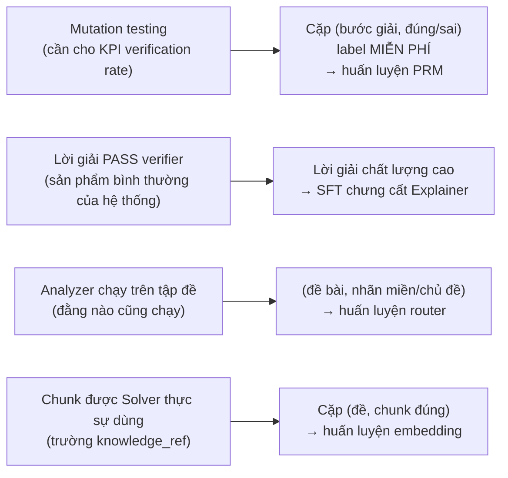

# ViMultiAgent — Có cần huấn luyện mô hình không?

> Tài liệu bổ sung cho [01-problem-and-architecture.md](./01-problem-and-architecture.md)

---

## 0. Trả lời ngắn

| Câu hỏi | Trả lời |
|---|---|
| Hệ thống có **chạy được** mà không train gì không? | **Có.** Prompt + tool + RAG trên model open-source là đủ để đạt cả 4 KPI. |
| Có **nên** train không? | **Nên.** Đây là môn *Học sâu Nâng cao* (CLO4). Dự án thuần điều phối sẽ bị vặn "phần học sâu ở đâu?". |
| Train có phá kiến trúc hiện tại không? | **Không.** Cả 4 phương án dưới đây đều *cắm vào* kiến trúc đã thiết kế như một tầng bổ sung, không thay thế gì. |
| Lấy dữ liệu huấn luyện ở đâu? | **Từ chính hệ thống.** Xem mục 1 — đây là điểm quan trọng nhất của tài liệu này. |

---

## 1. Dữ liệu huấn luyện đã có sẵn trong thiết kế

Đây là lý do việc thêm thành phần huấn luyện rẻ hơn nhiều so với cảm giác ban đầu.
Ba nguồn dữ liệu **không tốn công gán nhãn tay**, vì chúng là sản phẩm phụ của những thứ dự án đã phải làm:



Trường `knowledge_ref` trong `SolutionStep` và bộ sinh mutation trong `eval/mutations/` không phải chi
tiết trang trí — chúng được đặt vào thiết kế chính là để mở đường cho phần huấn luyện này.

---

## 2. Bốn phương án, xếp theo tỉ lệ (giá trị / công sức)

### ⭐ Phương án C — **ViSTEM-PRM: Process Reward Model kiểm tra bước giải**
**Khuyến nghị làm đầu tiên. Đây là thành phần học sâu có giá trị học thuật cao nhất.**

- **Là gì:** một mô hình phân loại nhỏ nhận `(đề bài, các bước giải tới bước i)` → dự đoán bước `i`
  **đúng hay sai**. Tức là một *process reward model* cho toán/lý/hóa tiếng Việt.
- **Cắm vào đâu:** trở thành **tầng T0 của Verifier**, chạy *trước* T1/T2/T3.
  Một forward pass ~30 ms thay cho một lượt gọi LLM ~2–4 s. Bài nào PRM tự tin là sai → đẩy thẳng
  vào vòng repair, không cần gọi LLM verifier.
- **Dữ liệu:** từ mutation testing. Lấy N lời giải đã PASS (nhãn 1), tiêm lỗi có kiểm soát ở bước
  ngẫu nhiên (nhãn 0 từ bước bị tiêm trở đi). 5 loại lỗi: sai dấu · sai/thiếu đơn vị · dùng nhầm công
  thức · sai số học · bỏ điều kiện xác định. **~10.000–20.000 mẫu bước-level sinh tự động.**
- **Mô hình:** `vinai/phobert-base-v2` (135M) hoặc `xlm-roberta-base` cho token LaTeX tốt hơn.
  Cân nhắc `Qwen2.5-0.5B` + LoRA nếu cần hiểu biểu thức dài.
- **VRAM:** ~3 GB (PhoBERT-base, AMP fp16, batch 32, seq 256) → **thoải mái trên 6 GB**.
- **Kết quả báo cáo:**
  - Bảng P/R/F1 của PRM so với LLM-verifier, tách theo **loại lỗi** (PRM bắt tốt lỗi đơn vị? kém lỗi logic?)
  - Đường cong precision–recall theo ngưỡng → chọn ngưỡng vận hành
  - **Độ trễ tiết kiệm được** khi PRM lọc trước
  - Ablation A3 mở rộng: LLM-verify vs. PRM vs. PRM+LLM
- **Vì sao mạnh:** nó *chính là* điểm đột phá mà đề bài tuyên bố (self-verification bằng tác tử độc
  lập), nhưng được nâng từ "prompt một model khác" thành "huấn luyện một model chuyên dụng".
  Có thể publish weights lên HuggingFace như một đóng góp phụ.

---

### ⭐ Phương án B — **Router phân loại đề bài** (rẻ nhất, có lãi ngay)

- **Là gì:** phân loại đa nhãn `(domain, subtopic, question_type)` từ text đề bài.
- **Cắm vào đâu:** thay phần *phân loại* của Analyzer. Analyzer LLM chỉ còn lo trích xuất
  givens/unknowns; việc định tuyến do classifier lo.
- **Lợi ích thật (không chỉ để có "phần deep learning"):** cắt ~1 lượt gọi LLM khỏi đường găng.
  Forward pass ~20 ms so với ~2 s → **đóng góp trực tiếp vào KPI độ trễ 45 s**.
- **Dữ liệu:** ~3.000–5.000 đề gán nhãn tự động bằng model mạnh, kiểm tay ~300 mẫu để đo chất lượng nhãn.
- **Mô hình:** `vinai/phobert-base-v2` fine-tune.
- **VRAM:** ~2–3 GB → **rất dễ**.
- **Kết quả báo cáo:** accuracy/macro-F1 per nhãn, confusion matrix (chủ đề nào hay lẫn — ví dụ
  "dao động cơ" vs "sóng cơ"), latency trước/sau.
- **Công sức:** thấp nhất trong 4 phương án. Làm trong 2–3 ngày.

---

### Phương án A — **Fine-tune embedding cho truy hồi STEM tiếng Việt**

- **Là gì:** contrastive learning để đề bài tiếng Việt "gần" đúng chunk công thức cần dùng.
- **Vì sao cần:** embedding đa ngữ sẵn có không biết rằng *"con lắc lò xo dao động điều hòa"* phải
  gần với công thức `T = 2π√(m/k)`. Đây là khoảng cách miền (domain gap) có thật và đo được.
- **Dữ liệu:** cặp `(đề bài, chunk trong knowledge_ref)` — lấy từ các lời giải PASS. Negative:
  in-batch + **hard negative** (chunk cùng môn khác chủ đề — đây mới là phần khó và đáng viết trong báo cáo).
- **Mô hình:** `bkai-foundation-models/vietnamese-bi-encoder` (135M) với `MultipleNegativesRankingLoss`
  (sentence-transformers). Giữ `bge-m3` đóng băng làm baseline so sánh.
- **VRAM:** ~3–4 GB (batch 16, seq 256) → **vừa**.
- **Kết quả báo cáo:** Recall@1/5/10, MRR, nDCG trước/sau fine-tune; và quan trọng hơn — **accuracy
  end-to-end của hệ thống** thay đổi bao nhiêu khi truy hồi tốt lên.
- **Công sức:** trung bình. Phụ thuộc chất lượng KB tự viết.

---

### 🎯 Phương án D — **Chưng cất Explainer xuống 3B chạy local** (tham vọng nhất)

- **Là gì:** knowledge distillation. Dùng model lớn (72B qua API) sinh lời giải sư phạm chất lượng cao,
  **chỉ giữ những bài đã PASS verifier**, rồi SFT một model 3B để bắt chước.
- **Vì sao Explainer là ứng viên đúng (không phải Solver):** Explainer **không cần suy luận toán** —
  đáp án và các bước đã có sẵn, nó chỉ diễn đạt lại theo khuôn sư phạm tiếng Việt. Đây là tác vụ
  *sinh văn bản có ràng buộc*, thứ mà model nhỏ học rất tốt qua SFT. Solver thì ngược lại — chưng cất
  năng lực suy luận toán xuống 3B sẽ hỏng.
- **Phần thưởng lớn nhất:** nếu thành công, Explainer chạy **local trên chính RTX 3060 6GB**
  → cắt được lượt gọi API tốn thời gian nhất (Explainer sinh nhiều token nhất, ~800), giảm chi phí,
  và có một câu chuyện demo rất mạnh: *"tác tử sư phạm chạy offline trên laptop sinh viên"*.
- **Dữ liệu:** 5.000–10.000 `(Solution + ProblemSpec) → Explanation` đã qua verifier.
- **Mô hình & cấu hình:** `Qwen2.5-3B-Instruct` + **QLoRA 4-bit**, LoRA r=16, seq 2048, batch 1 +
  grad accumulation 16, gradient checkpointing, `paged_adamw_8bit`.
- **VRAM ước tính:**

  | Model | Cấu hình | VRAM | Kết luận |
  |---|---|---|---|
  | Qwen2.5-1.5B | QLoRA 4-bit, seq 2048 | ~3 GB | ✅ thoải mái |
  | **Qwen2.5-3B** | **QLoRA 4-bit, seq 2048** | **~4 GB** | ✅ **điểm ngọt** |
  | Qwen2.5-7B | QLoRA 4-bit, seq 1024 | ~5.7 GB | ⚠️ sát nút, dễ OOM lúc eval |

- **Kết quả báo cáo:** điểm LLM-judge + người chấm của *3B-đã-chưng-cất* vs *3B-gốc* vs *72B-giáo-viên*.
  Kèm bảng độ trễ & chi phí. Nếu 3B đạt ≥ 90% chất lượng của 72B ở tác vụ diễn giải → đó là kết quả đắt giá.
- **Rủi ro:** cao nhất trong 4 phương án. Chỉ làm khi B và C đã xong.

---

## 3. Khuyến nghị chốt

| Ưu tiên | Phương án | Công sức | Lý do chọn |
|---|---|---|---|
| **1** | **C — PRM verifier** | Trung bình | Chính là điểm đột phá của đề tài, nâng từ prompt lên model huấn luyện. Dữ liệu miễn phí từ mutation testing. |
| **2** | **B — Router classifier** | Thấp | Rẻ nhất, đồng thời **cải thiện thật** KPI độ trễ. Không có lý do gì để bỏ. |
| **3** | **A — Embedding** | Trung bình | Làm nếu đo thấy truy hồi đang là nút thắt (Recall@5 thấp). |
| **4** | **D — Chưng cất Explainer** | Cao | Điểm cộng lớn khi bảo vệ, nhưng chỉ làm khi còn thời gian. |

**Tối thiểu để an toàn về mặt môn học: B + C.** Hai cái này cộng lại đã cho 2 mô hình được huấn luyện,
2 bảng kết quả trước/sau, và cả hai đều *cải thiện hệ thống thật* chứ không phải gắn vào cho có.

---

## 4. Lộ trình cập nhật (chèn phần huấn luyện vào 8 tuần)

Thay đổi so với lộ trình ở tài liệu 01 — in **đậm** là phần mới:

| Tuần | Mục tiêu |
|---|---|
| 1 | Khung dự án, schema, LLM provider, baseline CoT + **bộ eval** |
| 2 | Analyzer + Explainer, FastAPI SSE, khung frontend |
| 3 | Tool layer + sandbox · **bắt đầu thu thập dữ liệu router (B)** |
| 4 | Solver 3 miền · **huấn luyện + tích hợp router (B)** |
| 5 | Verifier 3 tầng + repair · **bộ sinh mutation → dựng dataset PRM** |
| 6 | Memory pool (RAG) · **huấn luyện PRM (C) + cắm làm tầng T0** |
| 7 | **Chạy toàn bộ ablation** (nay có thêm A8: có/không PRM) + LLM-judge + chấm người |
| 8 | Hoàn thiện frontend, báo cáo, video demo · *(tùy chọn: D nếu dư thời gian)* |

Thứ tự này có chủ đích: **mutation generator ở tuần 5 phục vụ đồng thời hai việc** — đo KPI
verification rate (bắt buộc) và sinh dataset cho PRM (phần huấn luyện). Làm một lần, dùng hai chỗ.

---

## 5. Bổ sung vào stack

| Thư viện | Dùng cho | Ghi chú VRAM |
|---|---|---|
| `transformers` + `datasets` | B, C, D | — |
| `peft` + `bitsandbytes` | D (QLoRA 4-bit) | bắt buộc để 3B vừa 6 GB |
| `trl` (`SFTTrainer`) | D | — |
| `sentence-transformers` | A | `MultipleNegativesRankingLoss` |
| `accelerate` | tất cả | AMP fp16/bf16, gradient checkpointing |
| `scikit-learn` | B, C | P/R/F1, confusion matrix, PR curve |
| `wandb` *(hoặc tensorboard)* | tất cả | log đường cong loss cho báo cáo |

Thư mục mới trong repo:

```
vimultiagent/
└── models/                        # PHẦN HỌC SÂU
    ├── router/       data_build.py · train.py · infer.py
    ├── prm/          mutate.py · data_build.py · train.py · infer.py
    ├── retriever_ft/ pairs_build.py · train.py · eval_ir.py
    └── explainer_sft/ distill_collect.py · train_qlora.py · merge.py
checkpoints/                       # .gitignore — dùng HF Hub nếu cần chia sẻ
```

---

## 6. Cần quyết định

1. Chốt **B + C** (tối thiểu an toàn) hay **B + C + D** (tham vọng)?
2. Nếu làm D: chấp nhận rủi ro OOM ở 3B, hay chơi chắc với 1.5B?
3. Có muốn công bố weights PRM lên HuggingFace như đóng góp phụ của báo cáo không?
