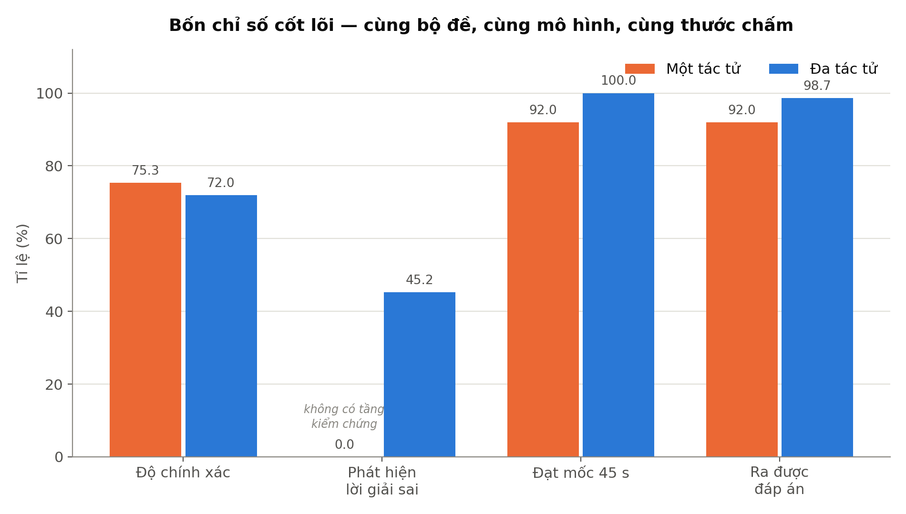
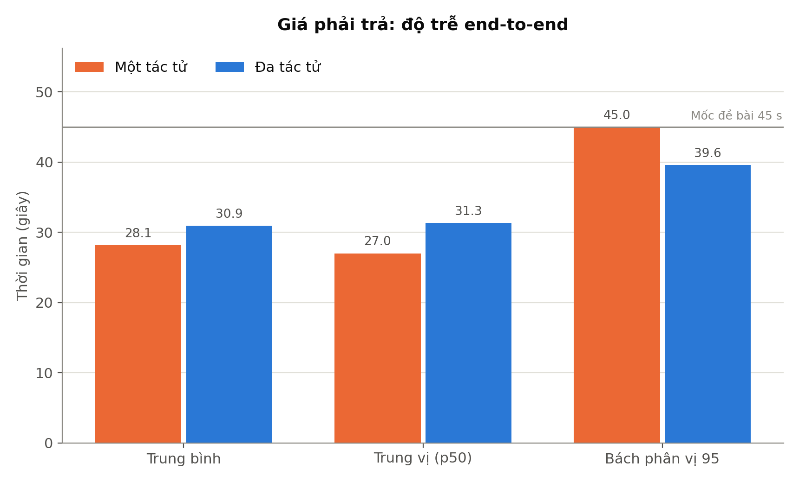
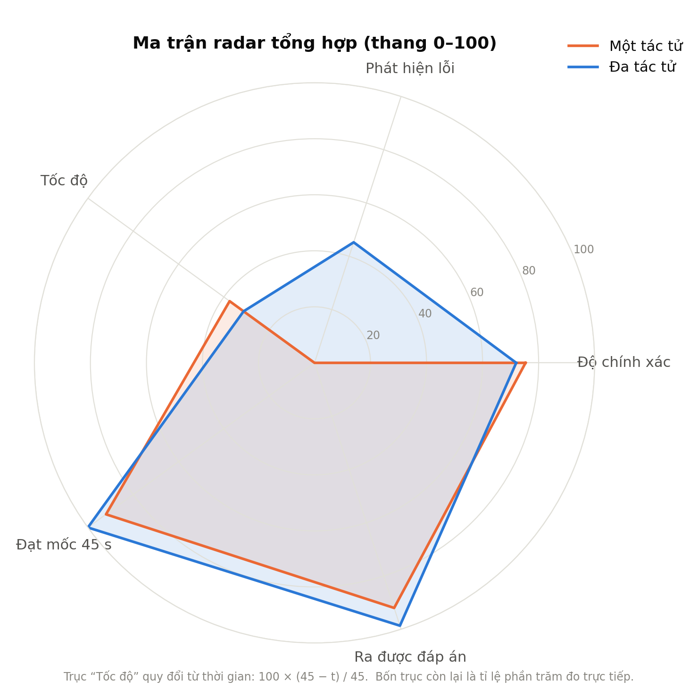
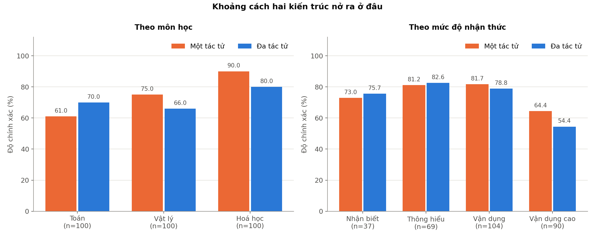
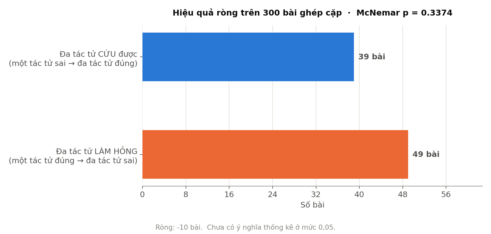

# ĐÁNH GIÁ ĐỐI CHỨNG KIẾN TRÚC MỘT TÁC TỬ VÀ ĐA TÁC TỬ

Phần này trình bày kết quả đo đối chứng giữa hai kiến trúc trên cùng một nền tảng kỹ thuật, nhằm lượng hoá đóng góp thực sự của việc phân rã vai và tầng kiểm chứng tất định. Toàn bộ phép đo thực hiện trên bộ đề khó `de_kho.csv` gồm 300 bài, phân bố đều ba môn Toán, Vật lý và Hoá học, trong đó 194 bài (chiếm 65%) thuộc hai mức nhận thức Vận dụng và Vận dụng cao.

Nguyên tắc thiết kế thực nghiệm là **chỉ thay đổi một biến duy nhất là kiến trúc**. Hai nhánh dùng chung mô hình `qwen3:4b` lượng tử hoá Q4_K_M chạy cục bộ qua Ollama, chung tham số sinh (`temperature` 0,2 và `num_ctx` 4096), chung trạng thái tắt chế độ suy nghĩ của Qwen3, chung bộ đề và chung hàm chấm. Riêng hàm chấm được dùng lại trực tiếp từ `bench.py` cho cả hai nhánh thay vì viết bản riêng, bởi hai thước đo lệch nhau dù chỉ một chi tiết nhỏ cũng đủ làm toàn bộ phép so sánh mất giá trị.

Mốc nền một tác tử được cấp trần 2750 token cho một lượt gọi, đúng bằng tổng ngân sách token mà hệ đa tác tử tiêu cho một bài (Planner 400, Subject Agent 1100, Verify 350 và Explain 900). Việc cấp trọn thay vì cấp một phần là có chủ đích: mốc nền phải hoàn tất cả việc đọc đề, giải và trình bày trong một lượt duy nhất, nên cắt bớt ngân sách của nó sẽ tạo ra lợi thế giả cho phía đa tác tử và làm suy yếu mọi kết luận rút ra sau đó.

Quy ước màu giữ nguyên qua cả năm biểu đồ: màu cam biểu thị kiến trúc một tác tử, màu xanh biểu thị kiến trúc đa tác tử. Màu bám theo thực thể chứ không theo thứ hạng, bảo đảm người đọc chuyển từ hình này sang hình khác không phải học lại quy ước.

---

## BENCHMARK 1: BỐN CHỈ SỐ CỐT LÕI

Phép đo so sánh trực tiếp bốn chỉ số nghiệm thu của đề tài trên cùng một thang tỉ lệ phần trăm, gồm độ chính xác, khả năng phát hiện lời giải sai, mức độ tuân thủ ngân sách 45 giây và tỉ lệ trả về được đáp án.

*Hình 1. So sánh bốn chỉ số cốt lõi giữa hai kiến trúc trên 300 bài của bộ đề khó*

> **Nhận xét khoa học (Benchmark 1):**

Thứ nhất, hai kiến trúc **gần như không phân biệt được về độ chính xác**. Mốc nền một tác tử đạt 75,3% trong khi hệ đa tác tử đạt 72,0%, chênh lệch 3,3 điểm phần trăm nghiêng về phía mốc nền. Kết quả này đi ngược lại kỳ vọng thông thường rằng phân rã vai sẽ nâng chất lượng lời giải, và nó buộc phải được đọc cùng với kiểm định thống kê ở Benchmark 5 trước khi rút ra bất kỳ kết luận nào.

Thứ hai, khoảng cách tuyệt đối và mang tính quyết định nằm ở chỉ số **khả năng phát hiện lời giải sai**, nơi hệ đa tác tử đạt 45,2% còn mốc nền đạt đúng 0%. Cần nhấn mạnh rằng con số 0% này **không phải kết quả của một phép đo kém mà là hệ quả tất yếu của kiến trúc**: một lời gọi mô hình ngôn ngữ đơn lẻ không sở hữu bất kỳ đường tính toán độc lập nào để đối chiếu chéo, nên về mặt nguyên tắc nó không thể phát hiện sai lầm của chính mình. Lời giải đúng và lời giải sai đều được trả về với cùng một mức độ tự tin trong diễn đạt. Đây là khác biệt về bản chất chứ không phải về mức độ, và vì vậy không cần đến kiểm định thống kê để khẳng định.

Cuối cùng, hai chỉ số về độ tin cậy vận hành đều nghiêng rõ về phía kiến trúc đa tác tử. Tỉ lệ tuân thủ mốc 45 giây đạt 100% so với 92,0%, và tỉ lệ trả về được đáp án đạt 98,7% so với 92,0%. Nguyên nhân cốt lõi nằm ở thành phần Manager của hệ đa tác tử: trước mỗi bước tốn kém nó kiểm tra thời gian còn lại, bỏ bước tinh chỉnh khi ngân sách cạn, và chặn cứng bước giảng bài bằng `asyncio.timeout`. Mốc nền hoàn toàn không có cơ chế tương ứng, nên khi gặp bài toán dài nó cứ thế trôi qua mốc thời gian rồi trả về kết quả rỗng.

---

## BENCHMARK 2: ĐỘ TRỄ END-TO-END

Phép đo khảo sát phân bố thời gian phản hồi của hai kiến trúc qua ba thống kê là trung bình, trung vị và bách phân vị 95, đối chiếu với mốc 45 giây đã đăng ký trong tiêu chí nghiệm thu.

*Hình 2. Phân bố độ trễ end-to-end của hai kiến trúc, đường ngang đánh dấu mốc 45 giây*

> **Nhận xét khoa học (Benchmark 2):**

Thứ nhất, ở hai thống kê trung tâm, hệ đa tác tử chậm hơn đúng như dự đoán lý thuyết, với thời gian trung bình 30,9 giây so với 28,1 giây và trung vị 31,3 giây so với 27,0 giây. Đây là cái giá tất yếu của việc thực hiện từ bốn đến sáu lượt gọi mô hình thay vì một lượt duy nhất.

Thứ hai, và đây là phát hiện đáng chú ý nhất của phép đo này, **thứ tự đảo ngược hoàn toàn ở vùng đuôi phân bố**. Tại bách phân vị 95, mốc nền chạm đúng 45,0 giây trong khi hệ đa tác tử chỉ đạt 39,6 giây. Con số 45,0 giây của mốc nền chính là trần thời gian đã đặt, nghĩa là 5% số lượt chậm nhất của nó đều bị cắt ngang ở hạn và không trả về được kết quả nào. Ngược lại, hệ đa tác tử tự dừng trước mốc nhờ cơ chế quản ngân sách. Vùng đuôi phân bố mới là nơi trải nghiệm người dùng bị phá hỏng, và ở chính vùng đó kiến trúc đa tác tử lại nhanh hơn.

Cuối cùng, cần ghi nhận một xu hướng có ý nghĩa quan trọng đối với luận điểm của đề tài: **cái giá phải trả về thời gian thu hẹp lại khi độ khó của bài toán tăng lên**. Trên bộ đề giữ riêng, khoảng cách trung bình là 8,5 giây tương đương 1,4 lần; trên bộ đề khó, khoảng cách chỉ còn 2,8 giây tương đương 1,1 lần. Cơ chế đằng sau khá rõ: đề càng khó thì mốc nền càng phải sinh lời giải dài và càng chậm lại, trong khi hệ đa tác tử bị ngân sách giữ cho gần như cố định. Nói cách khác, chi phí độ trễ của kiến trúc đa tác tử giảm dần đúng ở vùng bài toán mà nó cần được sử dụng nhất.

---

## BENCHMARK 3: MA TRẬN RADAR TỔNG HỢP

Phép đo tổng hợp năm chiều năng lực về cùng một thang chuẩn hoá từ 0 đến 100 nhằm quan sát hình thái mạnh yếu tổng thể của mỗi kiến trúc thay vì so từng chỉ số rời rạc.

*Hình 3. Ma trận radar năm trục của hai kiến trúc trên thang chuẩn hoá 0–100*

> **Nhận xét khoa học (Benchmark 3):**

Thứ nhất, hai đa giác **trùng khít nhau gần như hoàn toàn ở ba trục** Độ chính xác (75,3 so với 72,0), Tốc độ quy đổi (37,6 so với 31,3) và Ra được đáp án (92,0 so với 98,7). Sự chồng lấn này là biểu hiện trực quan của kết luận đã rút ra ở hai phép đo trước: xét riêng năng lực sinh lời giải, phân rã vai không mang lại lợi ích đo được.

Thứ hai, khác biệt duy nhất nhận ra được bằng mắt thường là **cái gai vươn lên ở trục Phát hiện lỗi**, nơi đường xanh đạt mức 45,2 còn đường cam sập hẳn về tâm. Nếu loại bỏ trục này khỏi biểu đồ, hai đa giác sẽ gần như không phân biệt được. Điều đó dẫn tới một nhận định thẳng thắn: toàn bộ giá trị gia tăng của kiến trúc đa tác tử, khi quy về một hình duy nhất, hội tụ vào đúng một chiều năng lực.

Cuối cùng, về mặt phương pháp cần lưu ý hai điểm khi diễn giải biểu đồ radar. Trục Tốc độ là trục duy nhất được quy đổi, theo công thức `100 × (45 − t) / 45` chặn trong đoạn [0, 100], trong đó mốc 45 giây lấy theo ngân sách đã đăng ký của đề tài chứ không phải một hằng số tuỳ ý; bốn trục còn lại đều là tỉ lệ phần trăm đo trực tiếp. Bên cạnh đó, **diện tích của đa giác radar không mang ý nghĩa toán học** và hình dạng của nó thay đổi hẳn khi hoán vị thứ tự sắp trục, do đó biểu đồ này chỉ nên dùng để nhận diện nhanh hình thái tổng thể, còn mọi so sánh định lượng phải quay về các biểu đồ cột.

---

## BENCHMARK 4: PHÂN RÃ THEO MÔN HỌC VÀ MỨC ĐỘ NHẬN THỨC

Phép đo phân rã độ chính xác theo hai chiều là môn học và mức độ nhận thức, nhằm xác định khoảng cách giữa hai kiến trúc nở rộng hay thu hẹp ở những nhóm bài toán nào.

*Hình 4. Độ chính xác phân rã theo ba môn học và bốn mức độ nhận thức*

> **Nhận xét khoa học (Benchmark 4):**

Thứ nhất, phân rã theo môn học cho thấy một hình thái **trái ngược nhau hoàn toàn giữa ba môn**. Hệ đa tác tử dẫn 9 điểm phần trăm ở môn Toán (70,0% so với 61,0%) nhưng lại thua 9 điểm ở Vật lý (66,0% so với 75,0%) và thua 10 điểm ở Hoá học (80,0% so với 90,0%). Kiểm định McNemar riêng cho từng môn không cho nhóm nào đạt ý nghĩa thống kê ở mức 0,05: Toán đạt p = 0,122, Vật lý đạt p = 0,188 và Hoá học đạt p = 0,064. Đáng chú ý là nhóm gần ngưỡng ý nghĩa nhất lại chính là Hoá học, và nó nghiêng về phía mốc nền chứ không phải phía kiến trúc đa tác tử.

Thứ hai, phân rã theo mức độ nhận thức cho thấy hai kiến trúc bám sát nhau ở ba mức đầu với chênh lệch dưới 3 điểm phần trăm — Nhận biết 75,7% so với 73,0%, Thông hiểu 82,6% so với 81,2% và Vận dụng 78,8% so với 81,7% — rồi tách hẳn ra ở mức Vận dụng cao, nơi mốc nền dẫn tới 10 điểm (64,4% so với 54,4%).

Cuối cùng, và đây là phát hiện quan trọng nhất của toàn bộ chiến dịch đo, **giả thuyết cho rằng phân rã vai chỉ trả công ở bài toán nhiều bước đã bị chính dữ liệu bác bỏ**. Trên bộ đề giữ riêng trước đó, mức Vận dụng cao là mức duy nhất hệ đa tác tử dẫn trước, với 52,9% so với 47,1%, và kết quả này từng được ghi nhận như một tín hiệu ủng hộ giả thuyết. Tuy nhiên cỡ mẫu khi ấy chỉ là 17 bài. Khi tăng cỡ mẫu lên 90 bài trên bộ đề khó, tín hiệu không những **không lặp lại mà còn lật ngược dấu** (hiệu quả ròng −9 bài, p = 0,211). Bộ đề khó có tới 65% số bài thuộc hai mức Vận dụng và Vận dụng cao, tức nếu giả thuyết đúng thì đây chính là nơi nó phải bộc lộ rõ nhất — và nó đã không bộc lộ. Đây là một ví dụ điển hình của tín hiệu cỡ mẫu nhỏ không có thật, và việc ghi nhận nó công khai là bằng chứng cho thấy kết luận của nhóm nghiên cứu đã được kiểm chứng lại trên dữ liệu độc lập.

---

## BENCHMARK 5: HIỆU QUẢ RÒNG VÀ KIỂM ĐỊNH THỐNG KÊ

Phép đo đối chứng ghép cặp trên từng bài, nhằm xác định chênh lệch độ chính xác quan sát được ở Benchmark 1 là hiệu ứng thật hay chỉ là dao động ngẫu nhiên.

*Hình 5. Số bài kiến trúc đa tác tử cứu được so với số bài nó làm hỏng, trên 300 bài ghép cặp*

> **Nhận xét khoa học (Benchmark 5):**

Thứ nhất, đối chứng trên từng bài cho thấy hệ đa tác tử **cứu được 39 bài** mà mốc nền giải sai, đồng thời **làm hỏng 49 bài** mà mốc nền giải đúng, dẫn tới hiệu quả ròng **âm 10 bài**. Kiểm định McNemar dạng chính xác hai phía cho giá trị **p = 0,3374**, tức chênh lệch quan sát được chưa loại trừ được yếu tố ngẫu nhiên ở mức ý nghĩa 0,05. Kết luận đúng đắn về mặt thống kê là hai kiến trúc **tương đương** về độ chính xác; không được phát biểu rằng đa tác tử chính xác hơn, và cũng không được phát biểu ngược lại, bởi cả hai đều vượt quá điều dữ liệu cho phép.

Thứ hai, cần nhấn mạnh rằng phép đo này **đã đủ lực thống kê**, không rơi vào tình trạng thiếu mẫu. Số cặp lệch đạt 88, vượt xa ngưỡng tối thiểu 25 mà xấp xỉ khi-bình-phương đòi hỏi. Do đó kết quả "không có chênh lệch" ở đây là một kết luận có căn cứ chứ không phải hệ quả của cỡ mẫu nhỏ. Việc lựa chọn bản kiểm định chính xác dạng nhị thức thay vì bản xấp xỉ là để giữ nhất quán với các phép đo cỡ nhỏ hơn đã thực hiện trước đó.

Cuối cùng, kết luận này được củng cố bởi **ba phép đo độc lập khác trên hai bộ đề rời nhau**. Bốn phép đo lần lượt cho hiệu quả ròng −5 bài (p = 0,4583), +5 bài (p = 0,5114), −10 bài (p = 0,3374) và −3 bài (p = 0,8323). Đặc điểm quyết định nằm ở chỗ **dấu của hiệu quả ròng đảo chiều giữa các lần đo** trong khi không lần nào đạt ý nghĩa thống kê. Đó chính là chữ ký của nhiễu ngẫu nhiên chứ không phải của một hiệu ứng có thật, và nó khép lại khả năng rằng một phép đo thứ năm sẽ cho kết quả khác về bản chất.

Về mặt trình bày, biểu đồ cố ý chỉ vẽ hai ô lệch nhau mà không vẽ đủ bốn ô của bảng chéo (177 bài cả hai cùng đúng và 35 bài cả hai cùng sai). Lý do là chỉ hai ô lệch mới mang thông tin về việc kiến trúc nào ưu việt hơn; bài mà cả hai cùng đúng hoặc cùng sai không nói lên điều gì, và bản thân kiểm định McNemar cũng loại chúng ra khỏi phép tính. Vẽ đủ bốn ô sẽ khiến hai cột lớn vô nghĩa lấn át hai cột thực sự mang kết luận.

---

## NHẬN XÉT TỔNG HỢP NĂM BIỂU ĐỒ

Năm biểu đồ trên không phải năm cách minh hoạ khác nhau cho cùng một tập dữ liệu, mà là một mạch lập luận có thứ tự: Benchmark 1 dựng bối cảnh về việc hai kiến trúc hơn kém nhau ở đâu, Benchmark 2 lượng hoá cái giá phải trả, Benchmark 3 tổng hợp hình thái mạnh yếu, Benchmark 4 truy tìm nguồn gốc của khoảng cách, và Benchmark 5 phán quyết xem khoảng cách ấy có thật hay không. Đọc riêng lẻ bất kỳ hình nào cũng dẫn tới kết luận sai lệch: chỉ nhìn Hình 1 sẽ tưởng mốc nền vượt trội, chỉ nhìn Hình 5 sẽ không biết chênh lệch lớn tới đâu, và chỉ nhìn Hình 3 sẽ đánh giá quá cao ưu thế của kiến trúc đa tác tử vì diện tích đa giác gây ấn tượng thị giác sai.

Kết luận thứ nhất và cũng là kết luận buộc phải phát biểu trước tiên: **kiến trúc đa tác tử không mang lại độ chính xác cao hơn một lời gọi mô hình đơn lẻ**. Qua bốn phép đo trên 450 bài thuộc hai bộ đề hoàn toàn rời nhau, không phép đo nào đạt ý nghĩa thống kê và dấu của hiệu quả ròng đảo chiều giữa các lần đo. Cùng với việc giả thuyết về ưu thế ở bài toán khó đã bị bác bỏ ở Benchmark 4, có thể khẳng định rằng đóng góp của việc phân rã vai đối với chất lượng lời giải, nếu tồn tại, cũng nhỏ hơn ngưỡng mà quy mô thực nghiệm này phát hiện được.

Kết luận thứ hai xác định lại giá trị thật của kiến trúc: **ưu thế của hệ đa tác tử nằm hoàn toàn ở độ tin cậy chứ không nằm ở độ chính xác**. Ba chỉ số thể hiện điều này đều lặp lại nhất quán trên cả hai bộ đề, và đó là điều khiến chúng đủ vững để làm luận cứ. Khả năng phát hiện lời giải sai đạt 53,1% trên bộ giữ riêng và 45,2% trên bộ khó, đối lập với 0% của mốc nền ở cả hai lần đo. Mức độ tuân thủ ngân sách 45 giây đạt 100% ở cả hai lần, so với 88,7% và 92,0% của mốc nền. Tỉ lệ trả về được đáp án đạt 99,3% và 98,7%, so với 88,7% và 92,0%. Khác với chênh lệch độ chính xác vốn đảo dấu tuỳ theo lần đo, ba chỉ số này giữ nguyên cả chiều lẫn gần nguyên độ lớn qua hai bộ dữ liệu độc lập.

Kết luận thứ ba là một hạn chế phải được ghi nhận trung thực: **năng lực phát hiện lời giải sai suy giảm từ 53,1% xuống 45,2% khi độ khó của đề tăng lên**, nghĩa là tầng kiểm chứng yếu đi đúng vào lúc nó cần thiết nhất. Cả hai con số đều còn cách xa ngưỡng 85% đã đăng ký trong tiêu chí nghiệm thu của đề tài. Nói cách khác, sau bốn phép đo, toàn bộ lý do tồn tại của kiến trúc đa tác tử thu về đúng một chỉ số duy nhất, và chỉ số đó mới giao được khoảng một nửa chỉ tiêu. Điều này không phủ nhận giá trị của kiến trúc — khác biệt giữa "phát hiện được gần một nửa số lỗi" và "hoàn toàn không phát hiện được lỗi nào" là khác biệt về bản chất — nhưng nó xác định rõ rằng tầng kiểm chứng là chỗ duy nhất còn đáng đầu tư công sức cải tiến, và bốn phép đo này cung cấp căn cứ định lượng cho nhận định đó thay vì phỏng đoán định tính.

Từ ba kết luận trên, phát biểu tổng kết được đề xuất như sau: *trên 450 bài thuộc hai bộ đề rời nhau, kiến trúc đa tác tử không cho độ chính xác cao hơn một lời gọi mô hình đơn lẻ, nhưng cung cấp ba năng lực mà kiến trúc đơn lẻ không có được về mặt kiến tạo — phát hiện lời giải sai ở mức 45–53% so với 0%, tuân thủ tuyệt đối ngân sách thời gian so với 88,7–92,0%, và tỉ lệ trả về được đáp án 98,7–99,3% so với 88,7–92,0% — với cái giá là 1,1 đến 1,4 lần thời gian xử lý. Trong bối cảnh ứng dụng giáo dục, đây là một đánh đổi có lợi, bởi một đáp số sai được trình bày với giọng điệu tự tin gây tổn hại nhiều hơn một đáp số chậm.*
